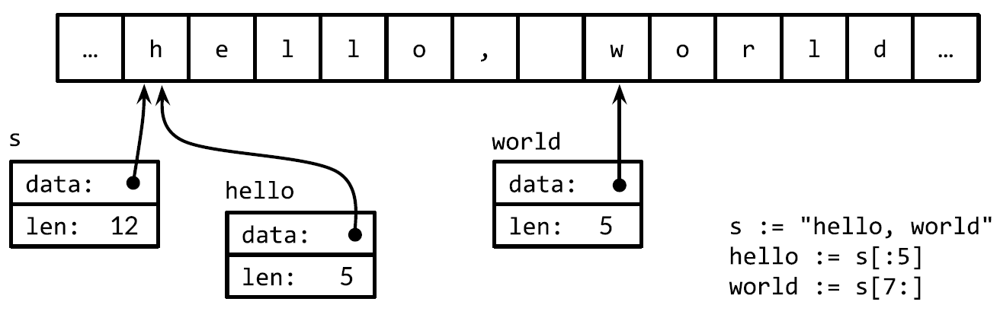

# 2.go语言基础语法


#    变量

## 变量的声明

变量的声明形式有:

1. `identifier := value`
  
	简短变量初始化，一般用于声明并初始化局部变量，变量类型根据表达式自动推导，也可以初始化一组变量：`i,j:=0,0`,但是要注意代码的可读性，`:=`变量声明语句，所以左边必须有**至少一个**新的变量（不必全是），否则无法通过编译
	
2. `var identifier type = value`

	显式地标明变量的类型，当变量类型与初值类型相同时，类型冗余，但如果两者类型不同，变量类型就必须了
	
	这个形式还可以进行部分的省略：
	&#43; 省略`=value` :`var indentifier type`
		
		依赖于字符串的默认初始化零值机制:如果变量没有显式初始化，则被隐式地赋予其类型的零值（zero value），数值类型是0，字符串类型是空字符串`&#34;&#34;`，布尔型为`false`,接口或引用类型为`nil`,数组或者结构体等俱黑类型对应的零值为每个元素或者字段均为对应类型的零值。也可一次性初始化多个该类型的变量，如：`var i,j,k int`， 
	&#43; 省略`type`:`var identifier = value`
		
		用得很少，除非同时声明多个变量,用这个语句声明多个变量的形式：`var a,b,c,d=true,2,3,&#34;four&#34;`
3. 函数的返回值进行初始化
	
	如：`var f,err=os.Open(name)`

实践中一般使用前两种形式中的某个，初始值重要的话就显式地指定变量的类型，否则使用隐式初始化。

**注意**：

在习惯上，go语言推荐使用驼峰命名法。

##### new函数

另外一个创建变量的方法是调用内建函数new函数，表达式`new(T)`将创建一个T类型的匿名变量，初始化为对应类型的零值，然后返回变量地址，返回指针类型为`*T`。

new创建变量和普通变量声明语句方式创建变量没什么区别，除了不需要声明一个临时变量的名字外。

new函数只是一个预定义的函数，不是一个关键字，因此可以将new这个名字重新定义为别的类型。 

## go数据类型

Go语言将数据类型分为四类：基础类型、复合类型、引用类型和接口类型

&#43; **基础类型**，包括:数字、字符串和布尔型
&#43; **复合数据类型**包括：数组和结构体
&#43; **引用类型**包括：指针、切片、字典、函数、通道

go语言不支持隐式类型转换，如`int a = b`(其中b为float型),即使两个自定义的类型底层类型是一样的两个也不能直接进行互相赋值，需要进行一个显式的类型转换才能进行相互转换：

对于每一个类型`T`都有一个对应的类型转换操作`T(x)`,用于将x转换为T类型（当T为指针类型，需要加上括号，如`(*int)(x)`）,类型转换可以是不同类型的，如将浮点型转换为整型,但是从高精度转换为低精度可能会出现精度丢失以及溢出等问题

#### 类型的可赋值性与可比性

可赋值性根据不同类型有不同的规则，在自定义的新类型需要解释相应的赋值规则，对已有类型的规则很简单：类型必须精确匹配，而nil值可以被赋值给任何接口变量与引用类型，而常量有更加灵活的可赋值性规则来规避显式转换。`==`与`!=`的结果与可赋值性相关：第一个操作数相对第二个操作数类型必须数可赋值的或者反过来赋值的。与可赋值性同理，我们也可以对新的自定义的可比较类型的相关规则进行定义。

### 基础类型

#### 整数（Integer）

整型按照长度分，有以下两个大类：
&#43; `int8,int16,int32,int64`

  有符号整数采用补码（2’s-complement）形式表示，对于n位的有符号整数，取值范围是$[−2^{n−1},2^{n−1}−1]$

&#43; `uint8（byte）,uint16,uint32(rune),uint64`
  无符号数所有的位用于存储值，范围为$[0,2^n-1]$

  &#43; byte是uint8类型的等价类型，byte类型一般用于强调数值是一个原始的数据而不是一个小的整数

  &#43; int16类似c中的short

  &#43; Unicode字符rune类型是和int32等价的类型，通常用于表示一个Unicode码点。这两个名称可以互换使用

  &#43; int64类似c中的long型

&#43; `int，uint`

  大小是32或64bit，取决于不同的编译器以及不同的硬件平台

&#43; `uintptr`

  无符号的整数类型，没有指定具体的bit大小但是足以容纳指针。uintptr类型只有在底层编程时才需要

上述的所有类型即使是等价类型，如果需要互相赋值，则必须显示的转换。

&gt; tips:
&gt;
&gt; 1. 如果没有特殊的要求，最好使用有符号数，否则如果遇到某些索引判断时会出现判断出错问题，如：
&gt;
&gt;    ```go
&gt;    	var i uint
&gt;    	for i = 10; i &gt;= 0; i-- {
&gt;    		fmt.Println(&#34;test&#34;)
&gt;    	}
&gt;    ```
&gt;
&gt;    因为无符号数的负溢出，会变成正数，此时循环永远不会终止，会导致错误，类似的问题还有很多，所以无符号数往往只有在位运算或其它特殊的运算场景才会使用（就像bit集合、分析二进制文件格式或者是哈希和加密操作等）
&gt;
&gt;    

#### 浮点数（Floating-Point Numbers）

Go语言提供了两种精度的浮点数，float32和float64。它们的算术规范由[IEEE754](https://zh.wikipedia.org/zh-hans/IEEE_754?oldformat=true)国际标准定义，被所有现代的CPU支持。

&gt; 浮点数的范围极限值可以在math包找到。详见 [a.常用的go标准库.md](a.常用的go标准库.md) 。 

#### 复数(Complex Numbers)

Go语言提供了两种精度的复数类型：`complex64`和`complex128`，分别由float32和float64组成实部和虚部。

内置的complex函数用于构建复数，内建的real和imag函数分别返回复数的实部和虚部：

```go
var x complex128 = complex(1, 2) // 1&#43;2i
var y complex128 = complex(3, 4) // 3&#43;4i
fmt.Println(x*y) // &#34;(-5&#43;10i)&#34;
fmt.Println(real(x*y)) // &#34;-5&#34;
fmt.Println(imag(x*y)) // &#34;10&#34;
```

#### 布尔型（Booleans）

布尔类型值只有两种:`true`,`false`。一元操作符`!`对应逻辑非操作。

布尔值可以和`&amp;&amp;`（AND）和`||`（OR）操作符结合，和C语言类似：如果运算符左边值已经可以确定整个布尔表达式的值，那么运算符右边的值将不在被求值。

因为`&amp;&amp;`的优先级比`||`高（助记：`&amp;&amp;`对应逻辑乘法，`||`对应逻辑加法，乘法比加法优先级要高）如下的代码不需要加括号：

```go
if &#39;a&#39; &lt;= c &amp;&amp; c &lt;= &#39;z&#39; ||
	&#39;A&#39; &lt;= c &amp;&amp; c &lt;= &#39;Z&#39;{
	// ...
}
```

#### 字符串(Strings)

一个字符串是一个**不可改变**的字节序列。字符串可以包含任意的数据（包括byte值0），文本字符串通常被解释为采用UTF8的编码Unicode码点（rune）序列。

内置的`len`函数可以返回一个字符串中的字节数目，而不是rune字符数目,对于rune字符数，可以使用`unicode/utf8`来进行统计：

```go
import &#34;unicode/utf8&#34;
s := &#34;Hello, 世界&#34;
fmt.Println(len(s)) // &#34;13&#34;:&#34;Hello, &#34;共7个；&#34;世界&#34;共6个；\0为1个
fmt.Println(utf8.RuneCountInString(s)) // &#34;9&#34;:&#34;Hello, &#34;共7个；&#34;世界&#34;共2个
```

索引操作`s[i]`返回第i个字节的**字节**值，子**字符串**操作`s[i:j]`基于原始的s字符串的第i个字节开始到第j个字节（并不包含j本身）生成一个新字符串不管是i还是j都可以被忽略，如果i被省略的话将使用0代替，如果j被省略的话将使用len(s)代替。

关于字符串的不可改性：一个字符串包含的字节序列永远不会被改变，当然我们也可以给一个字符串变量分配一个新字符串值,但是并不会导致原始的字符串值被改变：

```go
s := &#34;left foot&#34;
t := s
s &#43;= &#34;, right foot&#34;
fmt.Println(s) // &#34;left foot, right foot&#34;
fmt.Println(t) // &#34;left foot&#34;
```
因为字符串是不可修改的，因此尝试修改字符串内部数据的操作也是被禁止的：

 ```go
 s[0] = &#39;L&#39; // compile error: cannot assign to s[0]
 ```

不变性意味如果两个字符串共享相同的底层数据的话也是安全的，这使得复制任何长度的字符串代价是低廉的。同样，一个字符串s和对应的子字符串切片s[7:]的操作也可以安全地共享相同的内存，因此字符串切片操作代价也是低廉的。在这两种情况下都没有必要分配新的内存。下图是字符串共享时在内存中的布局，它们共用了底层存储的数据：



##### 字符串字面量（String Literals）

字符串的值可以用字符串字面量(String Literals， 有的翻译也叫面值),形式上就是带双引号的字节序列：

```go
&#34;hello 世界！&#34;
&#34;こんにちは世界！&#34;
```

因为Go语言源文件总是用UTF8编码，并且Go语言的文本字符串也以UTF8编码的方式处理，因此我们可以将Unicode码点也写到字符串字面量中：在一个双引号包含的字符串字面量中，可以用以反斜杠\\开头的转义序列插入任意的数据：

| 转义字符    | 含义                                                         |
| ----------- | ------------------------------------------------------------ |
| \\a         | 响铃（或警告）                                               |
| \\b         | 退格符                                                       |
| \\f         | 换页符                                                       |
| \\n         | 换行符（跳到下一行的同一个位置）                             |
| \\r         | 回车符（返回行首）                                           |
| \\t         | 制表符                                                       |
| \\v         | 垂直制表符                                                   |
| \\&#39;         | 单引号                                                       |
| \\&#34;         | 双引号                                                       |
| \\\\        | 反斜杠                                                       |
| \\xhh       | 十六进制数对应的单字节字符，两个h表示十六进制数字，大写或小写都可以（必须是两位，因为表示的是一个字节，范围为0~255） |
| \\ooo       | 八进制数对应的单字节字符，三个o表示八进制数字，大写或小写都可以（必须是三位，不能超过`\377`，`\377`对应十进制为255） |
| \\uhhhh     | unicode字符对应的数值，对应16bit的码点值                     |
| \\Uhhhhhhhh | unicode字符对应的数值，对应32bit的码点值                     |

 一个原生的字符串字面量使用反引号而不是双引号，在原生的字符串面值中，没有转义操作，全部的内容都是字面的意思，因此一个程序中的原生字符串面值可能跨越多行：

```go
const GoUsage = `Go is a tool for managing Go source code.
Usage:
go command [arguments]
...`
```

唯一的特殊处理是会删除回车以保证在所有平台上的值都是一样的，包括那些把回车也放入文本文件的系统(Windows系统会把回车和换行一起放入文本文件中)

&gt; 原生字符串面值用于编写正则表达式会很方便,同时被广泛应用于HTML模板、JSON面值、命令行提示信息以及那些需要扩展到多行的场景。

有很多Unicode字符很难直接从键盘输入，则可以用上面的`\u`和`\U`进行转义输入，以下的字符串表示的内容完全一致：

```go
&#34;世界&#34;
&#34;\xe4\xb8\x96\xe7\x95\x8c&#34;
&#34;\u4e16\u754c&#34;
&#34;\U00004e16\U0000754c&#34;
```

拿`世`举例：`\xe4\xb8\x96`对应的二进制为：**1110**0100 **10**111000 **10**010110，是一个标准的unicode二进制码，`\u4e16`则是unicode的对应的值的对应的二进制：01001110 00010110。

##### 字符串与rune切片

string接受到[]rune的类型转换，可以将一个UTF8编码的字符串解码为Unicode字符序列：

```go
s := &#34;プログラム&#34;
fmt.Printf(&#34;% x\n&#34;, s) // e3 83 97 e3 83 ...是标准的UTF-8编码
r := []rune(s)
fmt.Printf(&#34;%x\n&#34;, r) //[30d7 30ed 30b0 30e9 30e0]对应每一个字符的unicode编码值
```

如果是将一个[]rune类型的Unicode字符slice或数组转为string，则对它们进行UTF8编码：

```go
fmt.Println(string(r)) // &#34;プログラム&#34;
```

将一个整数转型为字符串意思是生成以只包含对应Unicode码点字符的UTF8字符串：

````go
fmt.Println(string(65)) // &#34;A&#34;, not &#34;65&#34;
fmt.Println(string(0x4eac)) // &#34;京&#34;
````

 如果对应码点的字符是无效的，则用&#39;\uFFFD&#39;无效字符作为替换:

```go
fmt.Println(string(1234567))//&#34;�&#34;
```

##### 字符串和Byte切片

标准库中有四个包对字符串处理尤为重要：bytes、strings、strconv和unicode包。strings包提供了许多如字符串的查询、替换、比较、截断、拆分和合并等功能。

&#43; **bytes**包也提供了很多类似功能的函数，用于操作字节切片(`[]byte`类型，与字符串有相同的结构)。

  &gt; 因为字符串是只读的，因此按照增量的方式构建字符串会导致很多分配和复制，在这种情况下，使用bytes.Buffer类型将会更有效。

&#43; **strconv**包提供了布尔型、整型数、浮点数和对应字符串的相互转换，还提供了双引号转义相关的转换。

&#43; **unicode**包提供了`IsDigit`、`IsLetter`、`IsUpper`和`IsLower`等类似功能，它们用于给字符分类。

  每个函数以单个rune类型作为参数，然后返回一个布尔值。转换函数（如`ToUpper`和`ToLower`）将用于表示英文字母的rune字符的大小写转换。所有的这些函数都是遵循Unicode标准定义的字母、数字等分类规范。**strings**包也有类似的函数，它们是`ToUpper`和`ToLower`，将原始字符串的每个字符都做相应的转换，然后返回新的字符串。

字符串和字节slice之间可以相互转换：

```go
s := &#34;abc&#34;
b := []byte(s)
s2 := string(b)
```

一个`[]byte(s)`转换是分配了一个新的字节数组用于保存字符串数据的拷贝，然后引用这个底层的字节数组。将一个字节slice转到字符串的string(b)操作则是构造一个字符串拷贝，以确保s2字符串是只读的。

&gt; 编译器的优化可以避免在一些场景下分配和复制字符串数据，但总的来说需要确保在变量b被修改的情况下，原始的s字符串也不会改变

为了避免转换中不必要的内存分配，bytes包和strings同时提供了许多实用函数：

```go
func Contains(s, substr string) bool
func Count(s, sep string) int
func Fields(s string) []string
func HasPrefix(s, prefix string) bool
func Index(s, sep string) int
func Join(a []string, sep string) string
```

bytes包中也对应的六个函数,它们之间唯一的区别是字符串类型参数被替换成了字节slice类型的参数:

```go
func Contains(b, subslice []byte) bool
func Count(s, sep []byte) int
func Fields(s []byte) [][]byte
func HasPrefix(s, prefix []byte) bool
func Index(s, sep []byte) int
func Join(s [][]byte, sep []byte) []byte
```

bytes包还提供了Buffer类型用于字节slice的缓存。一个Buffer开始是空的，但是随着string、byte或[]byte等类型数据的写入可以动态增长，一个bytes.Buffer变量并不需要初始化，因为零值也是有效的：

```go
// intsToString is like fmt.Sprint(values) but adds commas.
func intsToString(values []int) string {
    var buf bytes.Buffer
    buf.WriteByte(&#39;[&#39;)
    for i, v := range values {
        if i &gt; 0 {
        	buf.WriteString(&#34;, &#34;)
    	}
    	fmt.Fprintf(&amp;buf, &#34;%d&#34;, v)
    }
    buf.WriteByte(&#39;]&#39;)
    return buf.String()
}

func main() {
    fmt.Println(intsToString([]int{1, 2, 3})) // &#34;[1, 2, 3]&#34;
}
```

当向bytes.Buffer添加任意字符的UTF8编码时，最好使用bytes.Buffer的`WriteRune`方法，但是`WriteByte`方法对于写入类似&#39;[&#39;和&#39;]&#39;等ASCII字符则会更加有效。

##### 字符串和数字的转换

字符串与数字之间的转换由strconv包提供这类转换功能。

将一个整数转为字符串，一种方法是用fmt.Sprintf返回一个格式化的字符串；另一个方法是用strconv.Itoa：

```go
x := 123
y := fmt.Sprintf(&#34;%d&#34;, x)
fmt.Println(y, strconv.Itoa(x)) // &#34;123 123&#34;
```

`FormatInt`和`FormatUint`函数可以用不同的进制来格式化数:

```go
fmt.Println(strconv.FormatInt(int64(x), 2)) // &#34;1111011&#34;
```

如果要将一个字符串解析为整数，可以使用`strconv`包的`Atoi`或`ParseInt`函数，还有用于解析无符号整数的`ParseUint`函数:

```go
x, err := strconv.Atoi(&#34;123&#34;) // x is an int
y, err := strconv.ParseInt(&#34;123&#34;, 10, 64) // base 10, up to 64 bits
```

`ParseInt`函数的第三个参数是用于指定整型数的大小；例如16表示int16，0则表示int。在任何情况下，返回的结果y总是int64类型，你可以通过强制类型转换将它转为更小的整数类型。

#### 常量（Constants）

常量表达式的值在编译期计算，而不是在运行期。每种常量的潜在类型都是基础类型：`boolean`、`string`或数字。一个常量的声明语句定义了常量的名字，常量的值不可修改，这样可以防止在运行期被意外或恶意的修改。常量比变量更适合用于表达像π之类的数学常数，因为它们的值不会发生变化。

常量的声明可以用`const`关键字进行声明，声明的格式为`const identifier [type] = value`其中type可以省略。与变量声明一样，可以批量声明多个常量，这比较适合声明一组相关的常量:

```go
const (
    e = 2.71828182845904523536028747135266249775724709369995957496696763
    pi = 3.14159265358979323846264338327950288419716939937510582097494459
)
```

所有常量的运算都可以在编译期完成，这样可以减少运行时的工作，也方便其他编译优化。当操作数是常量时，一些运行时的错误也可以在编译时被发现，例如整数除零、字符串索引越界、任何导致无效浮点数的操作等。

常量间的所有算术运算、逻辑运算和比较运算的结果也是常量，对常量的类型转换操作或以下函数调用都是返回常量结果：`len`、`cap`、`real`、`imag`、`complex`和`unsafe.Sizeof`。

一个常量的声明也可以包含一个类型和一个值，但是如果没有显式指明类型，那么将从右边的表达式推断类型。

如果是批量声明的常量，除了第一个外其它的常量右边的初始化表达式都可以省略，如果省略初始化表达式则表示使用前面常量的初始化表达式写法，对应的常量类型也一样的：

```go
const (
    a = 1
    b
    c = 2
    d
)
fmt.Println(a, b, c, d) // &#34;1 1 2 2&#34;
```

它可以带来其它的特性，那就是iota常量生成器语法

##### iota 常量生成器(The Constant Generator iota)

常量声明可以使用iota常量生成器初始化，它用于生成一组以相似规则初始化的常量，但是不用每行都写一遍初始化表达式。在一个const声明语句中，在第一个声明的常量所在的行，iota将会被置为0，然后在每一个有常量声明的行加一:

```go
type Weekday int
const (
	Sunday Weekday = iota
	Monday
	Tuesday
	Wednesday
	Thursday
	Friday
	Saturday
)
```

上面的Sunday为0，monday为1，以此类推，对计量单位的赋值：

```go
const (
    _ = 1 &lt;&lt; (10 * iota)
    KiB // 1024
    MiB // 1048576
    GiB // 1073741824
    TiB // 1099511627776 (exceeds 1 &lt;&lt; 32)
    PiB // 1125899906842624
    EiB // 1152921504606846976
    ZiB // 1180591620717411303424 (exceeds 1 &lt;&lt; 64)
    YiB // 1208925819614629174706176
)
```

##### 无类型常量(Untyped Constants)

go语言的许多常量并没有一个明确的基础类型。

有六种未明确类型的常量类型，分别是**无类型的布尔型**、**无类型的整数**、**无类型的字符**、**无类型的浮点数**、**无类型的复数**、**无类型的字符串**。

**无类型的常量不仅可以提供更高的运算精度，而且可以直接用于更多的表达式而不需要显式的类型转换**。**只有常量**可以是无类型的，当一个无类型的常量被赋值给一个变量的时候，无类型的常量将会被隐式转换为对应的类型。

对于精度，编译器为这些没有明确的基础类型的数字常量提供比基础类型更高精度的算术运算，可以认为至少有256bit的运算精度。例如，上述的ZiB和YiB的值已经超出任何Go语言中整数类型能表达的范围，但是它们依然是合法的常量，而且可以像下面常量表达式依然有效（YiB/ZiB是在编译期计算出来的，并且结果常量1024，是Go语言int变量能有效表示的）：

```go
fmt.Println(YiB/ZiB) // &#34;1024&#34;
```

不需要显式的类型转换，math.Pi无类型的浮点数常量，可以直接用于任意需要浮点数或复数的地方：

```go
var x float32 = math.Pi
var y float64 = math.Pi
var z complex128 = math.Pi
```

对于一个没有显式类型的变量声明语法（包括短变量声明语法），无类型的常量会被隐式转为默认的变量类型:

```go
i := 0 // untyped integer; implicit int(0)
r := &#39;\000&#39; // untyped rune; implicit rune(&#39;\000&#39;)
f := 0.0 // untyped floating-point; implicit float64(0.0)
c := 0i // untyped complex; implicit complex128(0i)
```

默认类型是规则的：无类型的整数常量默认转换为int，对应不确定的内存大小，浮点数和复数常量则默认转换为float64和complex128(*Go语言本身并没有不确定内存大小的浮点数和复数类型，而且如果不知道浮点数类型的话将很难写出正确的数值算法*),如果不想使用默认的规则就需要指明类型。

### 复合数据类型(Composite Types)

以不同的方式组合基本类型可以构造出来的复合数据类型，包括**数组**、**slice**(切片)、**map**和**结构体**。

#### 数组(Arrays)

数组是一个由固定长度的特定类型元素组成的序列，一个数组可以由零个或多个元素组成。

数组的长度是数组类型的一个组成部分，因此补充长度的元素同类的数组是两种不同的数组类型。数组的长度必须是常量表达式，因为数组的长度需要在编译阶段确定。

数组的每个元素可以通过索引下标来访问，索引下标的范围是从0开始到数组长度减1的位置。内置的len函数将返回数组中元素的个数。

**数组的声明与初始化**

数组的一般声明形式如下：

`var identifier [num]type = [num]type{value_0,value_1,value_2,...value_num}`

其中num表示数组的长度，type为数组元素的基本类型。

可以省略等式右边，此时，数组的每个元素都被初始化为元素类型对应的零值，例如：

```go
var a [3]int //a数组的各个元素都是int类型的零值，即0
```

也可以省略数组的长度，使用`...`来替代长度，则表示数组的长度是根据初始化值的个数来计算:

`identifier := [...]type{value_0,value_1,value_2,...value_num}`

如：

```go
q := [...]int{1, 2, 3}
fmt.Printf(&#34;%T\n&#34;, q) // &#34;[3]int&#34;
```

也可以指定一个索引和对应值列表的方式初始化:

`identifier := [...]type{index_0:value_0,index_1:value_1,...index_n:value_n}`

如：

```go
type Currency int
const (
    USD Currency = iota // 美元
    EUR // 欧元
    GBP // 英镑
    RMB // 人民币
)
symbol := [...]string{USD: &#34;$&#34;, EUR: &#34;€&#34;, GBP: &#34;￡&#34;, RMB: &#34;￥&#34;}
fmt.Println(RMB, symbol[RMB]) // &#34;3 ￥&#34;
```

在这种形式的数组字面值形式中，初始化索引的顺序是无关紧要的，而且没用到的索引可以省略，省略的是零值。

**数组的比较**

只有当两个数组的所有元素都是相等的时候数组才是相等的

**其他注意：**

**与大多数语言不同，如果Go中的数组作为函数的参数，那么实际传递的参数是一份数组的拷贝，而不是数组的指针**

&#43; &gt; 函数参数传递的机制导致传递大的数组类型将是低效的,且数组的作用结果不是直接在原数组上

#### 结构体(Structs)

Go 语言中没有类的概念，因此在 Go 中结构体有着更为重要的地位。最常用的方法是使用关键字 type 和 struct 来定义一个结构体:

```go
type identifier struct{
	attribute1 type1
    attribute2 type2
    ...
}
```

遇到结构简单的结构体的也可以进行一些简化：

```go
type identifier struct{
	a,b,c type1
}
```

**结构体字面量**：

结构体值也可以用结构体面值表示。

第一种方法，结构体面值可以指定每个成员的值：

```go
type Point struct{ X, Y int }
p := Point{1, 2}
```

上述的方法要求以结构体成员定义的顺序为每个结构体成员指定一个面值，一般只在定义结构体的包内部使用，或者是在较小的结构体中使用

第二种写法，以成员名字和相应的值来初始化，可以包含部分或全部的成员：

```go
anim := gif.GIF{LoopCount: nframes}
```

在这种形式的结构体面值写法中，如果成员被忽略的话将默认用零值，顺序不做要求

**结构体的比较：**

如果结构体的全部成员都是可以比较的，那么结构体也是可以比较的

&gt; 可比较的结构体类型和其他可比较的类型一样，可以用于map的key类型

**结构体嵌入和匿名结构体(Struct Embedding and Anonymous Fields):**

结构体嵌入机制让一个命名的结构体包含另一个结构体类型的匿名成员，这样就可以通过简单的点运算符`x.f`来访问匿名成员链中嵌套的`x.d.e.f`成员。

Go语言有一个特性让我们只声明一个成员对应的数据类型而不指名成员的名字，这类成员就叫匿名结构体（或叫匿名成员）。匿名结构体的数据类型必须是命名的类型或指向一个命名的类型的指针。

```go
type Circle struct {
    Point
    Radius int
}
type Wheel struct {
    Circle	//匿名成员
    Spokes int
}
```

对于匿名成员，可以由于嵌入的特性直接访问嵌入的结构体的成员：

```go
var w Wheel
w.X = 8 // 等价于w.Circle.Point.X = 8
w.Y = 8 // 等价于w.Circle.Point.Y = 8
w.Radius = 5 // 等价于w.Circle.Radius = 5
w.Spokes = 20
```

匿名结构体的缺点是无法通过简短的方式对结构体赋值:

```go
w = Wheel{8, 8, 5, 20} // compile error: unknown fields
w = Wheel{X: 8, Y: 8, Radius: 5, Spokes: 20} // compile error: unknown fields
```

只能老老实实地赋值：

```go
w = Wheel{Circle{Point{8, 8}, 5}, 20}
w = Wheel{
    Circle: Circle{
        Point: Point{X: 8, Y: 8},
        Radius: 5,
    },
    Spokes: 20, // NOTE: trailing comma necessary here (and at Radius)
}
fmt.Printf(&#34;%#v\n&#34;, w)
// Output:
// Wheel{Circle:Circle{Point:Point{X:8, Y:8}, Radius:5}, Spokes:20}
w.X = 42
fmt.Printf(&#34;%#v\n&#34;, w)
// Output:
// Wheel{Circle:Circle{Point:Point{X:42, Y:8}, Radius:5}, Spokes:20}
```

因为匿名成员也有一个隐式的名字，因此**不能同时包含两个类型相同的匿名成员**。同时，因为成员的名字是由其类型隐式地决定的，所有匿名成员也有可见性的规则约束。在上面的例子中，Point和Circle匿名成员都是导出的。

即使它们不导出（比如改成小写字母开头的point和circle），我们依然可以在包内用简短形式访问匿名成员嵌套的成员：

```go
w.X = 8
```

但是在包外部，因为circle和point没有导出不能访问它们的成员，因此简短的匿名成员访问语法也是禁止的,下面的代买可以在包内运行成功，但是在包外的时候，这代码将会报如下的错误：

```go
//包外使用如下语句
a := test.Wheel{}
a.circle.point.X = 8
//报错：a.circle undefined (cannot refer to unexported field or method circle)
```

匿名成员并不要求是结构体类型，其实任何命令的类型都可以作为结构体的匿名成员，这样做的意义是：是匿名类型的方法集，简短的点运算符语法可以用于选择匿名成员嵌套的成员，也可以用于访问它们的方法。

外层的结构体不仅仅是获得了匿名成员类型的所有成员，而且也获得了该类型导出的全部的方法。这个机制可以用于将一个有简单行为的对象组合成有复杂行为的对象。

**注意：**

&#43; 结构体成员的输入顺序也有重要的意义，顺序不一样的结构体不是同一个结构体。
&#43; 如果结构体成员名字是以大写字母开头的，那么该成员就是导出的，由go语言导出规则决定的。一个结构体可能同时包含导出和未导出的成员。
&#43; 一个命名为S的结构体类型将不能再包含S类型的成员：因为一个聚合的值不能包含它自身。但是S类型的结构体可以包含*S指针类型的成员，这可以让我们创建递归的数据结构，比如链表和树结构等。
&#43; 结构体变量的成员可以通过点操作符访问：`identifier.attribute1`,并且可以直接对其赋值，取地址，然后通过指针访问。结构体本身也可以被取址。
&#43; 结构体类型的零值是每个成员都对是零值。通常会将零值作为最合理的默认值。
&#43; 如果结构体没有任何成员的话就是空结构体，写作`struct{}`。它的大小为0，也不包含任何信息。有些Go语言程序员用map带模拟set数据结构时，用它来代替map中布尔类型的value，只是强调key的重要性，但是因为节约的空间有限，语法比较复杂，通常避免这样的用法。
&#43; 如果考虑效率的话，较大的结构体通常会用指针的方式传入和返回。

### 引用类型

#### 切片(slice)

Slice（切片）代表变长的序列，序列中每个元素都有相同的类型。类似于Python的list，一个slice类型一般写作`[]T`，其中T代表slice中元素的类型，slice的语法和数组很像，只是没有固定长度而已。

一个slice是一个轻量级的数据结构，提供了访问数组子序列（或者全部）元素的功能(slice的底层确实引用一个数组对象)。一个slice由三个部分构成：**指针、长度和容量**：

&#43; **指针**指向第一个slice元素对应的底层数组元素的地址(slice的第一个元素并不一定就是数组的第一个元素)。
&#43; **长度**对应slice中元素的数目。内置的len函数返回slice的长度。
&#43; **容量**是从slice的开始位置到底层数据的结尾位置。长度不能超过容量。内置的cap函数返回slice的容量。

切片的定义与初始化：`var identifier []type`

&#43; `var s []int`初始化为长度为0的空切片,默认为`nil`
&#43; `s :=[] int {1,2,3}`直接初始化
&#43; `s := arr[startIndex:endIndex]`数组arr的引用

slice的切片操作s[i:j]，其中0 ≤ i≤ j≤ cap(s)，用于创建一个新的slice，引用s的从第i个元素开始到第j-1个元素的子序列。新的slice将只有j-i个元素。类似大多数支持切片的语言，如果i位置的索引被省略的话将使用0代替，如果j位置的索引被省略的话将使用len(s)代替。

slice和数组的字面值语法很类似，不过不需要定义长度，或使用内置的make函数来创建切片:

```go
var s []type = make([]type, len)	//或者s := make([]type, len)
```

`make([]T, length, capacity)`此处的length是切片的初始长度，capacity指的是切片的容量，切片长度不能超过该长度（容量部分可以省略，在这种情况下，容量将等于长度）

多个slice之间可以共享底层的数据，并且引用的数组部分区间可能重叠：

```go
months := [...]string{1: &#34;January&#34;, /* ... */, 12: &#34;December&#34;} //定义months数组
Q2 := months[4:7]	//由数组生成切片
summer := months[6:9]//由数组生成切片
```


如果切片操作超出cap(s)的上限将导致一个panic异常，但是超出len(s)则是意味着扩展了slice，因为新slice的长度会变大：

```go
fmt.Println(summer[:20]) // panic: out of range
endlessSummer := summer[:5] // extend a slice (within capacity)
fmt.Println(endlessSummer) // &#34;[June July August September October]&#34;
```

**append函数**

一般的格式为`append(slice,element1,element2,element3...)`,设置可以增加slice，`append(slice,slice1,slice2,slice3...)`

返回增加元素后的slice，所以一般的用法是`slice =append(slice,element) `

底层原理：每次调用append函数，必须先检测slice底层数组是否有足够的容量来保存新添加的元素。

&#43; 如果有足够空间的话，直接扩展slice（依然在原有的底层数组之上），将新添加的y元素复制到新扩展的空间，并返回slice
&#43; 如果没有足够的增长空间的话，append函数则会先分配一个足够大的slice用于保存新的结果，先将输入的x复制到新的空间，然后添加y元素

根据底层原理，append函数返回的slice是可能与原来的slice不共用底层的数组， 会改变长度甚至容量与指针。

**切片的比较**

slice之间不能比较，因此我们不能使用`==`操作符来判断两个slice是否含有全部相等元素。(*标准库提供了高度优化的bytes.Equal函数来判断两个字节型slice是否相等（[]byte），但是对于其他类型slice，我们必须自己展开每个元素进行比较*)

可以自己写函数进行切片的相等的判断：

```go
func equal(x, y []string) bool {
    if len(x) != len(y) {
    	return false
    }
    for i := range x {
        if x[i] != y[i] {
        	return false
        }
    }
    return true
}
```

slice不直接支持比较运算符的原因：

&#43; 一个slice的元素是间接引用的，一个slice甚至可以包含自身。
&#43; 一个固定值的slice在不同的时间可能包含不同的元素，因为底层数组的元素可能会被修改。

slice唯一合法的比较操作是和nil比较：

```go
if summer == nil { /* ... */ }
```

一个零值的slice等于`nil`。**一个`nil`值的slice并没有底层数组**。一个`nil`值的slice的长度和容量都是0(slice的nil值类似于NULL，是没有底层的内存空间的)。与任意类型的`nil`值一样，我们可以用 []int(`nil`)类型转换表达式来生成一个对应类型slice的`nil`值  

&gt; 但是也有非`nil`值的slice的长度和容量也是0的，例如[]int{}或make([]int, 3)[3:]。

```go
var s []int // len(s) == 0, s == nil
s = nil // len(s) == 0, s == nil
s = []int(nil) // len(s) == 0, s == nil
s = []int{} // len(s) == 0, s != nil
```

因此，如果需要测试一个slice是否是空的，使用`len(s) == 0`来判断，而不应该用`s == nil`来判断，除此之外，一个nil值的slice的行为和其它任意0产长度的slice一样。

#### 字典(map)

map类型可以写为`map[K]V`，其中K和V分别对应key和value。

map中所有的key都有相同的类型，所有的value也有着相同的类型。 其中K对应的key必须是支持==比较运算符的数据类型，所以map可以通过测试key是否相等来判断是否已经存在。对于V对应的value数据类型则没有任何的限制。

&gt; 虽然浮点数类型也是支持相等运算符比较的，但是将浮点数用做key类型则是一个坏的想法，最坏的情况是可能出现的NaN和任何浮点数都不相等

Map 是一种集合，所以我们可以像迭代数组和切片那样迭代它。不过，Map 是无序的，我们无法决定它的返回顺序，这是因为 Map 是使用 hash 表来实现的。 map存储了键/值（key/value）的集合，对集合元素，提供常数时间的存、取或测试操作。键可以是任意类型，只要其值能用`==`运算符比较（最常见的例子是字符串），值则可以是任意类型。 

**map的定义**：

&#43; `var map_identifier map[key_type]value_type`

  不初始化的 map 是 `nil`，如果不初始化map，那么就会创建一个nil map。nil map不能用来存放键值对。**因此，map上的大部分操作，包括查找、删除、len和range循环都可以安全工作在nil值map上，它们的行为和一个空的map类似。但是向一个nil值的map存入元素将导致一个panic异常**

&#43; 创建map并初始化：`var map_indentifier := map[key_type]value_type{}`

  经过初始化后的此map不等于nil

&#43; `map_identifier := make(map[key_type]value_type)`

&#43; 也可以通过字面量进行初始化

  ```go
  ages := map[string]int{
      &#34;alice&#34;: 31,
      &#34;charlie&#34;: 34,
  }
  ```

  这相当于：

  ```go
  ages := make(map[string]int)
  ages[&#34;alice&#34;] = 31
  ages[&#34;charlie&#34;] = 34
  ```

**map的读取**：

map的读取可以通过键来读取：`map_indentifier[key_name]`,map中不含某个键时，首次读到时，值将被计算为其类型的零值。

但是有的时候为了区分这个值是真正的零值还是因为不存在而返回的零值（比如`map[string]int`代表名字与成绩对应的map，不能确定是否是因为没有这个人导致成绩为0还是本身得0分），可以使用如下的方法进行判断该键的值是否存在：

```go
if age, ok := ages[&#34;bob&#34;]; !ok { /* ... */ }
```

map的下标语法将产生两个值，第二个是一个布尔值，用于报告元素是否真的存在

**map的遍历**：

要想遍历map中全部的键值对的话，可以使用range风格的for循环实现：

```go
for name, age := range ages {
	fmt.Printf(&#34;%s\t%d\n&#34;, name, age)
}
```

Map的迭代顺序是不确定的

**map的删除**：

删除可以使用map的delete函数：`delete(map_indentifier,key_name)`

**map的比较**：

和slice一样，map之间也不能进行相等比较，唯一的例外是和`nil`进行比较

**注意与技巧**：

&#43; map中的元素并不是一个变量，因此我们不能对map的元素进行取址操作

  禁止对map元素取址的原因是map可能随着元素数量的增长而重新分配更大的内存空间，从而可能导致之前的地址无效

&#43; go没有集合这个数据结构，有时候可以忽略value，将map当做集合（set）使用：`map[key_type]bool`,即将值设置为布尔值

#### 函数(functions)

与很多编程语言的函数一样，实参是按值传递的，函数接收到的是每个实参的副本。修改函数的形参不会影响到调用者的实参，但是如果提供的实参包含引用类型如指针，slice，map，函数或者通道，则会间接地修改实参变量。

**go函数特别之处在于，go函数也属于一种变量，拥有类型，也存在空值（但是除了与空值比较，函数之间不能比较）**,其为什么是引用变量的原因见后面的匿名函数小节。

函数的类型称为*函数签名（signature）*，当两个函数拥有相同的形参列表和返回列表时，认为这两个函数的类型或签名是相同的。形参和返回值的名字不会影响到函数类型，采用简写也不会影响到函数的类型。

##### 函数的声明

函数声明包括：**函数名**、**形参列表**、**返回值列表**（可省略）以及**函数体**。

```go
func name(parameter-list) (result-list) {
	body
}
```

如果一组形参或返回值有相同的类型，我们不必为每个形参都写出参数类型:

```go
func hypot(x, y float64) float64 {/*...*/}
```

如果函数返回一个**无名变量**或者**没有返回值**，返回值列表的括号是可以省略的,但是只要有返回值，就必须写返回类型，否则报错:

```go
func funcs(x float64) float64 {/*...*/}
```

Go语言没有默认参数值，也没有任何方法可以通过参数名指定形参，因此形参和返回值的变量名不会对调用方产生影响。

返回值也可以像形式参数一样被命名。在这种情况下，每个返回值被声明成一个局部变量，并根据该返回值的类型，将其初始化为0，如果一个函数将所有的返回值都显示的变量名，那么该函数的return语句可以省略操作数。这称之为bare return:

```go
func sub(x, y int) (z int) { z = x - y; return}
```

如果一个函数在声明时，包含返回值列表，该函数必须以 return语句结尾，除非函数明显无法运行到结尾处。例如函数在结尾时调用了panic异常或函数中存在无限循环。如果一个函数声明不包括返回值列表，那么函数体执行完毕后，不会返回任何值。

空白h标识符`_`表示这个形参在函数中未使用：

```go
func first(x int, _ int) int { return x }
```

偶尔遇到没有函数体的函数声明，这表示该函数不是以Go实现的。这样的声明定义了函数标识符：

```go
package math
//使用汇编语言实现
func Sin(x float64) float
```

##### 多返回值

在Go中，一个函数可以返回多个值（许多标准库中的函数返回2个值，一个是期望得到的返回值，另一个是函数出错时的错误信息）。

##### 错误

go与大多数语言不一样，go使用普通的值而非*异常(exception)*来报告错误，虽然Go有异常机制但这些机制仅被使用在处理未预料的程序bug，而不是那些已经预料到的写在程序中的错误处理部分处理的错误。

**错误处理策略**：

当一次函数调用返回错误时，调用者有应该选择何时的方式处理错误。根据情况的不同，有很多处理方式：

1. 最常用的方式是传播错误是着函数中某个子例程的错误（如c&#43;&#43;,python,java的异常处理），会变成主调用例程的错误。

   如果是这种情况，那么当错误最终被某一个错误处理的程序段处理时，需要一个清晰的因果链，如：

   `genesis: crashed: no parachute: G-switch failed: bad relay orientation`

   由于错误信息经常是以链式组合在一起的，所以错误信息中应避免大写和换行符。最终的错误信息可能很长。

2. 对于不固定或者不可预测的错误，在短暂间隔后对操作进行重试，超过了重试次数再报错退出。

3. 如果错误发生后，程序无法继续运行，可以采用第三种策略：输出错误信息并结束程序（比如使用`os.Exit(1)`结束程序）。需要注意的是，这种策略只应在main中执行。

   通常库函数应该讲错误传递给调用者，除非这个错误表示一个内部一致性的错误，这代表库内部存在bug。

4. 在一些错误下，只记录错误信息然后程序继续运行。

5. 在一些特殊情况下可以直接安全忽略掉整个日志

   这个情况像是我们忘记处理错误一样，要习惯考了每个函数出错的情况，当有意忽略错误的时候，需要清除解释原因。

**文件结束标识EOF**：

`io`包保证任何由文件结束引起的读取失败都返回同一个错误——`io.EOF`，EOF的定义为：

EOF is the error returned by Read when no more input is available.

##### 函数变量

函数在go语言中是头等重要的值：就如其他值，函数变量也有类型，而且可以赋给变量或者传递或者从其他函数中返回。

例如：

```go
func square(n int) int { return n * n }
func negative(n int) int { return -n }
func product(m, n int) int { return m * n }

f := square
fmt.Println(f(3)) // &#34;9&#34;
f = negative
fmt.Println(f(3)) // &#34;-3&#34;

fmt.Printf(&#34;%T\n&#34;, f) // &#34;func(int) int&#34;
f = product // compile error: can&#39;t assign func(int, int) int to func(int) int
```

函数类型的零值为`nil`,代用空的函数将导致宕机(panic)。

```go
var f func(int) int
f(3) // panic: call of nil function
```

但是函数值之间是不可比较的，所以也不能用函数值作为map的key。

函数值使得我们不仅仅可以通过数据来参数化函数，还可以将函数的行为当做参数进行传递,l例如遍历一个网页的所有节点：

```go
// forEachNode针对每个结点x,都会调用pre(x)和post(x)。
// pre和post都是可选的。
// 遍历孩子结点之前,pre被调用
// 遍历孩子结点之后，post被调用
func forEachNode(n *html.Node, pre, post func(n *html.Node)) {
    if pre != nil {
        pre(n)
    }
    for c := n.FirstChild; c != nil; c = c.NextSibling {
        forEachNode(c, pre, post)
    }
    if post != nil {
        post(n)
    }
}
```

该函数接收2个函数作为参数，分别在结点的孩子被访问前和访问后调用。这样的设计给调用者更大的灵活性。

##### 匿名函数（Anonymous Functions）

命名函数（拥有函数名的函数）智能在包级别作用域进行声明，通过*函数字面量（function literal）*在任何表达式中指定一个函数，函数的字面量就像函数声明，但是在`func`关键字后面没有函数的名称，它是一个表达式，值称为*匿名函数*。

函数字面量运行我们需要的时候才定义，如：

```go
strings.Map(func(r rune) rune { return r &#43; 1 }, &#34;HAL-9000&#34;)
```

通过这种方式定义的函数可以获得的词法环境（lexical environment），这意味着里层的函数可以使用外层函数的变量：

```go
// squares返回一个匿名函数。
// 该匿名函数每次被调用时都会返回下一个数的平方。
func squares() func() int {
    var x int
    return func() int {
        x&#43;&#43;
        return x * x
    }
}
func main() {
    f := squares()
    fmt.Println(f()) // &#34;1&#34;
    fmt.Println(f()) // &#34;4&#34;
    fmt.Println(f()) // &#34;9&#34;
    fmt.Println(f()) // &#34;16&#34;
}
```

函数squares返回另一个类型为 `func() int `的函数。对squares的一次调用会生成一个局部变量x并返回一个匿名函数。每次调用时匿名函数时，该函数都会先使x的值加1，再返回x的平方。第二次调用squares时，会生成第二个x变量，并返回一个新的匿名函数。新匿名函数操作的是第二个x变量。

上述代码说明，**函数值不仅仅是一串代码，还拥有状态**。在squares中定义的匿名内部函数可以获取和更新squares函数中的局部变量，这意味着匿名函数和squares中，存在变量引用，**这就是函数被归类为引用类型和函数变量不可比较的原因**。Go使用*闭包（closures）*技术实现函数值，Go程序员也把函数变量叫做闭包。

通过这个例子，我们看到**变量的生命周期不由它的作用域决定**：squares返回后，变量x仍然隐式的存在于f中。

当一个匿名函数需要递归，我们必须首先声明一个变量（在下面的例子中，我们首先声明了`visitAll`），再将匿名函数赋值给这个变量，如果不分成两步，函数字面量无法与`visitAll`绑定，我们也无法递归调用该匿名函数：

```go
func main() {
    for i, course := range topoSort(prereqs) {
        fmt.Printf(&#34;%d:\t%s\n&#34;, i&#43;1, course)
    }
}

//深度优先算法
func topoSort(m map[string][]string) []string {
    var order []string
    seen := make(map[string]bool)
    var visitAll func(items []string)
    visitAll = func(items []string) {
        for _, item := range items {
            if !seen[item] {
                seen[item] = true
                visitAll(m[item])
                order = append(order, item)
            }
        }
    }
    var keys []string
    for key := range m {
        keys = append(keys, key)
    }
    sort.Strings(keys)
    visitAll(keys)
    return order
}
```

下面就不能递归：

```go
visitAll := func(items []string) {
    // ...
    visitAll(m[item]) // compile error: undefined: visitAll
    // ...
}
```

**警告：迭代变量的值的获取问题**

下面介绍Go词法作用域的一个容易错的陷阱：

当没有函数的情况下，下面的语句是对的：

```go
func main() {
	a := []int{1,2,3}
	x := []int{}
	for _,i := range(a){
		x = append(x,i)
	}
	fmt.Println(x)//[1 2 3]
}
```

但是当存在函数的时候：

```go
func main() {
	a := []int{1,2,3}
	x := []func()int{}
	var p *int
	for _,i := range(a){
		fmt.Println(&amp;i)//每次循环i的地址没有变化过
		p = &amp;i
		x = append(x,func()int{
			return i&#43;1
		})//每次x增加的函数地址也没有变化
	}
	for _,f := range(x){
		fmt.Println(f())//每次都是4
	}
	for _,f := range(x){
		fmt.Println(&amp;f)//每次地址都相同
	}
	fmt.Println(*p)
}
/*output：
0xc0000140a0
0xc0000140a0
0xc0000140a0
4
4
4
0xc000006038
0xc000006038
0xc000006038
[0xec55e0 0xec55e0 0xec55e0]
3
*/
```

问题的原因在于循环变量的作用域。在上面的程序中，for循环语句引入了新的词法块，循环变量i在这个词法块中被声明。在该循环中生成的所有函数值都共享相同的变量（一个可访问的存储位置而非固定的值，所以上述的函数slice中每个函数的地址都是相同的）。需要注意，**函数值中记录的是循环变量的内存地址**，而不是循环变量某一时刻的值。for循环完成后，i的地址中存储的值为最后一次迭代的值，都是一样的。

为了解决这个问题，我们会引入一个与循环变量同名的局部变量，作为循环变量的副本:

```go
func main() {
	//...
		p = &amp;i
		i :=i			//局部变量加在这里
        //...
}
```

上述看着加的有点古怪，具体见 [go语言结构](1. go语言结构.md) 中的 [作用域](1. go语言结构.md##作用域) 

##### 变长函数(Variadic Functions)

参数数量可变的函数称为**变长函数**(例如：`fmt.Printf`)。在参数列表最后的类型名称之前使用`...`表明一个变长函数调用这个函数可以传递该类型的任意数目的参数：

```go
func sum(vals ...int) int {
    total := 0
    for _, val := range vals {
        total &#43;= val
    }
    return total
}

fmt.Println(sum())           // &#34;0&#34;
fmt.Println(sum(3))          // &#34;3&#34;
fmt.Println(sum(1, 2, 3, 4)) // &#34;10&#34;
```

在函数体中，`vals`被看作是类型为`[] int`的切片。在上面的代码中，调用者隐式的创建一个数组，并将原始参数复制到数组中，再把数组的一个切片作为参数传给被调用函数。

如果原始参数已经是切片类型，只需在最后一个参数后加上省略符,就可以把数组中的元素传入函数：

```go
values := []int{1, 2, 3, 4}
fmt.Println(sum(values...)) // &#34;10&#34;
```

虽然在可变参数函数内部，`...int` 型参数的行为看起来很像切片类型，但实际上，可变参数函数和以切片作为参数的函数是不同的：

````go
func f(...int) {}
func g([]int) {}
fmt.Printf(&#34;%T\n&#34;, f) // &#34;func(...int)&#34;
fmt.Printf(&#34;%T\n&#34;, g) // &#34;func([]int)&#34;
````

##### 延迟调用函数（Deferred Function Calls）

defer语句的目的是在函数退出的前一刻执行对应的对应的函数（defer后面必须是函数调用语句，不能是其他语句，否则编译器会报错），只需要在调用普通函数或方法前加上关键字defer，就完成了defer所需要的语法。

当执行到该条语句时，函数和参数表达式得到计算求值，不论包含defer语句的函数是正常return结束，还是由于panic（宕机）导致的异常结束，该defer语句的函数执行完毕后，才会进行上述return或者异常处理。defer语句没有数量限制，它们的执行顺序**与声明顺序相反**。

defer语句经常被用于成对的操作，如打开与关闭、连接与断开连接、加锁与释放锁。通过defer机制，不论函数逻辑多复杂，都能保证在任何执行路径下，资源被释放。释放资源的defer应该直接跟在**成功**请求资源的语句后。例如：

```go
//gopl.io/ch5/title2
/*如果没有defer，则在每个return前都要加一个Body.close函数*/
func title(url string) error {
	resp, err := http.Get(url)
	if err != nil {
		return err
	}//成功请求到资源
	defer resp.Body.Close()//defer释放资源语句
	ct := resp.Header.Get(&#34;Content-Type&#34;)
	if ct != &#34;text/html&#34; &amp;&amp; !strings.HasPrefix(ct,&#34;text/html;&#34;) {
		return fmt.Errorf(&#34;%s has type %s, not text/html&#34;,url, ct)
	}
	doc, err := html.Parse(resp.Body)
	if err != nil {
		return fmt.Errorf(&#34;parsing %s as HTML: %v&#34;, url,err)
	}
	// ...print doc&#39;s title element…
	return nil
}
/*output:
$ go build gopl.io/ch5/title1 
$ ./title1 http://gopl.io 
The Go Programming Language 
$ ./title1 https://golang.org/doc/effective_go.html
Effective Go - The Go Programming Language 
$ ./title1 https://golang.org/doc/gopher/frontpage.png 
title: https://golang.org/doc/gopher/frontpage.png has type image/png, not text/html
*/
```

在文件操作，互斥锁操作等地方也可以使用defer操作，调试复杂程序时也可以用于记录何时进入和退出函数：

```go
//gopl.io/ch5/trace
func bigSlowOperation() {
	defer trace(&#34;bigSlowOperation&#34;)() // don&#39;t forget the extra parentheses
	// ...lots of work...
	time.Sleep(10 * time.Second) // simulate slow operation by sleeping
}

func trace(msg string) func() {
	start := time.Now()
	log.Printf(&#34;enter %s&#34;, msg)
	return func() { log.Printf(&#34;exit %s (%s)&#34;, msg, time.Since(start)) }
}
func main() {
	bigSlowOperation()
}
/*
!&#43;output
$ go build gopl.io/ch5/trace
$ ./trace
2021/08/06 17:41:45 enter bigSlowOperation
2021/08/06 17:41:55 exit bigSlowOperation (10.0220884s)
!-output
*/
```

&gt; 注：此处一定要加括号

**注意：**

1. 被延迟执行的匿名函数甚至可以修改函数返回给调用者的返回值
2. 在循环中如果defer用于释放资源，需要十分小心，因为全部是在函数结束时才会调用，太多资源不释放可能会导致程序崩溃

##### Panic内置函数（又名宕机）

有些错误只能在运行时进行检查，如数组访问越界，空指针等，这些错误在运行时会引起panic。

当panic发生时，程序会中断运行，并立即执行在该goroutine(暂且理解为线程)中的defer定义的延迟函数。随后程序崩溃并输出日志信息。日志信息包括*panic值*（*panic value*）和函数调用的堆栈跟踪信息。panic值通常是某种错误信息。对于每个goroutine，日志信息中都会有与之相对的发生panic时的函数调用*栈跟踪*（*stack trace*）信息。由于足够详细，在填写问题报告时一般会将panic异常和日志信息一并记录。

不是所有的panic异常都来自运行时（runtime），直接调用内置的panic函数也会引发panic异常；panic函数接受任何值作为参数，当某些不应该发生的场景发生时，最好调用panic，比如触发到不可执行的地方：

```go
switch s := suit(drawCard()); s { 
    case &#34;Spades&#34;: // ... 
	case &#34;Hearts&#34;: // ... 
case &#34;Diamonds&#34;: // ... 
case &#34;Clubs&#34;: // ... 
default:
	panic(fmt.Sprintf(&#34;invalid suit %q&#34;, s)) // Joker? 
}
```

**注意：**

panic类似其他语言的异常，与其他语言的异常不同，panic会引起程序的崩溃，但是好的程序尽量避免程序崩溃，因此panic一般用于严重的错误，对于任何可预期的漏洞，一般使用错误机制，而不是panic，只有当调用者输入了不应该出现的输入时，才应该触发panic，对于此类判断接收到不合法就panic的函数一般以Must开头命名，如`MustCompile`。

##### Recover内置函数（恢复）

通常来说，不应该对panic做出任何处理，但是有时可以从异常中恢复，至少在崩溃前做出一些操作。如果在defer中调用内置函数recover，并且该defer语句所在的函数发生了panic异常，recover能使程序从panic中恢复并返回panic值，导致panic异常的函数不会继续运行，但是能正常返回。在未发生panic时调用recover则会返回nil。

**注意：**

&#43; recover只有在defer调用的函数中有效
&#43; 因为有些错误没有处理，不能不加区分恢复所有panic异常
&#43; 不应该试图去恢复其他包引起的panic异常，公有的API应该将函数的运行失败作为error返回，而并不是panic，安全的做法是有选择性的recover。即只恢复应该被恢复的panic异常，为了标识某个panic是否应该被恢复，我们可以将panic value设置成特殊类型（自定义类型）

#### 指针(pointer)

指针的值是变量的地址，不是所有的值都有地址，但是变量都有，使用指针可以在无需知道变量名字的情况下间接读取或者更新变量的值。指针的类型为`*`&#43;数据类型，如`var p *int =&amp;x`，其中x为整型。任何类型的指针的零值都是`nil`，如果p！=nil测试为真，则p是指向某个有效变量。指针是可比较的，两个指针当且仅当指向同一个变量或者两者都是`nil`才会相等。

##### 与c语言的不同点
go语言也有指针，大体上的用法与C差不多，但是由于运算符的优先级，会出现以下的不同点：
```go
func main() {
	var a int = 1;
	var p = &amp;a- 
	*p&#43;&#43;
	fmt.Println(a)
}
```
输出的结果为2,而C语言中： 
```c
int main(){
    int a = 1;
    int *p = &amp;a;
    *p&#43;&#43;;
    printf(&#34;%d&#34;,a);
}
```
这里的a的值却是1，因为C语言的运算符优先级为`&#43;&#43;`&gt;`*`,而go语言是相反的，而且go语言为了安全防止歧义，仅允许数字可以使用`&#43;&#43;`，而不允许其他类型自加

## go语句
### 类型声明语句

 与C语言中`typedef`关键字功能类似，go中有`type`关键字进行创建新的类型名字，使其和现有的类型具有相同的底层结构，新命名的类型提供了一个方法，用来分隔不同概念的类型，这样即使它们底层类型相同页式不兼容的

 一般用法：
 ```go
 type new_type_name type_name
 ```
  类型声明语句一般出现在包一级，如果首字母大写，则在外部包也可以使用。 

### 赋值语句
#### 一般赋值语句
最简单的复制语句：`identifier=value`
#### 加减乘除二元运算符赋值语句
二元赋值运算符有：`&#43;=`,`-=`,`*=`,`/=`,可以省去对符号的重复计算
#### 自增与自减
值得注意的是，与C/C&#43;&#43;不同，自增`&#43;&#43;`与自减`--`都是语句而非表达式，所以go不能出现`x=i&#43;&#43;`这样的语句，同时，`&#43;&#43;`只是右运算符，不能出现在变量的左侧。
#### 元组赋值
元组赋值允许同时更新多个变量的值，赋值前会将赋值语句右边所有表达式先进行求值 ，然后统一更新左边对应变量的的值：
```go
x,y=y,x
i,j,k=1,2,3
f,err=os.Open(&#34;foo.txt&#34;)
```

#### 隐式赋值

很多赋值都是隐式的，比如函数调用的给形参赋值，return语句隐式将值赋给结果变量，复合类型的字面量表达式赋值等。不管是显式还是隐式，只要变量与值的是有可赋值性的即可。

### 比较语句

比较运算符与大部分主流编程语言相似：`&gt;,&gt;=,==,&lt;=,&lt;`,得到的结果为`true`或`false`,只有数据类型一样的两个变量才能得到这些内置运算符的支持，如果两个值的类型不同则不能直接进行比较。

#### range

 range 关键字用于 for 循环中迭代数组(array)、切片(slice)、通道(channel)或集合(map)的元素。在数组和切片中它返回元素的索引和索引对应的值，在集合中返回 key-value 对。 

### 循环语句
go语言的循环语句只有for循环一种，但是有多个变种，方便不同情况下使用：
1. 最一般情况：
	```go
	for initialization; condition; post {
		// zero or more statements
	}
	```
	
	for循环三个部分不需括号包围。大括号强制要求，左大括号必须和post语句在同一行。
	&#43; initialization
		
		initialization语句是可选的，在循环开始前执行。initalization如果存在，必须是一条简单语句，即，短变量声明、自增语句、赋值语句或函数调用。
	&#43; condition
	
		condition是一个布尔表达式，其值在每次循环迭代开始时计算。如果为true则执行循环体语句
	&#43; post
	
		post语句在循环体执行结束后执行，之后再次对condition求值。condition值为false时，循环结束。
	
2. 类“while”语句
    for循环的这三个部分每个都可以省略，如果省略initialization和post，分号也可以省略：
  ```go
  // a traditional &#34;while&#34; loop
  for condition {
  	// ...
  }
  ```

3. 死循环
    如果连condition也省略了，像下面这样
  ```go
  // a traditional infinite loop
  for {
   	// ...
  }
  ```
  这就变成一个无限循环，尽管如此，还可以用其他方式终止循环，如一条break或return语句。

4. range与for结合
    for循环的另一种形式，在某种数据类型的区间（range）上遍历，如字符串或切片：
  ```go
  for index,i:=range slide{
  	//...
  }
  ```
  每次循环迭代，range产生一对值：**索引**以及在该索引处的**元素值**。
  &gt; 有时候不需要索引，但range的语法要求，要处理元素，必须处理索引。一种思路是把索引赋值给一个临时变量（如temp）然后忽略它的值，但Go语言不允许使用无用的局部变量（local variables），因为这会导致编译错误。
  &gt; 
  &gt; Go语言中这种情况的解决方法是用空标识符，即`_`（也就是下划线）。空标识符可用于在任何语法需要变量名但程序逻辑不需要的时候（如：在循环里）丢弃不需要的循环索引，并保留元素值。

### 条件判断语句
if语句条件两边也不加括号，但是主体部分需要加。if语句的else部分是可选的。
```go
if 布尔表达式 {
	/* 在布尔表达式为 true 时执行 */
}
else{
	/* 在布尔表达式为 false 时执行 */
}
```


