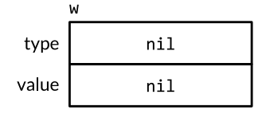

# 3.go语言的面向对象编程


# 方法(methods)

一个面向对象的程序会用方法来表达其属性和对应的操作，这样使用这个对象的用户就不需要直接操作对象，而是借助方法来做这些事情。

## 方法的声明

在函数声明时，在其名字之前放上一个变量，即是一个方法：

```go
func (identifier Type) name(parameter-list) (result-list) {
	body
}
```

其中`identifier`称为方法的*接收器*（*receiver*），Go并不会像其它语言那样用this或者self作为接收器，接收器名字可以自定义，例如：

```go
type Point struct{ X, Y float64 }

type func (p Point) Distance(q Point) float64 { 
	return math.Hypot(q.X-p.X, q.Y-p.Y)
}

func main(){
    p := Point{1, 2}
    q := Point{4, 6} 
    fmt.Println(p.Distance(q))
}
```

`p.Distance`表达式称为*选择器*（*selector*，又称选择子），因为会给p合适的名为Distance的方法执行（因为Distance方法可能不止一个）,选择器也可以用来选择结构类型中的某些字段值，如`p.X`。方法与字段在同一个命名空间，因此如果声明一个X方法是非法的。

go语言运行给任何类型定义方法，包括Go自带的各种类型，指针与接口除外。

## 指针作为参数的方法

有时为了避免实参拷贝为形参，就需要用到指针而不是对象来声明方法：

```go
func (p *Point) ScaleBy(factor float64) { 
	p.X *= factor 
    p.Y *= factor
}
```

这个方法的名字是`(*Point).ScaleBy`，其中括号是必须的，没有括号的这个表达式可能被理解为`*(Point.ScaleBy)`。只有类型（如`Point`）与指向它的指针类型（如`*Point`）是唯一可以出现在receiver声明处的类型。在声明方法的时候，如果一个类型本身是指针的话，不允许其出现在receiver中：

```go
type P *int 
func (P) f() { /* ... */ } // compile error: invalid receiver type
```

想要调用指针类型方法，只需要提供一个该类型的指针即可：

```go
p := Point{1, 2} 
pptr := &amp;p 
pptr.ScaleBy(2) 
fmt.Println(p) // &#34;{2, 4}&#34;
```

上述的操作可以更简单的表达，如果对上述的`p`直接执行`p.ScaleBy(2)`，编译器会隐式帮程序员用`&amp;p`调用`ScaleBy`方法：

```go
p := Point{1, 2} 
p.ScaleBy(2) 
fmt.Println(p) // &#34;{2, 4}&#34;
```

这种简单的方法只适用于变量，包括struct里面的成员变量（如`p.X`）以及数组或切片里面的元素（如某数组第一个元素`perim[0]`）,但是不能适用于取不了地址的receiver来调用指针方法：

```go
Point{1, 2}.ScaleBy(2) // compile error: can&#39;t take address of Point literal
```

但如果`*Point`类型的receiver来调用`Point`类型的方法是合法的，因为可以通过地址找到这个变量，只需加载receiver的指针指向的值即可，同理于上面`p`可以隐式插入`&amp;`符号取址，此时编译器也会对指针隐式插入`*`操作符进行取值，因此下面两个语句是等效的：

```go
pptr.Distance(q) 
(*pptr).Distance(q)
```

上述的过程进行总结如下：

&#43; 不管你的method的receiver是指针类型还是非指针类型，都是可以通过对应的指针/非指针类型进行调用的，编译器会帮你隐式做类型转换（只要可以取址或者可以取值）。
&#43; 在声明一个method的receiver该是指针还是非指针类型时，你需要考虑两方面的内部：
  &#43; 第一方面：这个对象本身是不是特别大，如果声明为非指针变量时，调用会产生一次拷贝
  &#43; 第二方面：是如果你用指针类型作为receiver，那么你一定要注意，这种指针类型指向的始终是一块内存地址，就算你对其进行了拷贝

## nil也是一个合法的receiver值

就像一些函数允许nil值的变量作为参数，方法也可以用nil指针作为receiver，尤其当nil对于对象来说说合法的零值时，如map或slice。但是不能直接使用`nil.method()`调用方法，因为nil字面量编译器无法判断其类型。

## 通过嵌入结构体来扩展类型

如果有结构体`ColorPoint`:

````go
type ColoredPoint struct { 
	Point 
	color.RGBA
}
````

该结构体嵌入了`Point`结构体，因此也“继承”了`Point`的方法，但是该方法的参数并不会自动变成`ColorPoint`：

```go
var p = ColoredPoint{Point{1, 1}, red}
var q = ColoredPoint{Point{5, 4}, blue}
p.Distance(q) // compile error: cannot use q (ColoredPoint) as Point
p.Distance(q.Point)
```

除非在`ColorPoint`内再写一遍`Distance`方法（如果此时仍然将方法命名为`Distance`则会发生对`Point.Distance`方法的覆盖）：

```go
func (p ColoredPoint) Distance(q ColoredPoint) float64 { 
	return p.Distance(q.Point)
}
```

嵌入结构体的方法查找顺序为：

&#43; 首先查找这个类型的方法
&#43; 接着是内嵌的结构体对应的方法
&#43; 如果内嵌结构体还有内嵌的结构，则递归查找下去

上述顺序找到就停止下一步的查找。

## 方法值和表达式（method value and expression）

**方法值：**

格式：`identifier.method`

对于常用的`p.Distance()`方式，其实可以分成两步：首先独立得到selector：`distanceFromP := p.Distance`，selector会返回一个*方法值*（*method value*）：一个将方法（`Point.Distance`）绑定到特定selector得到的函数。

&gt; 所以方法值本质上是一个函数

```go
p := Point{1, 2} 
q := Point{4, 6}
distanceFromP := p.Distance 		// method value
fmt.Println(distanceFromP(q))   	// &#34;5&#34;
var origin Point        	// {0, 0} 
fmt.Println(distanceFromP(origin)) 	// &#34;2.23606797749979&#34;, sqrt(5)

scaleP := p.ScaleBy // method value 
scaleP(2)			// p becomes (2, 4)
scaleP(3) 			// then (6, 12)
scaleP(10)			// then (60, 120)
```

如果包内的API调用一个函数值（如`distanceFromP`,`scaleP`），且希望这个函数变量主要用于调用一个特定的receiver（如`p`，`q`），方法值非常有效。

**方法表达式：**

格式：`Type.method`

与方法变量相关的还有*方法表达式*（*method expression*），调用一个方法时，与调用函数相比，需要提供selector，并根据对应的语法（如`p.Distance`）进行调用。对于类型`T`，方法表达式有`T.f`和`(*T).f`两种，这两种表达式得到的类型均为函数，这个函数将第一个参数作为receiver，余下的参数即对应方法的参数：

```go
p := Point{1, 2} 
q := Point{4, 6}
distance := Point.Distance 		// method expression 
fmt.Println(distance(p, q)) 	// &#34;5&#34; 
fmt.Printf(&#34;%T\n&#34;, distance) 	// &#34;func(Point, Point) float64&#34;

scale := (*Point).ScaleBy 
scale(&amp;p, 2) 
fmt.Println(p)					// &#34;{2 4}&#34; 
fmt.Printf(&#34;%T\n&#34;, scale) 	// &#34;func(*Point, float64)&#34;
```

如果需要在多个方法中经常使用某个特定类型`T`的某个特定的方法`f`，就可以将这个类型的方法单独用一个变量来表示（`e:=T.f`），这个变量就可以用方法表达式来得到，而所有的方法都属于同一种类型`T`，因此这个变量可以在不同情况更换不同的方法表达式得到的函数（从`e=T.f`到`e=T.g`）:

```go
type Point struct{ 
	X, Y float64 
}
func (p Point) Add(q Point) Point { 
    return Point{p.X &#43; q.X, p.Y &#43; q.Y} 
} 
func (p Point) Sub(q Point) Point { 
    return Point{p.X - q.X, p.Y - q.Y} 
} 
type Path []Point
func (path Path) TranslateBy(offset Point, add bool) { 
    var op func(p, q Point) Point 
    if add { 
        op = Point.Add
	} else { 
        op = Point.Sub
	} 
    for i := range path { // Call either path[i].Add(offset) or path[i].Sub(offset). 
        path[i] = op(path[i], offset)
	}
}
```

## 封装（encapsulation）

一个对象的变量或者方法如果对调用方是不可见的话，一般就被定义为“封装”。对于不可见性，go语言只有一个方式：大写首字母的标识符会从定义它们的包中被导出，小写字母的则不会，所以如果要封装一个对象，必须将其定义为一个struct：

```go
type IntSet struct { 
    words []uint64
}
```

这种基于名字的手段使得在go语言中的封装单位是包，而不是其他语言的类型，所以go语言的一个struct类型字段对同一个包的所有代码都可见。

封装提供了三方面的有点：

&#43; 调用方不能直接修改对象的变量值，只需要关注少量语句与变量
&#43; 隐藏实现细节
&#43; 最重要地，阻止外部包调用方对对象内部的值进行肆意修改，只允许按照一定的规则修改内容（比如setter，getter等）

go不禁止直接导出字段，但是一旦进行了导出，就无法在不改变API兼容性的情况下撤销导出（所以最初的设计需要额外小心）。

# 接口（interface）

接口类型是对其他类型行为的抽象和概括。go语言接口类型的独特之处在与它是满足隐式实现的，即我们没有必要对于给定的具体类型定义所有满足的接口类型，拥有一些必需的方法就够了。很多Go程序中都尽可能多的去使用标准库中的接口。

## 接口即约定

接口类型是一种抽象的类型，不会暴露他所代表的对象内部值的结构和这个对象支持的基础操作的集合，它们只会展示出它们自己的方法，所以，使用者使用接口对象时，接口类型封装和隐藏具体类型和它的值，即使该类型有其他的方法，接口类型也只能暴露接口定义的方法而不能使用其他方法。

## 接口的定义

接口定义的格式为：

```go
type T interface{
    Func(indentifier_list)(return_value_list)
}
```

接口也可以通过现有接口的组合进行定义,这种方法称为接口的嵌套：

```go
type Reader interface { 
    Read(p []byte) (n int, err error)
}
type Writer interface { 
    Write(p []byte) (n int, err error)
}

type ReadWriter interface { 
    Reader 
    Writer
}
```

当然也可以直接写在在内部：

```
type ReadWriter interface { 
    Read(p []byte) (n int, err error) 
    Write(p []byte) (n int, err error)
}
```

或者混搭：

```go
type ReadWriter interface { 
    Read(p []byte) (n int, err error) 
    Writer
}
```

上述的顺序也对接口的定义没有影响。

## 接口的实现

一个类型如果拥有一个接口需要的所有方法，那么这个类型就实现了这个接口。接口指定的规则非常简单：表达一个类型属于某个接口只要这个类型实现这个接口。

```go
// 对于空接口，什么方法都不需要实现
var any interface{} 
any = true 
any = 12.34 
any = &#34;hello&#34; 
any = map[string]int{&#34;one&#34;: 1} 
any = new(bytes.Buffer)
```

非空的接口类型通常由一个指针类型来实现的，特别是当接口类型一个或多个方法暗示会修改receiver的情况（如`Write`函数）。

注意：

&#43; 虽然对于指针方法，编译器会隐式转换`(*Type).method`与`Type.method`，但是这两个方法是不一样的，所以实现某个接口的时候这两个方法会被当做两个不同方法

## 接口值

概念上讲，接口之由两个部分组成：一个具体类型和该类型的一个值，二者称为接口的*动态类型*（*dynamic type*）与*动态值*（*dynamic value*）。提供每个类型信息的值被称为类型描述符（type descriptor），比如类型的名称和方法。 在一个接口值中，类型部分代表与之相关类型的类型描述符。

### 接口的零值

一个接口的零值为`nil`，此时动态类型与动态值均为`nil`：



比如对于接口w，只要执行`w=nil`，即可使w设置为零值。

值得注意的是，一个不包含任何值的nil接口值和一个刚好包含nil指针的接口值是不同的，所以，动态类型不为空，而动态值为空的时候，接口也不为空：


此时如果对上面的w进行写操作会导致panic，因为该指针为空，无法写入内容。

### 接口的使用

随着接口变量的赋值与操作，接口的动态类型与动态值可能会变化：

```go
var w io.Writer			//接口类型：io.Writer 动态类型：nil 动态值：nil
w = os.Stdout			//接口类型：io.Writer 动态类型：*os.File 动态值：os.Stdout
//上句等价于：w = io.Writer(os.Stdout)
w = new(bytes.Buffer) 	//接口类型：io.Writer 动态类型：*bytes.Buffer 动态值：bytes.Buffer指针值，此时buffer里为空
w = nil					//接口类型：nil 动态类型：nil 动态值：nil
```

一个接口值可以持有任意大的动态值。从概念上讲，不论接口值多大，动态值总是可以容下它。

### 接口的可比较性

接口类型与众不同，接口有时候是可比较的，有时是不可比较的。如果该动态类型是不可比较的，那么就会出现panic，当接口类型可比较，接口值可以使用`==`和`!=`来进行比较,两个接口值相等仅当它们都是`nil`值或者它们的动态类型与动态值相等。

## 类型断言

*类型断言*（*Type Assertions*）用来从它的操作数中把具体类型的值提取出来，类型断言会检查作为操作数的动态类型是否满足指定的断言类型。类型断言作用于接口值，格式为：`x.(T)`，其中`x`是一个接口类型的变量，`T`是一个类型。

如果`T`是一个具体的类型，则会判断`x`的动态类型是否为`T`类型，如果是则类型断言的结果就是`x`的动态值，否则会panic：

```go
var w io.Writer 
w = os.Stdout 
f := w.(*os.File)// success: f == os.Stdout 
c := w.(*bytes.Buffer) // panic: interface holds *os.File, not *bytes.Buffer
```

如果`T`是接口类型， 则会断言检查`x`的动态类型是否满足T接口，如果满足，动态值并不会提取出来，而是返回与动态类型与动态值相等的该类型接口的接口值，如果该动态类型不满足接口所需的方法，则会panic：

```go
var w io.Reader
w = os.Stdout
f := w.(io.ReadWriter)//f的接口类型变为了io.ReadWriter,f的动态类型为*os.File
f.Write([]byte(&#34;asd&#34;))//此时输出“asd”

w = new(ByteCounter) 
rw = w.(io.ReadWriter) // panic: *ByteCounter has no Read method
```

如果断言操作的对象是一个`nil`接口值，那么不论被断言的类型是什么这个类型断言都会失败。一般的操作是将接口转化为要求更严格的接口，很少要从一个接口类型向一个要求更宽松的类型做类型断言（即更少的方法，且方法集合是子集），因为除了操作`nil`之外，其他情况与赋值一致。

如果类型断言出现在一个有两个返回值的赋值操作中，则第二个参数表示成功与否的布尔值，这个操作不会在失败的时候发生panic：

```go
var w io.Writer = os.Stdout 
f, ok := w.(*os.File)// success: ok, f == os.Stdout 
b, ok := w.(*bytes.Buffer) // failure: !ok, b == nil
```

当类型断言操针对象是一个变量的时候，可以将该变量覆盖使用：

```go
if w, ok := w.(*os.File); ok { 
    // ...use w...
}
```


