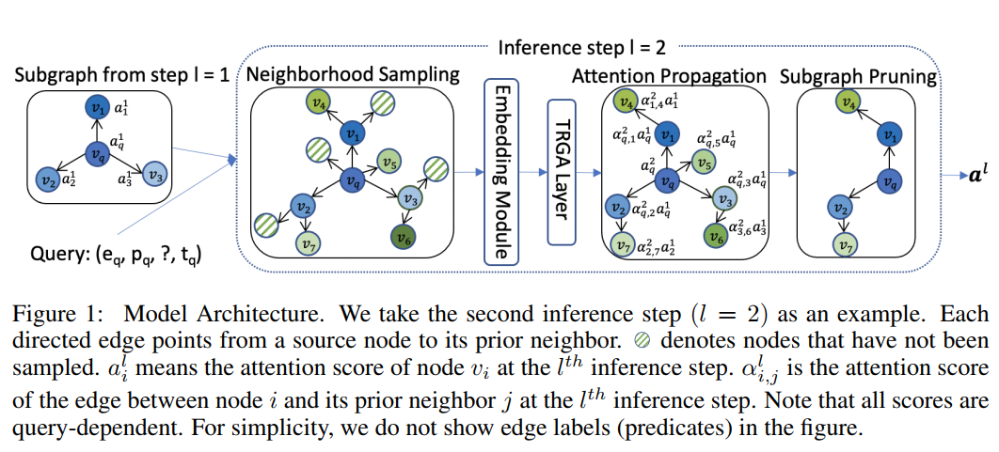
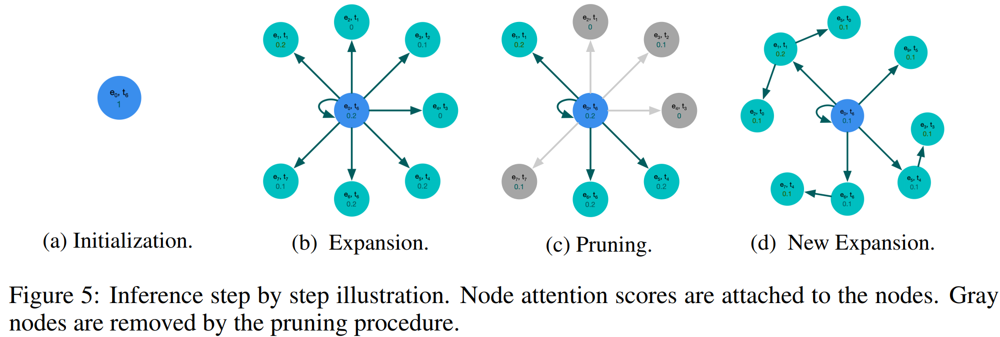
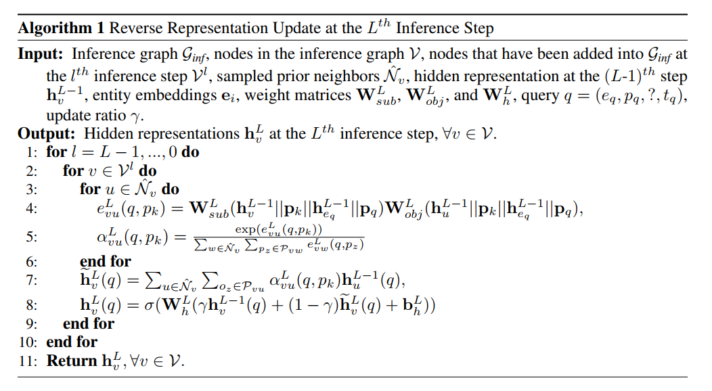
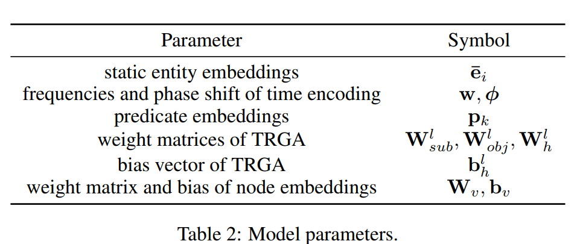
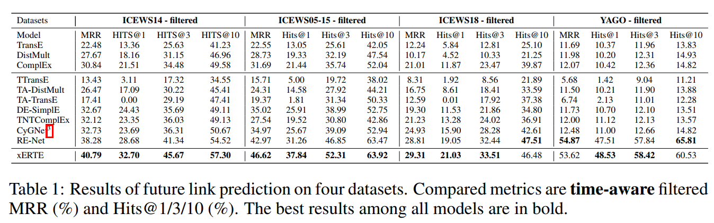
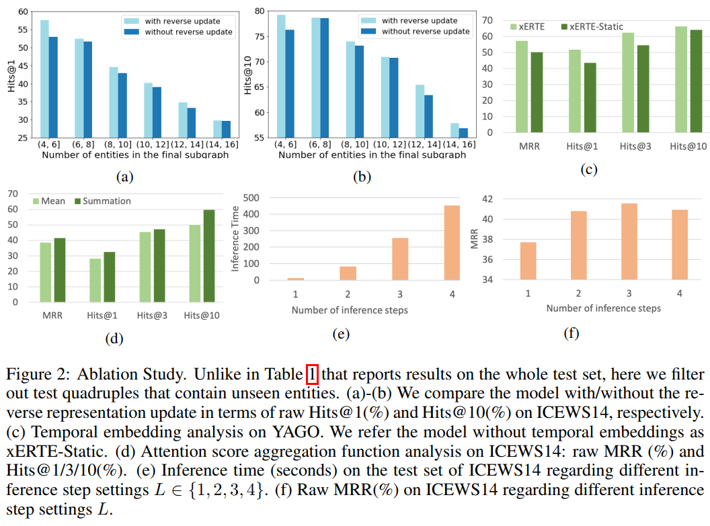
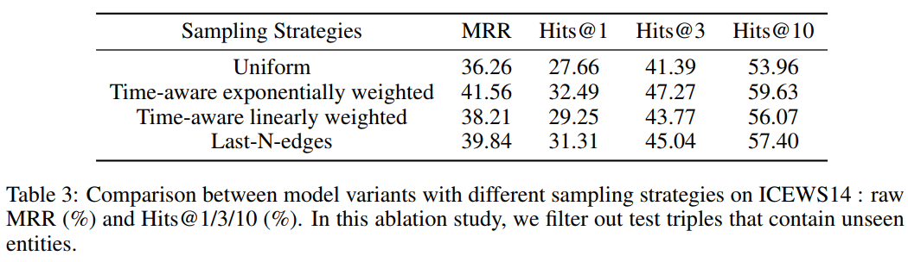
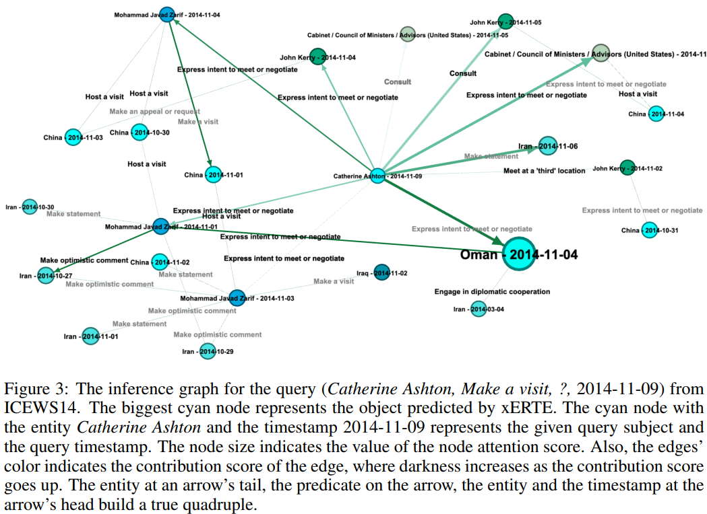

# xERTE

explainable subgraph reasoning for forecasting on temporal knowledge graphs[^4]
&lt;!--more--&gt;
## xERTE

贡献：

&#43; 第一个可解释的预测未来链接的时序知识图谱模型，该模型基于时序关系注意力机制，保留了时序多关系的因果性质的数据
&#43; 不像大多数黑盒基于嵌入的模型，xERTE将推理过程可视化并且提供了可解释的推理图突出重要的线索
&#43; 动态剪枝过程让模型能在大规模的时序图谱上推理

&#43; 对53名受访者进行调研，以评估所提取的证据是否符合人类的理解

符号定义：

| 符号                             | 含义                                                         |
| -------------------------------- | ------------------------------------------------------------ |
| $\mathcal{E,P}$                      | 实体和谓词的集合                                             |
| $\mathcal{F}$                        | 已知事实的集合                                               |
| $\mathcal{G}_{inf}$                  | 一个推理图，图中的节点表示实体-时刻对$v=(e_i,t),e_i\in\mathcal{E}$ |
| $\mathcal{N}_{v}$                | 节点v的单跳前驱邻居节点$\mathcal{N}_ {v=(e_{i},t)}=\\{(e_{j},t^{\prime})\|(e_{i},p_{k},e_{j},t^{\prime})\in\mathcal{F}\wedge(t^{\prime}\lt t)\\}$，包括逆关系[^2]得到的前驱节点 |
| $\overline{{{\mathcal{N}}}}_{v}$ | 节点v的单跳后继邻居节点$\overline{{{\mathcal{N}}}}_ {v=(e_{i},t)}=\\{(e_{j},t^{\prime})\|(e_{j},p_{k},e_{i},t)\in{\mathcal{F}}\wedge(t^{\prime}&gt;t)\\}$，包括逆关系得到的前驱节点 |
| $$\mathcal{Q}_ {v}$$与$q_v$       | $\mathcal{Q}_ {v}$是节点v和$\mathcal{N}_ {v}$之间边的集合，$q_v\in \mathcal{Q}_ {v}$ |

### 模型架构

&gt; [^2]: 在主流的时序图谱上本论文增加了逆关系：即对于四元组$(e_{s},p,e_{o},t)$​，加入$(e_{o},p^{-1},e_{s},t)$​，这样客实体的识别就不会失去一般性。

**子图推理过程**

1. neighborhood sampling：给定查询$q=(e_{q},p_{q},?,t_{q})$，初始的$\mathcal{G}_ {inf}$为只有一个节点$v_{q}\ =\ (e_{q},t_{q})$的图，通过对$v_q$的前驱节点进行取样来扩大$\mathcal{G}_ {inf}$:比如存在事实$(e_{q},p_{k},e_{j},t^{\prime}),t^{\prime}&lt;t_q$，那么将节点$v_{1}=\left(e_{j},t^{\prime}\right)$加入$\mathcal{G}_ {inf}$,并把其与$v_q$进行连接,从$v_q$到$v_1$，标签为$p_k$。
2. embedding  module：使用一个**嵌入模型**（embedding module）来使$\mathcal{G}_ {inf}$中的节点和谓词分配一个时序的嵌入，嵌入模型的主要思想是让节点得到查询无关的信息，并且得到图结构的整体信息，因为接下来的时序关系图神经层（temporal relational graph attention，**TRGA**）只在局部执行查询无关的消息传递。

3. TRGA layer：将节点和谓词的嵌入作为输入，在小的推理图上通过消息传递给每个节点产生一个查询无关的表示。
4. attention propagate：通过边的注意力分数将每个节点的注意力传递给前驱节点。
5. subgraph pruning：通过对$\mathcal{G}_ {inf}$的前驱节点采样扩张$\mathcal{G}_ {inf}$,为了防止推理图在不断扩张后快速增长，需要对边进行剪枝。

在进行L次推理步骤后，模型会选择最高注意力分数的实体作为查询中缺失的客实体，同时推理图本身会作为一个图形化的对推理的解释。

子图推理过程如下：

初始化图为查询节点(a)，通过采样前驱节点进行扩张推理图(b)，为防止指数级扩张，对图进行剪枝(c)，接下来再次对剪枝后剩余的节点同样进一步扩张(d)，经过L次这样的迭代，模型选择得到图中最高注意力得分的节点作为缺失查询的客实体，而图本身则可以作为一个解释的图形化。

**neighborhood sampling**

为了降低复杂度，每步推理都对前向边的进行取样，得到子集$\hat{\mathcal{Q}}_ {v}\in{\mathcal{Q}}_ {v}$，将采样得到的节点v的前驱邻居与后继邻居记为${\hat{\mathcal{N}}}_ {v}$和$\overline {\hat{\mathcal{N}}_ {v}}$，注意：由于可能存在多个谓词，因此节点v和前驱节点u之间可能有多个边。

采样有三个策略：

&#43; 均一采样：每个被采样的概率都是一样的：$\mathbb{P}(q_{v})=1\ {\big/} |\mathcal{Q} _{v}|$

&#43; 时序感知的指数重采样：通过指数分布分配概率：
  &lt;div&gt;
  $$
    \mathbb{P}(q_{v}=(e_{i},p_{k},e_{j},t^{\prime}))\\\\
    =\frac{\exp(t^{\prime}-t)}{\sum_{(e_{i},p_{l},e_{m},t^{\prime\prime}){\in}{\mathcal Q}_{v}}\exp(t^{\prime\prime}-t)}
  $$
  &lt;/div&gt;

  其中$t^{\prime}$和$t^{\prime\prime}$都小于$t$。

&#43; 时序感知的线性权重采样：久远的事件有更大的可能被采样，明显不合理。

后续消融实验表明第二个采样策略效果最好。

**embedding module**

使用了TGAT[^1]的思想，使用相对时间建模。每个实体的嵌入为：${\mathbf{e}}_ {i}(t)=[\bar{{\mathbf{e}}}_ {i}]\mathbf{\Phi(t)}]^{T}\in\mathbb{R}^{d_{S}&#43;d_{T}}$,其中$\bar{\mathbf{e}}_{i}\ \in\ R^{d_S}$表示时序不变的静态嵌入信息以及全局依赖。

**TRGA layer**

输入：节点的嵌入$\mathbf{e}_i(t)$以及边$\mathbf{p}_k$的嵌入。

TRGA层给每个边查询无关的注意力并将新隐藏表示作为输出。与graphSAGE和GAT相似，TRGA层使用了本地表示的汇聚。为了防止错误使用未来信息，只允许前驱结点向后驱节点的消息传递：即对于结点v，汇聚函数只使用节点v以及${\hat{\mathcal N}}_{v}$的表示来汇聚。

由于每个节点的谓语不一样可能会导致节点不同的含义，所以在注意力函数中加入谓语的嵌入来引入关系信息。将查询信息引入,并计算查询无关的注意力分数来对不同前驱节点$u\in{\hat{\mathcal N}}_ {v}$分配不同的重要程度:
&lt;div&gt;
$$
e_{v u}^{l}(q,p_{k})={\bf W}_{s u b}^{l}({\bf h}_{v}^{l-1}||{\bf p}_{k}^{l-1}||{\bf h}_{e_{q}}^{l-1}||{\bf p}_{q}^{l-1}){\bf w}_{o b j}^{l}({\bf h}_{u}^{l-1}||{\bf p}_{k}^{l-1}||{\bf h}_{e_{q}}^{l-1}||{\bf p}_{q}^{l-1})
$$
&lt;/div&gt;
$e_{v u}^{l}(q,p_{k})$是边$(v,p_k,u)$的注意力得分，$\mathbf{h}_{v}^{l-1}$表示节点v第l-1步推理的隐藏表示，当l=1，即最开始一层${\bf h}_{v}^{0}={\bf W}_{v}{\bf e}_{i}(t)&#43;{\bf b}_{v}$，$v=(e_i,t)$，注意力得分$\alpha_{v u}^{l}(q,p_{k})$由其softmax得到：
&lt;div&gt;
$$
\alpha_{v u}^{l}(q,p_{k})=\frac{\exp(e_{v u}^{l}(q,p_{k}))}{\sum_{u\in\hat{N}_{v}}\sum_{p_{z}\in{\mathcal P}_{v w}}\exp(e_{v w}^{l}(q,p_{z}))},
$$
&lt;/div&gt;
$\mathcal{P}_{vw}$表示连接节点v，w的边的标签，接下来用softmax归一化后的注意力得分更新前驱节点的表示：
&lt;div&gt;
$$
\tilde{\bf h}_{v}^{l}(q) =\sum_{u\in\hat{\mathcal{N}}_{v}}\sum_{p_{k}\in{\mathcal P}_{v u}}^{l}\alpha_{v u}^{l}(q,p_{k}){\bf h}_{u}^{l-1}(q).
$$
&lt;/div&gt;
接下来将${\bf h}_{u}^{l-1}(q)$和$\tilde{\bf h}_{v}^{l}(q)$结合：
$$
\mathrm{h}_{v}^{l}(q)=\sigma(\mathbf{W}_{h}^{l}(\gamma\mathbf{h}_{v}^{l-1}(q)&#43;(1-\gamma)\tilde{\mathbf{h}}_{v}^{l}(q)&#43;\mathbf{b}_{h}^{l})),
$$
另外，使用同样的TRGA更新关系的嵌入，利用${\mathbf{p}}_{k}^{l}\ =\mathbf{W}_{h}^{l}\mathbf{p}_{k}^{l-1}&#43;\mathbf{b}_{h}^{l}$使得关系被投影到与节点相同的嵌入空间。

**attention propagation and subgraph pruning**

接下来计算在l步推理中结点v与查询q的注意力得分：
&lt;div&gt;
$$
a_{v,q}^{l}=\sum_{u\in\overline{\hat{N}}_{v}}\sum_{p_{z}\in{\mathcal P}_{u v}}\alpha_{u v}^{l}(q,p_{z})a_{u,q}^{l-1}.
$$
&lt;/div&gt;
接着将每个节点传递给的注意力传递给前驱节点，因为每个节点都是实体-时刻对，为了给每个实体一个独特的注意力得分，节点中实体相同的节点进行统一的注意力汇聚：
&lt;div&gt;
$$
a_{e_{i,q}}^{l}= g(a_{v,q}^{l}|v(e)= e_{i}),\ \ \mathrm{for}\,v\in\mathcal{V}_{\mathcal{G}_{i n f}},
$$
&lt;/div&gt;
$a_{e_{i,q}}^{l}$表示实体$e_i$的注意力得分，$v(e)$表示节点v的实体，论文尝试了加和汇聚和平均汇聚，消融实验表明加和汇聚表现更好。

为了表明哪个事实证据对推理过程重要，论文给推理图中的每个边$(v,p_k,u)$一个贡献分:$c_{v u}^{\phantom{a}}(q,p_{k})\,=\,\alpha_{v u}^{l}(q,p_{k})a_{v,q}^{l}$，u为v的在$p_k$前驱节点，在每一步只保留贡献值最大的K个边来对图进行剪枝。对于$\mathcal{G}_{i n f}$中不存在的实体，将其注意力得分设置为0,最后将候选实体进行排序取最高得分实体作为预测。

**reverse representation update mechanism**

为了模仿人类推理的行为，我们需要确保$\mathcal{G}_ {inf}$所有节点能考虑到新加入的节点的消息，然而因为每步推理都会扩张$\mathcal{G}_ {inf}$，所以在第l步可能会包含查询节点l跳的邻居节点如果直接沿着路径进行，那么计算量就会指数级上升，因此采用反向的表示更新机制，具体的算法如下：

**训练学习过程**

通过时间段的不同将数据集分为三部分，训练集的时间点&lt;验证集的时间点&lt;测试集的时间点，使用交叉熵来作为损失函数：
&lt;div&gt;
$$
{\mathcal{L}}=-{\frac{1}{|\mathcal{Q}|}}\sum_{q\in\mathcal{Q}}{\frac{1}{|{\mathcal{E}}_{q}^{i n f}|}}\sum_{e_{i}\in{\mathcal{E}}_{q}^{i n f}}\left(y_{e_i,q}\log({\frac{a_{e_i,q}^{L}}{\sum_{e_{j}\in{\mathcal{E}}_{q}^{i n f}}a_{e_{j,q}}^{L}}})&#43;(1-y_{e_i,q})\log(1-{\frac{a_{e,q}^{L}}{\sum_{e_{j}\in{\mathcal{E}}_{q}^{i u f}\,a_{e_i,q}^{L}}}})\right),
$$
&lt;/div&gt;
其中$\mathcal{E}_q^{inf}$表示查询q的推理图中实体的集合，$y_{e_i,q}$表示$e_i$是否为q的答案的二元标签，Q代表训练集四元组，所有模型参数如下表所示：

### 实验结果

使用了time-aware filtered评价指标[^3]作为依据。

**消融实验**

**反向表示更新机制**的影响如下图(a)(b)，当一个查询主体只有很少的邻居时影响会很大；**相对时间编码**的影响如图(c)(d)所示；**推理步数**对训练时间和精度影响如(d)(e)所示：

**采样策略**对精度的影响：

**可解释性的图像化**

[^1]: Xu D, Ruan C, Korpeoglu E, et al. Inductive representation learning on temporal graphs[J]. arXiv preprint arXiv:2002.07962, 2020.https://tabuless.github.io/tgat/
[^3]: [知识图谱常用评价指标 - Tabuless](https://tabuless.github.io/评价指标/)
[^4]:Han Z, Chen P, Ma Y, et al. Explainable subgraph reasoning for forecasting on temporal knowledge graphs[C]//International Conference on Learning Representations. 2020.
