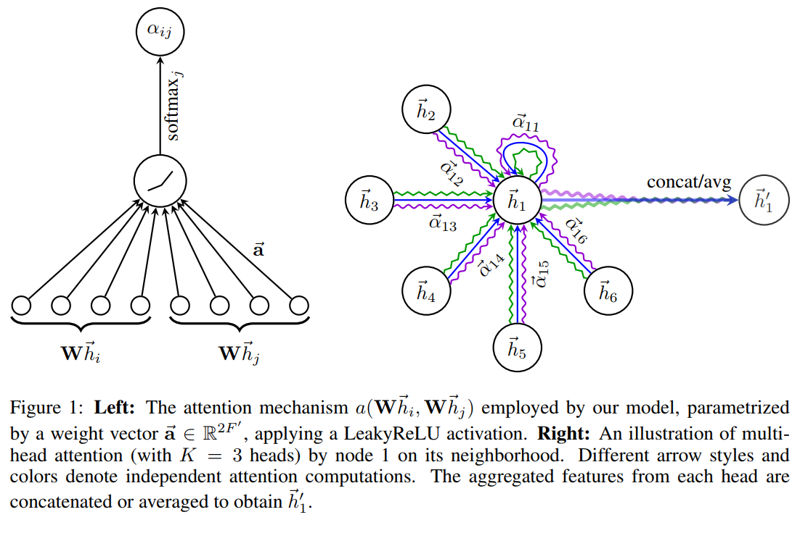
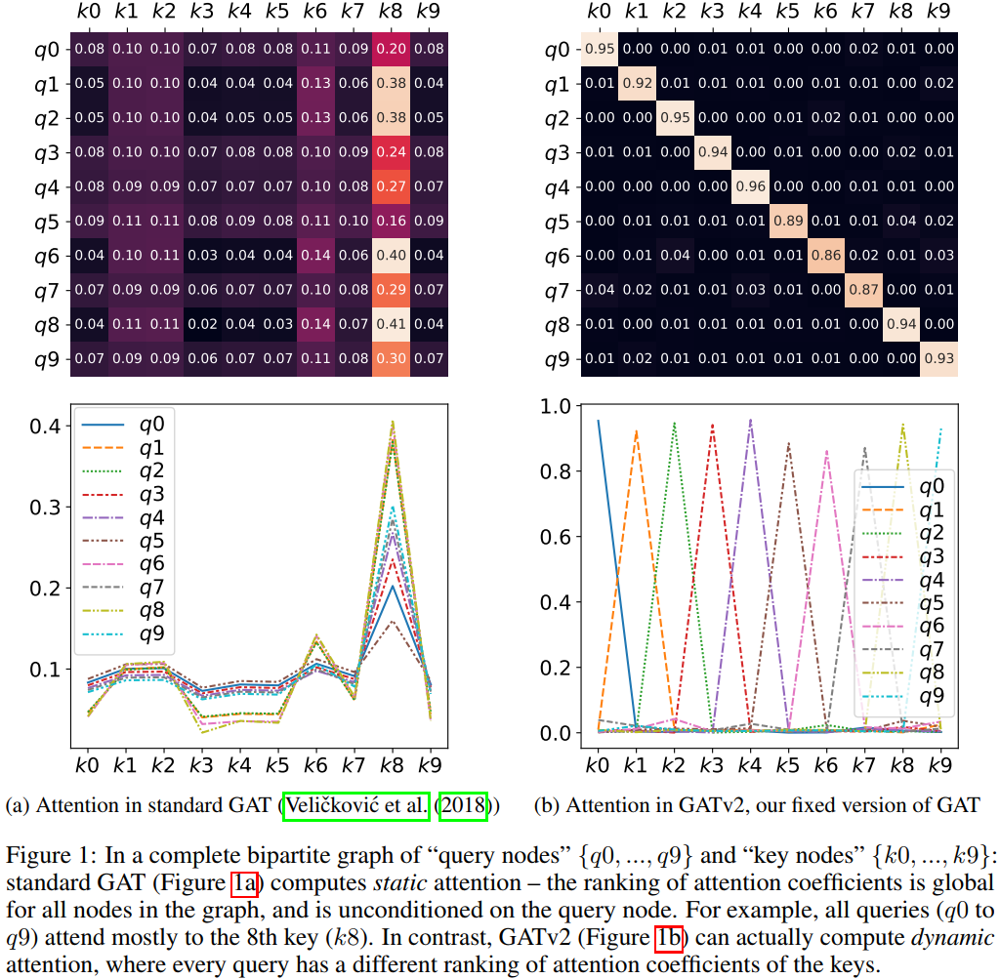

# GAT&amp;GATv2

## GAT[^1]

graph attention network，用于解决图结构数据的分类问题。主要思想是通过计算与其相邻的节点的关系（self-attention机制）计算每个节点的表示方法。

attention机制的优点：

&#43; 不同相邻节点对可以并行操作
&#43; 通过不同的权重表示不同的度（degree）的节点
&#43; inductive learning

&gt; **inductive**:如果训练数据不包括测试集，如经典样本独立的supervised learning
&gt;
&gt; **transductive**:如果训练数据包括测试集（无标注），如样本间有连接的LPA算法

### graph attention layer

GAT每层成为graph attention layer：

单层输入、输出为节点的特征（feature）：
$$
输入：\mathbf{h} = \{ \overrightarrow{h_1}, \overrightarrow{h_2}, \dots, \overrightarrow{h_N} \}, \overrightarrow{h_i} \in \mathbb{R}^F\\
输出：\mathbf{h&#39;} = \{ \overrightarrow{h&#39;_1}, \overrightarrow{h&#39;_2}, \dots, \overrightarrow{h&#39;_N} \},\overrightarrow{h&#39;_i} \in \mathbb{R}^{F&#39;}
$$

| *F/F&#39;* | *每个节点的输入/输出特征* |
| ------ | ------------------------- |
| *h/h&#39;* | *输入/输出节点的特征集合* |
| *N*    | *节点个数*                |

#### attention的计算

首先计算attention系数：
$$
e_{ij} = a(\mathbf{W} \overrightarrow{h_i}, \mathbf{W} \overrightarrow{h_j})，j\in \mathcal{N}_i
$$

| 符号            | 含义                                                         |
| --------------- | ------------------------------------------------------------ |
| $e_{ij}$        | 节点i与j之间的attention系数（attention coefficient）         |
| a               | $\mathbb{R}^{F&#39;}\times \mathbb{R}^{F&#39;}\rightarrow \mathbb{R}$ 的attention机制，表示节点j对i的重要性，最简单的a是一个单层全连接神经网络（FFN） |
| $\mathcal{N}_i$ | i的相邻节点                                                  |

&gt; $\mathcal{N}_i$是attention引入图的一个核心概念，因为不相邻的节点没有直接联系

论文中论文中使用$\overrightarrow{a}\in \mathbb{R}^{2F&#39;}$，并且应用`LeakyReLU`：
$$
e_{ij} = \text{LeakyReLU} \Big( \overrightarrow{\mathbf{a}}^\top \Big[\mathbf{W} \overrightarrow{h_i}|| \mathbf{W} \overrightarrow{h_j} \Big] \Big)
$$
其中`||`是concat操作。

为了让attention 系数在不同节点之间有可比较性，进行一次softmax：
$$
\alpha_{ij} = \text{softmax}_j(e_{ij}) = \frac{\exp(e_{ij})}{\sum_{j \in \mathcal{N}_i} \exp(e_{ij})}
$$
上述的$\alpha_{ij}$指的就是节点i与节点j之间的attention。

#### 加入激活函数

对于多头的注意力机制，假如有$K$个头，则第$k$头的输出$\overrightarrow{h&#39;^k_i}$为：
$$
\overrightarrow{h&#39;^k_i} =\sigma \Big (\sum_{j \in \mathcal{N}_i} \alpha^k_{ij} \mathbf{W}^k \overrightarrow{h_j} \Big )
$$
最后通过一个concat操作得到最终的多头attention的单层输出：
$$
\overrightarrow{h&#39;_i} = \Bigg\Vert_{k=1}^{K} \overrightarrow{h&#39;^k_i}
$$

### GAT最后一层

如果在最后一层的话multi-head的concat操作不再敏感，一般不会concat，而是对每个head取平均，把非线性层（softmax或者sigmoid）放在最后进行操作：
$$
\overrightarrow{h_i&#39;} =\sigma \Big (\frac{1}{K}\sum_{k=1}^{K}\sum_{j \in \mathcal{N}_i} \alpha^k_{ij} \mathbf{W}^k \overrightarrow{h_j} \Big )
$$

### GAT和GCN的比较

&#43; 计算高效，所有的相邻节点之间的attention可以并行计算
&#43; 给不同相邻节点间赋值不同的重要性

代码示例：&lt;https://nn.labml.ai/graphs/gat/index.html&gt;

## GATv2[^2]

在GAT中，每个节点通过使用自己的representation作为query，根据其邻居节点更新其representation。通过让每个节点计算邻居节点之间的加权平均得到最相关的节点，产生了很多典型的average-pooling和max-pooling。

但是GATv2的作者认为GAT没有真正计算真正的注意力，GAT的注意力被定义为静态注意力（static attention），真正的注意力被他们称之为*动态*注意力（*dynamic* attention）。

通过修改GAT中的操作顺序，GATv2实现了一个通用的近似注意函数，因此严格来说比GAT更强大。

#### 静态/动态注意力（static/dynamic attention）

GAT中，对于任意的节点（query），attention函数是关于邻接节点（key）单调（monotonic）的：对于一组keys，如果不同的query对这组keys进行attention，得到的attention分数排名不变，那么这个attention函数就是静态的。如下图所示。

**静态注意力的定义**：已知一个key的集合$\mathbb{K}=\{k_1,k_2,...,k_n\}\subset \mathbb{R}^d$与query集合$\mathbb{Q}=\{q_1,q_2,...,q_m\}\subset \mathbb{R}^d$，对于一个打分函数族$\mathcal{F}\subseteq (\mathbb{R}^d\times\mathbb{R}^d \rightarrow \mathbb{R})$，如果对于$\forall f\in\mathcal{F}$，存在一个“最高分数”的key $j_f\in [n]$，使得对每个query $i\in [m]$与key $j\in [n]$有：$f ( q _{ i } , k_ { j_f } ) \geq f ( q _{ i } , k_ { j } )$恒成立，则称该函数族为$\mathbb{K}$与$\mathbb{Q}$的**静态注意力的函数族**。

**动态注意力的定义**：已知一个key的集合$\mathbb{K}=\{k_1,k_2,...,k_n\}\subset \mathbb{R}^d$与query集合$\mathbb{Q}=\{q_1,q_2,...,q_m\}\subset \mathbb{R}^d$，对于一个打分函数族$\mathcal{F}\subseteq (\mathbb{R}^d\times\mathbb{R}^d \rightarrow \mathbb{R})$，如果对任何的映射$\varphi : [ m ] \rightarrow [ n ]$存在$f\in\mathcal{F}$使得对任何的query $i\in [m]$与key $j_{\neq \varphi(i)}\in [n]$有$f ( q_ { i } , k _{\varphi (i)} ) \geq f ( q_ { i } , k _ { j } )$，则称该函数族为$\mathbb{K}$与$\mathbb{Q}$的**动态注意力的函数族**。

GAT是静态注意力的证明比较简单，大致思路是将计算$e_{ij}$的$\overrightarrow{a}$进行分块：$\overrightarrow{a}=[a_1||a_2]$，则有：
$$
e_{ij} = \text{LeakyReLU} \Big( \overrightarrow{\mathbf{a}}^\top \Big[\mathbf{W} \overrightarrow{h_i}|| \mathbf{W} \overrightarrow{h_j} \Big] \Big)\\
=\text{LeakyReLU} \Big( [a_1||a_2]^\top \Big[\mathbf{W} \overrightarrow{h_i}|| \mathbf{W} \overrightarrow{h_j} \Big] \Big)\\
=\text{LeakyReLU} \Big( [a_1^\top \mathbf{W} h_i&#43; a_2^\top \mathbf{W} h_j \Big)
$$
证明得到的结论是：$s_j=a_2^\top \mathbf{W} h_j$对于任何的query节点（$h_i$）来说，最大值都是不变的，$s_i=a_1^\top \mathbf{W} h_i$这一项仅仅表征了图像的陡峭程度（如图figure 1a）。

#### GATv2的动态注意力

GAT之所以会是静态的原因在于$W和a$是连乘的，会坍缩为一个先行层，进行如下的改进：

| GAT   | $e(h_i,h_j) = \text{LeakyReLU} \Big( \overrightarrow{\mathbf{a}}^\top \Big[\mathbf{W} \overrightarrow{h_i}||\mathbf{W} \overrightarrow{h_j} \Big] \Big)$ |
| ----- | ------------------------------------------------------------ |
| GATv2 | $e(h_i,h_j) = \overrightarrow{\mathbf{a}}^\top\text{LeakyReLU} \Big(\mathbf{W}\Big[ \overrightarrow{h_i}||\overrightarrow{h_j} \Big] \Big)$ |

#### 如何选择GAT与GATv2

一般来说很难预先知道两个模型哪个更好，理论上更差的模型可能实际上表现更好，因为可能会产生过拟合等问题，因此作者认为节点之间的交互越复杂那么理论上GATv2会有更好的效果：如果某个问题有全局排序那么GAT可能会好一点，如果不同节点有不同的排序那么GATv2会更好一点。

GAT的作者也是在Twitter上说明了GAT是针对容易过拟合的数据集进行设计的（如cora，citeseer等）。

[^1]: Veličković P, Cucurull G, Casanova A, et al. Graph Attention Networks[C]//International Conference on Learning Representations. 2018.
[^2]: Brody S, Alon U, Yahav E. How attentive are graph attention networks?[J]. arXiv preprint arXiv:2105.14491, 2021.

