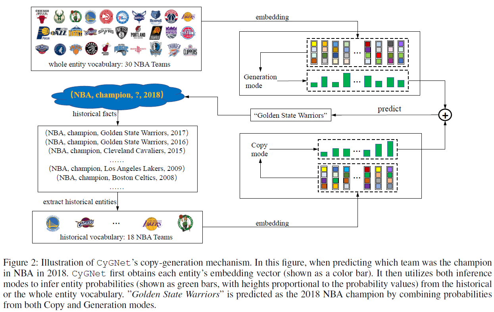
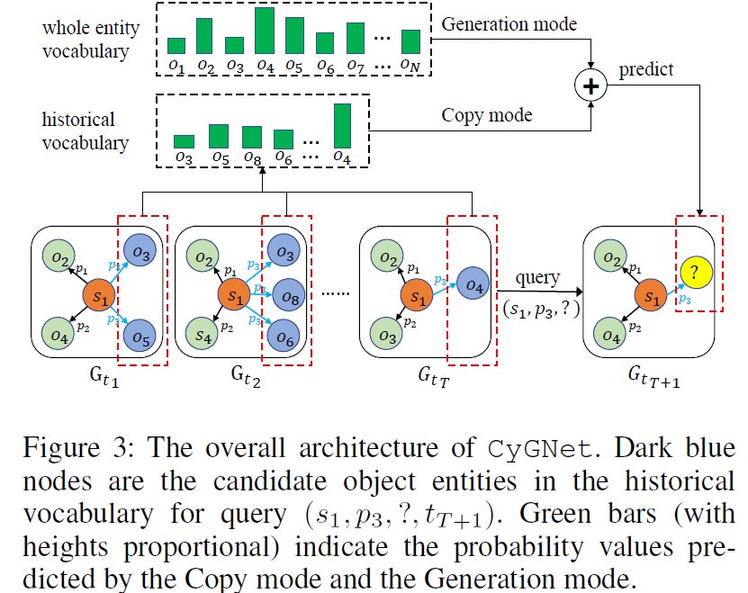
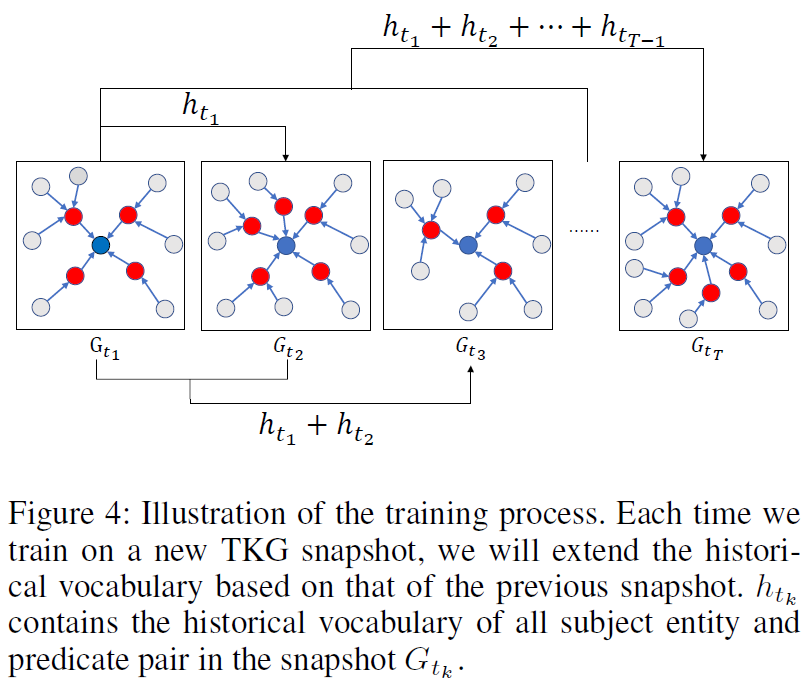

# CyGNet

# CyGNet：从历史数据中进行预测

Zhu等人提出了CyGNet（时序复制生成网络，Temporal **C**op**y**-**G**eneration **Net**work），作者认为许多事实常常会随着时间展现出重复，例如金融危机或外交活动等。这样的观察发现暗示我们模型有潜力去学习更多的在历史中出现的已知知识。为了这个目的，作者提出了一个新的时序提出了新的时序知识图谱的表征学习模型CyGNet。该模型基于一个新颖的时间感知副本生成机制，它不仅可以根据全部的实体词库预测事件，还能够识别重复的事实并且相应地预测与过去已知事件相关的未来事实。作者在5个基准数据集上对提出的模型进行了评估，实验证明了CyGNet的有效性。

CyGNet由两种推断模式组成，即**复制模式**和**生成模式**。图中用2018年NBA冠军的示例预测说明了CyGNet的两种推断模式。因此，2018年之前的所有18名NBA冠军团队都被收集为历史实体词汇，个实体组共包含有30个NBA球队。为了完成查询（NBA，冠军，？，2018），CyGNet利用复制模式来预测来自已知实体词汇表的实体概率，并采用生成模式来推断来自整个实体词汇表的实体概率。然后，将两个概率分布组合为最终预测。一个CyGNet的示例流程如图所示。

时序知识图谱在传统的知识图谱中包含时间信息。在时序知识图谱中，每个事实在时间$t \in T$确定了对于主实体$s\in E$和客实体$o \in E$之间的关系$p \in R$，其中$E,R$表示相应的实体和关系的词典中，$T$表示时间戳的集合。$s,p,o,t$表示主实体，谓词p，客实体o，以及时间t是一个时序事实。$G_t$是时序知识图谱在t时刻的快照，$g=(s,p,o,t)$表示一个$G_t$的四元组（事实）。一个时序知识图谱TKG建立在一组事实四元组之上，这些四元组根据它们的时间戳按顺序递增排列。即：$G=\{G_1,G_2,...,G_T\}$,其中相同的冗余四元组被删除。对每个主语实体-谓语对在时间$t_k$（即$(s,p,t_k)$），定义一个分隔的子集$E$（被称为$(s,p,t_k)$的历史词汇），记作$H_{t_k}^{(s,p)}$，其中包含在$t_k$前的已知的沿着一系列快照$G_{(t_1,t_{k-1})}=\{G_1,G_2,...G_{k-1}\}$中的主实体$s$，谓词$p$，被当做事实中的客实体。历史词汇$H_{t_k}^{(s,p)}$是一个N维的多热向量指标，N是E的基，在历史词汇中的实体被记为1其余的记为0。对一个缺失的时刻时间目标是:给定$(s,p,?,t)$推测出缺失的客实体，或者$(?,p,o,t)$推测出主体，或者给定的主实体和客实体的$(s,?,o,t)$推测出谓词。在不丧失一般性的情况下，**我们将我们的模型描述为预测时间事实中缺失的客实体，尽管该模型可以很容易地扩展到预测其他元素，包括主实体和谓词。**

模型结合了两种推断模式，即复制模式和生成模式，其中前者寻求从一个特定历史词汇中选择实体，在后面预测整个实体词汇表中的实体，在历史中形成重复的事实。当预测一个四元组$(s_1,p_3,?,T&#43;1)$如图所示，复制模式应推断在主实体为$s_1$，谓词为$p_3$，沿着事实构成的快照序列$G_{(t_1,t_T)}$中，被作为客实体的历史词汇表的$\{s_3,s_4,s_5,...s_m\}$中实体的概率。另一方面，生成模式估计整个实体词汇表中每个实体的概率以应答查询。然后，CyGNet将复制模式和生成模式的概率预测结合起来，输出最终预测，其整体结构如图所示。

该研究首先处理训练集，以获得训练快照中每个时刻t上每个主语实体和谓词组合$(s,p,t)$的历史词汇，在每个快照上按顺序训练模型，类似于递归的思想，通过增量维护所有以前快照的历史词汇表来训练。当在验证集和测试集中评估CyGNet的表现时，将使用整个训练集中的最大历史词汇表，上述训练过程如图所示。

## 复制模式

复制模式旨在识别重复发生的事实，并通过复制历史上已知的事实来预测未来的事实。**如果查询$(s,p,?,t_k)$有历史词汇表$\textbf{H}_{t_k}^{(s,p)}$，CyGNet将增加在历史词汇表中选择的对象实体的估计概率**。具体地说，复制模式首先使用MLP生成索引向量$v_q$：

&lt;div&gt;
$$
        t_k=t_{k-1}&#43;t_u\\
    v_q=tanh(\textbf{W}_c[s,p,t_k]&#43;b_c)
$$
&lt;/div&gt;

其中$\textbf{W}_c\in\mathbb{R}^{3d\times N}$，$b_c\in\mathbb{R}^N$，是可训练的参数。$t_u$是一个时间单元，$t_1=t_u$。查询向量$v_q$是一个N维的向量，N是整个实体词汇表$E$的基的基数。

为了最大限度地降低某些实体在历史上未形成s和p已知事实的可能性（即那些对复制模式*不感兴趣*的实体），首先对${\textbf{H}}\_{t\_k}^{(s,p)}$进行修改：$\dot{\textbf{H}}\_{t\_k}^{(s,p)}$改变了$\textbf{H}\_{t\_k}^{(s,p)}$中不感兴趣的实体的索引为一个小的负数。因此，通过增加$v_q$，修改后的$\dot{\textbf{H}}\_{t\_k}^{(s,p)}$，CyGNet能通过减少不感兴趣的实体的概率限定候选的空间，然后通过一个softmax函数估计历史词汇表中客实体的概率：

&lt;div&gt;
$$
   c_q=v_q&#43;\dot{\textbf{H}}_{t_k}^{(s,p)}\\
    \textbf{p}(c)=softmax(\textbf{c}_q)
$$
&lt;/div&gt;

其中，$c_q$是N维索引向量，使得与$c_q$中不感兴趣的实体对应的值接近0。$\textbf{p}(c)$是一个向量，其大小等于整个实体词汇表的大小，表示历史词汇表上的预测概率。最后，$\textbf{p}(c)$的最大维度表示要从历史词汇表中复制的对象实体。复制模式的优点是，它能够从比整个实体词汇表更为分隔的候选空间中学习预测。然而，事实也可能在即将发布的快照中新出现。因此，需要一种生成模式来预测这些事实。

## 生成模式

给定相同的上述查询$(s,p,?,t_k)$，生成模式负责通过从整个实体词汇表$E$中选择对象实体来预测事实。生成模式所做的预测是将预测的事实视为一个全新的事实，而不参考历史。与复制模式类似，生成模式还生成索引向量$g_q$，其大小等于候选空间$E$的大小，并且使用softmax函数进行归一化以进行预测：
&lt;div&gt;$$
\textbf{g}_q=\textbf{W}_g[\textbf{s,p,t}_k]&#43;b_g\\
        \textbf{p}(g)=softmax(\textbf{g}_q)
$$&lt;/div&gt;
其中$\textbf{W}_g\in\mathbb{R}^{3d\times N}$，$b_g\in\mathbb{R}^N$，是可训练的参数。与复制模式中的$ \textbf{p}(c) $类似，$ \textbf{p}(g) $表示整个实体词汇表上的预测概率。$\textbf{p}(g)$中的最大值表示通过生成模式在整个实体词汇表中预测的客实体。生成模式与复制模式互补，具有从头开始（即无历史事实）事实预测的能力。

**训练：**

在给定查询$(s,p,?,t_k)$时预测（客）实体可以被视为多级分类任务，其中每个类对应于一个对象实体。学习目标是在训练期间存在的时序知识图谱快照的所有事实中最小化以下的交叉熵损$L$：
&lt;div&gt;$$
L=-\sum_{t\in T}\sum_{i\in E}\sum_{k=1}^Ko_{it}ln\textbf{p}(y_{ik}|s,p,t)
$$&lt;/div&gt;
$o_{it}$是快照$G_t$中的第i个基本事实的客实体，$\textbf{p}(y_{ik}|s,p,t)$是快照$G_t$中的第i个基本事实的第k个客实体为$o_i$的概率。

**推理：**

在不丧失一般性的情况下，我们将推理过程描述为预测时间事实中缺失的对象，尽管这个过程可以很容易地扩展到预测主实体和关系。为了对查询$(s,p,?,t_k)$进行预测，复制和生成模式都会在其候选空间内给出概率最高的预测对象实体，其中复制模式可以从比整个实体词汇表小得多的候选空间进行预测。为了确保$E$中所有实体的概率总和等于1，引入系数$\alpha$以调整复制模式和生成模式之间的权重。CyGNet通过将复制模式和生成模式给出的每个实体的概率相加，将复制模式和生成模式的概率预测结合起来。最终预测$o_t$将是接收到最高组合概率的实体，定义如下：
&lt;div&gt;$$
p(o|s,p,t)=\alpha*\textbf{p}(c)&#43;(1-\alpha)*p(g),\\
o_t=argmax_{o\in E}\textbf{p}(o|s,p,t)
$$&lt;/div&gt;
$\alpha \in [0,1]$，$\textbf{p}(o|s,p,t)$为整个实体词汇量向量，其中包含了所有实体出现的概率。

