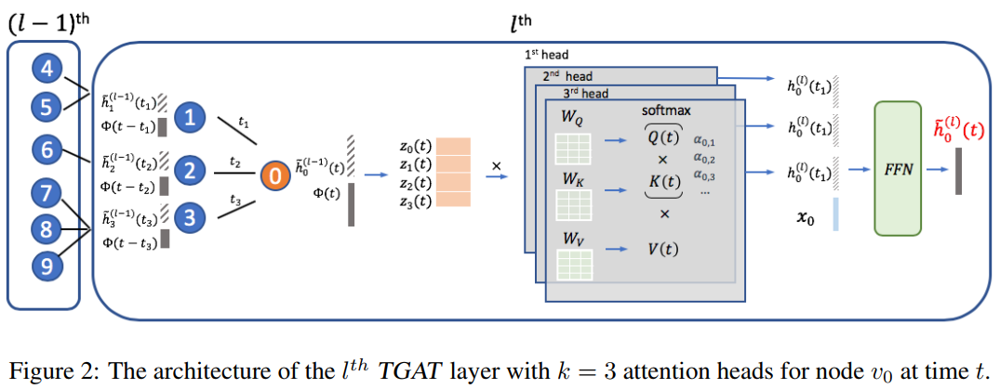

# TGAT

时序图的挑战：

&#43; 节点嵌入不应该只投影拓扑结构和节点的特点，而应该考虑连续的时间函数。
&#43; 图结构随着时间演变，给邻域的汇聚带来限制
&#43; 节点特征和拓扑结构表示了时间的模式（pattern），比如很久之前发生的事情可能对现在的拓扑结构影响比较小。

时序图注意（temporal graph attention，TGAT[^1]）层可以有效地汇聚（aggregate）时间拓扑邻域特征，并学习时间特征之间的相互作用。

### 时间编码

一般时序图中相对的时间段而非绝对时间揭示了重要的时序信息，定义$\Phi:T\rightarrow \mathbb{R}^{d_\top}$为时间领域到$d_\top$维度的向量空间的映射，用于替代self-attention中的positional encoding，对于时刻$t_1,t_2$以及对应的$\Phi(t_1),\Phi(t_2)$,作者更加关注$|t_2-t_1|$的时间段，时间段的编码表示为$\big&lt; \Phi(t_1),\Phi(t_2)\big&gt;$，同时能与self-attention兼容。

根据上述的idea，时序图的time encoding有以下的性质：

定义时序核$\mathcal{K}:T\times T\rightarrow \mathbb{R}$其中$\mathcal{K}(t_1,t_2):=\big&lt; \Phi(t_1),\Phi(t_2)\big&gt;$且$\mathcal{K} ( t_{ 1 } , t_{ 2 } ) = \psi( t_{ 1 } - t_{ 2 } ) $，对$\forall t_1,t_2\in T$,因为时序核的平移不变形，有$\mathcal{K} ( t_{ 1 }&#43;c , t_{ 2 }&#43;c ) = \psi( t_{ 1 } - t_{ 2 } )=\mathcal{K} ( t_{ 1 } , t_{ 2 } )$,其中c为任意常数。可以知道$\mathcal{K}$满足Bochner定理。

根据Bochner定理以及原文的一系列推导，得到：

&lt;div&gt;$$
\mathcal{K} ( t_{ 1 } , t_ { 2 } ) = \mathbb{E} _{ w } [ \cos ( w ( t _ { 1 } - t _ { 2 } ) ) ] = \mathbb{E}_ { w } [ \cos ( w t _ { 1 } ) \cos ( w t _ { 2 } ) &#43; \sin ( w t _ { 1 } )\sin ( w t _ { 2 } )]
$$&lt;/div&gt;

其中$\mathbb{E}_w(\cdot)=\int_ { \mathbb{R} }\cdot \ p ( w ) dw$，$p(\omega)$为概率测度，进而根据蒙特卡洛方法得到近似：
&lt;div&gt;$$
\mathcal{K} ( t _{ 1 } , t_ { 2 } ) \approx \frac { 1 } { d } \sum _{ i = 1 } ^ { d } \big [\cos ( w _ { i } t _ { 1 } ) \cos ( w _ { i } t _ { 2 } ) &#43; \sin ( w _ { i } t _ { 1 } ) \sin ( w _ { i } t _ { 2 } )\big ]
$$&lt;/div&gt;
同时$\omega_1,\cdots,\omega _d \overset{i.i.d}{\sim}p(\omega)$因此得到有限维度的函数映射：
&lt;div&gt;$$
t \mapsto \Phi_d(t):=\sqrt{\frac{1}{d}}[ \cos ( w _ { 1 } t ) , \sin ( w _ { 1 } t ) , \cdots , \cos ( w _ { d } t ) , \sin ( w _ { d } t ) ]
$$&lt;/div&gt;

### 时序图注意力层

类似于graphSAGE和GAT，TGAT层可以被当做一个本地的汇聚操作，把邻居的隐藏表示（特征）和时间戳作为输入，输出是目标节点在时间t的时序感知的表示。

定义符号表如下：

| 符号                                    | 含义                               |
| --------------------------------------- | ---------------------------------- |
| $v_i$                                   | 节点i                              |
| $x_i \in \mathbb{R}^{d_0}$              | 初始的节点特征                     |
| $\mathcal{N}(v_0;t)=\{v_1,\cdots,v_N\}$ | t时刻前的历史时间中$v_0$的邻居节点 |

**单层输入/输出**：TGAT的输入是邻居节点的信息$Z=\{ \widetilde h_{ 1 } ^ { ( l - 1 ) } ( t_{ 1 } ) , \cdots , \widetilde h_{ N } ^ { ( l - 1 ) } ( t_{ N } ) \}$以及时刻t目标节点信息$(\widetilde h_{ 0 } ^ { ( l - 1 ) } ( t ) , t )$，其中l表示层数，当l等于1的时候表示第一层，此时输入是原始的节点特征。

**最后输出**：目标节点$v_0$在时间t的时序感知的表示，记为$ \widetilde h _ { 0 } ^ { ( l ) } ( t )$

&gt; 时间t是我们希望得到的embedding的时刻，$t_i$是目标节点（$v_0$）与邻居节点$v_i$有关联的时刻，由于时序核的平移不变性，只考虑相对时间，嵌入时使用$\{t - t _{ 1 } , \cdots , t - t_ { N }\}$替代$\{t_1,\cdots t_N\}$，$t-t_i$是目标节点($v_0$)与$v_i$之间的时间跨度（timespan）。

首先得到实体时序特征：
&lt;div&gt;$$
Z ( t ) = [\widetilde h_0 ^{( l - 1 )} ( t ) ||\Phi_{d_T}(0) , \widetilde h_1 ^{( l - 1 )} ( t_1 ) ||\Phi_{d_T}(t-t_1), \cdots , \widetilde h_N ^{( l - 1 )} ( t_N ) ||\Phi_{d_T}(t-t_N)] ^ \top (或者使用求和)
$$&lt;/div&gt;

为了得到QKV，分别投影到三个矩阵：
&lt;div&gt;$$
q ( t ) = [ Z ( t ) ] _{ 0 } W_ { Q } , K ( t ) = [ Z ( t ) ] _{ 1 : N } W_ { K } , V ( t ) = [ Z ( t ) ] _{ 1 : N }W_V
$$&lt;/div&gt;
其中$W_ { Q } , W _{ K } , W_ { V } \in \mathbb{R} ^ { ( d &#43; d _{ T } ) \times d_ { h } }$。

根据注意力机制，attention值为$\alpha _i=\operatorname {softmax}( \frac { Q K ^ { T } } { \sqrt { d } } ) =\operatorname { exp } ( q ^ { T } K_ { i } ) / ( \sum _{ q } \operatorname {exp} ( q ^ { T } K_ { q } ) )$，表示了节点$v_0$的邻接节点$v_i$的attention，则每个节点$v_i\in \mathcal{N}(v_0;t)$的隐藏表示为$\alpha _i V_i$即印象层的表示为：
&lt;div&gt;$$
h(t) = \alpha_i V_i=\operatorname {softmax}( \frac { Q K ^ { T } } { \sqrt { d } } ) V_i=\operatorname {attn} ( q ( t ) , K ( t ) , V ( t ) )\in \mathbb{R}^{d_n}
$$&lt;/div&gt;
接下来，在最后一层输出时，为了将邻居节点的表示与目标节点的特征相结合，先将其与目标节点进行concat操作，然后使用一个FFN进行变换：
&lt;div&gt;$$
\widetilde h_ { 0 } ^ { ( l ) } ( t ) =\operatorname{FFN}( h ( t ) | | x _{ 0 } ) = \operatorname {ReLU}( [ h ( t ) | X _ { 0 }] W_0^ { (l) } )&#43; b_ { 0 } ^ { ( l ) } ) W_1^ { ( l ) } &#43; b _{ 1 } ^ { ( l ) }
$$&lt;/div&gt;
$\widetilde h_ { 0 } ^ { ( l ) } ( t ) \in \mathbb{R}^d$，其中：
&lt;div&gt;$$
W _{ 0 } ^ { ( l ) } \in R ^ { ( d_ { h } &#43; d _{ 0 } ) \times d_ { f } } , W _{ 1 } ^ { ( l ) } \in R ^ { d_f \times d} , b_ { 0 } ^ { ( l ) } \in R ^ { d_f } , b _{ 1 } ^ { ( l ) } \in \mathbb{R}^d
$$&lt;/div&gt;
如果考虑多头机制，那么有：
&lt;div&gt;$$
\widetilde h_ { 0 } ^ { ( l ) } ( t ) =\operatorname{FFN}( h ^ { ( 1 ) } ( t ) || \cdots  || h ^ { ( k ) } ( t ) | | x _ { 0 } )
$$&lt;/div&gt;

与graphSAGE一样，单层TGAT只汇聚了单跳的邻居信息，通过叠加L层TGAT层可以将汇聚扩展至L跳。

### 损失函数与实验

实验使用时序敏感的链接预测损失函数来训练l层的TAGT网络：
&lt;div&gt;$$
\mathcal{l} = \sum _{ ( v_i,v_j,t_{ij})\in \mathcal{E}} - \log({\sigma ( - \widetilde h _{ i } ^ { l } ( t_ { i j} )^\top \widetilde h _{ j } ^ { l } ( t_ { i j} ))}) -  Q.\mathbb{E}_{v_q \sim P_n(v)} \log ({\sigma (\widetilde  h_i^l(t_{ij})^\top\widetilde h_q^{ l } (t_{ij})})
$$&lt;/div&gt;

### TGAT和GAT的区别

首先，明显的是TGAT考虑了时间信息的嵌入。其次，两者使用的注意力机制不一样，GAT使用的是先concat然后进行线性变换最后进行ReLU&#43;softmax非线性变换：
&lt;div&gt;$$
e_{ij} = \text{LeakyReLU} \Big( \overrightarrow{\mathbf{a}}^\top \Big[\mathbf{W} \overrightarrow{h_i}|| \mathbf{W} \overrightarrow{h_j} \Big] \Big)\\
\alpha_{ij} = \text{softmax}_j(e_{ij}) = \frac{\exp(e_{ij})}{\sum_{j \in \mathcal{N}_i} \exp(e_{ij})}
$$&lt;/div&gt;
而TGAT的注意力使用的是transformer（《attention is all you need》）中的KQV：
&lt;div&gt;$$
\alpha _i=\operatorname { exp } ( q ^ { T } K_ { i } ) / ( \sum _{ q } \operatorname {exp} ( q ^ { T } K_ { q } ) )
$$&lt;/div&gt;
带入得到：
&lt;div&gt;$$
\alpha_{ij}(t)=\frac{\exp({([\widetilde h_i ( t_i ) ||\Phi_{d_T}(t-t_i) ]\textbf{W}_Q)^\top([\widetilde h_j ( t_j ) ||\Phi_{d_T}(t-t_j) ]\textbf{W}_K)})}{\sum_{k\in\mathcal{N}(v_i;t)}\exp({([\widetilde h_i ( t_i ) ||\Phi_{d_T}(t-t_i) ]\textbf{W}_Q)^\top([\widetilde h_k ( t_k ) ||\Phi_{d_T}(t-t_k) ]\textbf{W}_K)})}
$$&lt;/div&gt;

[^1]: Xu D, Ruan C, Korpeoglu E, et al. Inductive representation learning on temporal graphs[J]. arXiv preprint arXiv:2002.07962, 2020.

