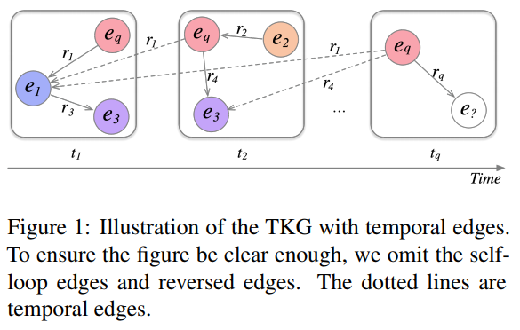
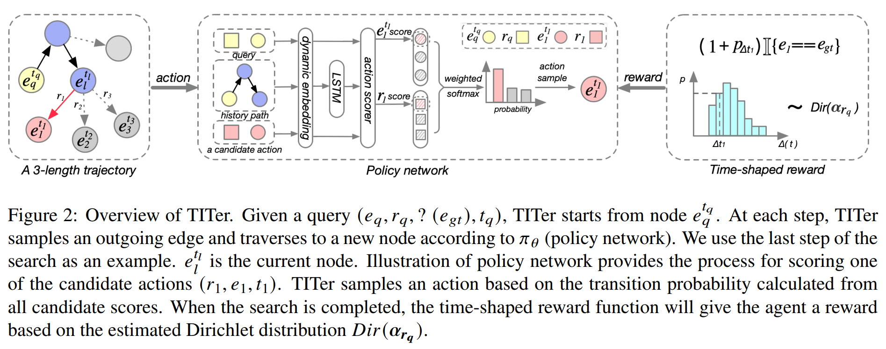
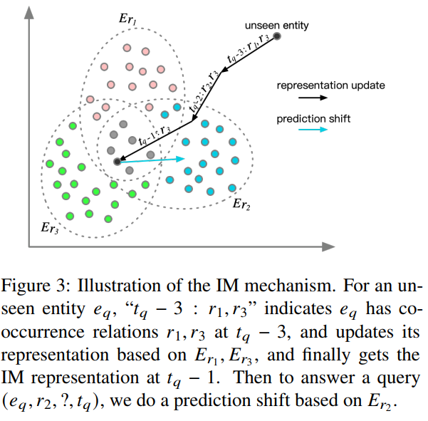
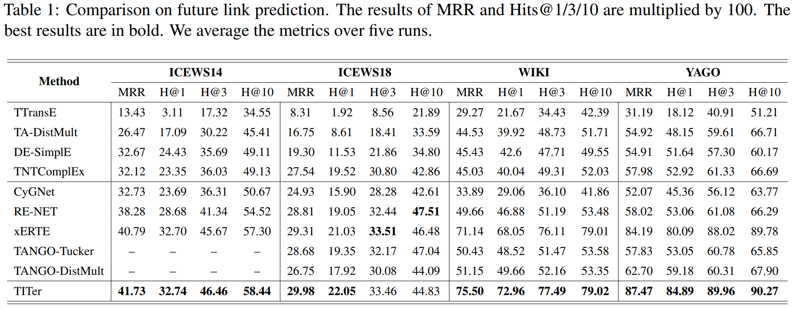
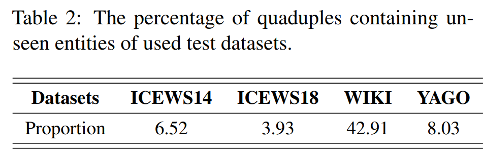
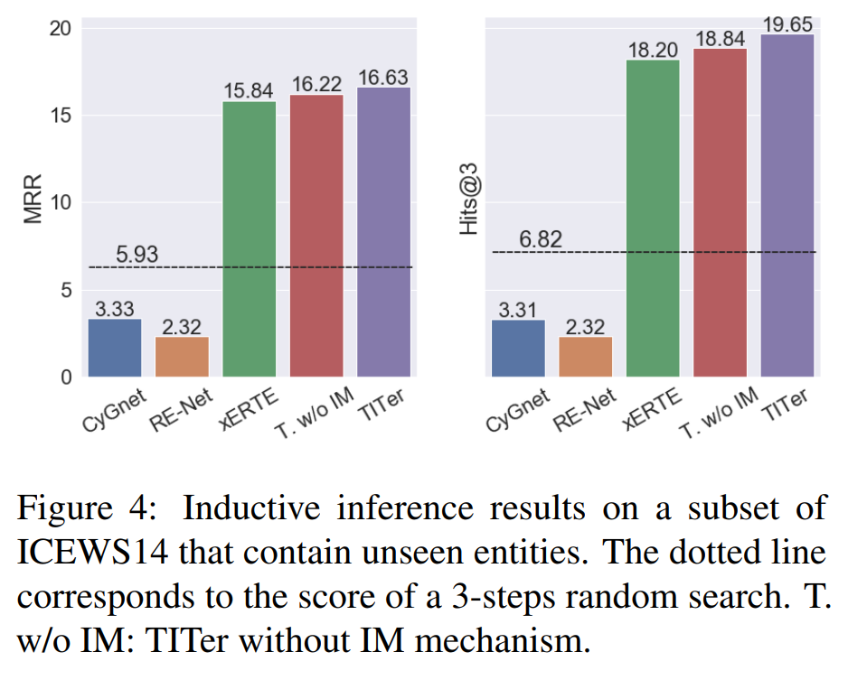
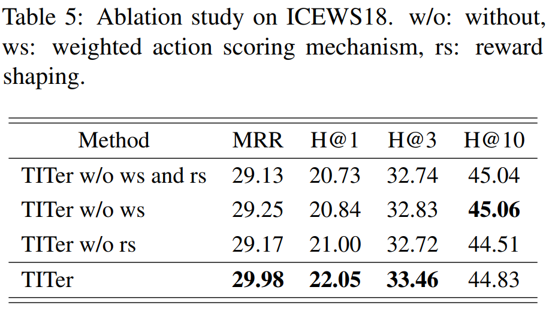

# TiTer

TimeTraveler: Reinforcement Learning for Temporal Knowledge Graph Forecasting[^3]
&lt;!--more--&gt;

贡献：

&#43; 第一个基于时序路径的强化学习模型，用于在时序图谱上进行extrapolate预测
&#43; 使用相对路径编码函数
&#43; 对没有见到的实体的表示机制，在不提高计算花销的情况稳定的提升表现
&#43; 扩展实验表明比已有方法计算量更小

### 强化学习框架

符号：

| 符号                      | 含义                               |
| ------------------------- | ---------------------------------- |
| $\mathcal{E},\mathcal{R},\mathcal{T}$ | 实体，关系，时间的集合             |
| $\mathcal{F}$                 | 事实的集合，一个事实表示一个四元组 |
| $e_i^t$                   | t时刻的实体i                       |

定义：

&#43; 解决的问题：已知事实组$\{(e_{si},r_i,e_{oi},t_i)|t_i&lt;t_q\}$，对查询$(e_q,r_q,?,t_q)$或者$(?,r_q,e_q,t_q)$进行预测

&#43; 逆关系：对每个四元组$(e_s,r,e_o,t)$加入逆向四元组$(e_o,r^{-1},e_s,t)$
&#43; 自环边：自环允许agent停在某个地方作为一个停留操作
&#43; 时序边：如果有四元组$(e_s,r,e_o,t_i)$，且$t_i&lt;t_j\le t_q$，agent可以通过边r从$e_s^{t_j}$转移到$e_o^{t_i}$

TiTER可以被看做是一个马尔科夫决策过程（MDP），其中的元素如下：

**状态**：$\mathcal{S}$表示状态空间，一个状态表示五元组$s _ { l } = ( e _ { l } , t _ { l } , e _ { q } , t _ { q } , r _ { q } )\in \mathcal{S}$，$(e_l,t_l)$表示第l步访问的节点，$( e _ { q } , t _ { q } , r _ { q } )$表示查询中的元素，查询可以看做是全局信息，$(e_l,t_l)$可以看做是本地信息。初始状态是$s _ { 0 } = ( e _ { q } , t _ { q } , e _ { q } , t _ { q } , r _ { q } )$。

**行动**：$\mathcal{A}$表示行动空间，$\mathcal{A_l}$表示第l步的可选行动集合，$\mathcal{A_l}\sub \mathcal{A}$包含节点$e_l^{tl}$所有的出边，具体地说，$\mathcal{A}_l$应该满足$\{ ( r ^ { \prime } , e ^ { \prime } , t ^ { \prime } ) | ( e_l , r ^ { \prime } , e ^ { \prime } , t ^ { \prime } ) \in \mathcal{F}, t ^ { \prime } \leq t _ { 1 } , t ^ { \prime } \lt t _ { q } \}$，由于有很多历史相关的行动。因此最后的行动选项是从出边中进行采样得到的。

**转移**：agent选择了边后就会转移状态，转移方程为：$\delta:\mathcal{S}\times\mathcal{A}\rightarrow \mathcal{S}$，$\delta ( s _ { l } , \mathcal{A} _ { l } ) = s _ { l &#43; 1 } = ( e _ { l &#43; 1 } , t _ { l &#43; 1 } , e _ { q } , t _ { q } , r _ { q } )$

**奖励（time-shaped）**：当agent到达了正确的目标实体那么奖励为1，否则为0，即如果最终状态是$s _ { L } = ( e_L , t _ { L } , e _ { q } , t _ { q } , r _ { q } )$，$( e_q , r _ { q } , e _ { g t } , t _ { q } )$是事实（ground truth），那么奖励函数则是：$R ( s_L ) = \mathbb{I} \{ e_L = = e _ { g t } \}$。然而相同实体的四元组常常集中在一个特定的时期，导致了时序上的多样化与稀疏，因此查询的结果会有时间上的一个分布，可以引入这个先验知识来促进agent的学习，time-shaped的奖励能让agent更好的找到答案。修改奖励函数为Dirichlet分布：
$$
\left. \begin{array}  { l  }  { \tilde{R} ( s_L ) = ( 1 &#43; p _ {\Delta t L } ) R ( s_L ) } \\ { \Delta t _ { L } = t _ { q } - t _ { L } } \\ { ( p _ { 1 } \cdots , p_K ) \sim Di r i c h l e t  ( \alpha _ { r_q } ) } \end{array} \right.
$$
其中$\alpha _{r_q}\in \mathbb{R}^K$是关系$r_q$的Dirichlet分布，可以从训练集中进行估计：对于训练集中的每个包含关系$r_q$的四元组，得到在最近K个历史快照中客实体出现的次数，然后获取多项式分布$x_i$和$D=\{x_1,\cdots,x_N\}$,进行极大似然估计：
$$
p ( D | \alpha _ { r_q } ) = \prod _ { i } ( p ( x _ { i } | \alpha _ { r_q } ) )
$$
这样就可以估计得到$\alpha_{r_q}$(具体见原文附录A.5)。

### 策略网络

定义策略网络为$\pi(a_l|s_l)=P(a_l|s_l;\theta)$，$a_l\in \mathcal{A}_l$，$\theta$是模型的参数。网络包含以下三个模型：

**动态嵌入**：用向量$\textbf{r}\in\mathbb{R}^{d_r},\textbf{e}\in\mathbb{R}^{d_e}$分别表示关系r和实体$e_i^t$的嵌入，另外使用相对时间编码的方式进行时间嵌入：
$$
\mathbf{\Phi}(\Delta t)=\sigma(\mathbf{w} \Delta t&#43;\mathbf{b})
$$
其中$\Delta t=t_{q}-t$，将相对编码结合就得到实体的嵌入$e_i^t:\mathbf{e}_{i}^{t}=\lbrack \mathbf{e} _{i};\mathbf{\Phi}(\Delta t)\rbrack$。

**路径编码**：搜索历史$h_l=((e_{q},t_{q}),r_{1},(e_{1},t_{1}),\ldots,r_{l},(e_{l},t_{l}))$是采取的动作序列，agent通过LSTM来解码历史序列：
$$
\mathbf{h}_ {l}=\mathrm{LSTM}(\mathbf{h}_ {l-1},[\mathbf{r}_ {l-1};\mathbf{e}_ {l-1}^{t_{l-1}}]),\\\\
{\bf h}_{0}=\mathrm{LSTM}({\bf 0},[{\bf r} _{0};{\bf e} _{q}^{t _{q}}]).
$$
$\mathbf{r}_0$是开始关系，另外如果是自环边的话LSTM的状态是不变的。

**动作得分**：$a_{n}=\left (e_{n},t_{n},r_{n}\right)\mathop{\in}\mathcal{A}_ {l}$代表在第l步的动作选项。由于未来的时间通常充满不确定性，数据集中没有足够的信息，使得有很强的因果关系，因此实体和查询之间的相关关系更加重要。因此使用加权动作得分函数来帮助agent更加关注目标节点和不同类型的边,这里使用两个MLP来进行加权：
&lt;div&gt;
$$
\phi(a_{n},s_{l})=\beta_{n}\left\langle\widetilde{{{\bf e}}},\mathbf{e}_ {n}^{t_{n}}\right\rangle&#43;\left(1-\beta_{n}\right)\left\langle\widetilde{{{\bf e}}},\mathbf{r}_{n}\right\rangle
$$
$$
\widetilde{\mathbf{e}}={\bf W}_{e}\mathrm{ReLU}({\bf W}_{1}[{\bf h}_ {l};{\bf e}_{q}^{t_{q}};{\bf r}_{q}]),\\\\
\widetilde{\mathbf{r}}=\mathbf{W}_ {r}\mathrm{ReLU}(\mathbf{W}_ {1}[\mathbf{h}_ {l};\mathbf{e}_ {q}^{t_{q}};\mathbf{r}_ {q}]),
$$
&lt;/div&gt;

其中权重为：
&lt;div&gt;
$$
\beta_{n}=\mathrm{sigmoid}(\mathrm{W}_{\beta}[\mathrm{h}_{l};\mathrm{e}_{q}^{t_{q}};\mathrm{r}_{q};\mathrm{e}_{n}^{t_{n}};\mathrm{r}_{n}]),
$$
&lt;/div&gt;

变量含义如下：

| 符号             | 含义                |
| ---------------- | ------------------- |
| 目标节点嵌入     | $\widetilde{e}$     |
| 目标出边嵌入     | $\widetilde{r}$     |
| 候选动作得分函数 | $\phi(a_{n},s_{l})$ |
| 节点的权重       | $\beta_{n}$         |

### 优化与训练

将搜索路径长度修整为L，那么有策略网络生成的路径为$\pi_ {\theta} : \\{ a_{1},a_{2},...,a_{L}\\}$，策略网络将在所有训练样本$\cal{F}_{train}$中进行训练来达到最大期望奖励值：
&lt;div&gt;
$$
J(\theta)=\mathbb{E}_{(e_{s},r,e_{o},t)\sim{\mathcal{F}}_{train}}\left[\mathbb{E}_{a_{1},...,a_{L}\sim\pi_{\theta}}\left[{\widetilde{R}}(s_{L}|e_{s},r,t)\right]\right ]
$$
&lt;/div&gt;
使用策略梯度来对策略优化：通过下面的随机梯度不断迭代$\cal{F}_{train}$中的四元组，更新$\theta$：
&lt;div&gt;
$$
\nabla_{\theta}J(\theta)\approx\nabla_{\theta}\sum_{m\in[1,L]}\widetilde{R}(s_{L}|e_{S},r,t)l o g\pi_\theta(a_{l}|s_{l})
$$
&lt;/div&gt;

### 归纳平均(Inductive Mean)表示

为了解决未观测过的实体的预测问题，前人工作一般通过邻居的信息汇聚[^1]$^,$[^2]进行实体的表示预测,然而新出现的实体一般只有很少的边，只有很少的信息，对于一个查询$(Evan_{-}Mobley,play_{-}f o r,?,2022)$，实体Evan\_Mobley在之前的时间中从未出现，但是可以从“plays\_for”关系推断出其为运动员，从此给“Evan\_Mobley”分配一个更加合理的初始嵌入值，更加有利于推理。基于此思想，作者利用查询信息以及训练集中的实体提出了新的方法：归纳平均(Inductive Mean，IM)来表示未观测的实体。

${\mathcal{G}}_ {(t_{j},t_{q}-1)}$表示TKG测试集中的某个时刻，查询的实体$e_q$在${\mathcal{G}}_ {t_{j}}$首次出现且随机初始化表示向量。如果有四元组中有$(e_q,r)$，那么将r称为实体$e_q$的*共现关系*（co-occurrence relation）。定义$R_t(e_q)$为$e_q$在时刻t共现关系集合，$E_r$表示训练集中共现关系是r的所有实体的集合。由此得到有相同共现关系的实体的归纳表示：
$$
\overline{{{\mathbf{e}^{r}}}}=\frac{\sum_{e\in E_{r}}\mathbf{e}}{|E_{r}|}
$$
**表示更新**（representation update）：有相同的关系r的实体有相似的特点，所以IM能使用$\overline{{{\mathbf{e}^{r}}}}$来在时间流上逐渐更新$e_q$的表示：
&lt;div&gt;
$$
\mathrm{e}_ {q,t}=\mu\mathbf{e}_ {q,t-1}&#43;(1-\mu)\frac{\sum_ {r\in R_{t}}(e_{q})\,\overline{{{\mathbf{e}^ {r}}}}}{|R_{t}(e_{q})|}
$$
&lt;/div&gt;

其中$\mu$是一个超参数。

**预测位移**（prediction shift）：对于关系$r_q$，基于${\overline{{\mathbf{e}^{r}q}}}$做一个预测的位移：
&lt;div&gt;
$$
{\bf e}_{q,t_{q},r_{q}}=\mu{\bf e}_{q,t_{q}-1}&#43;(1-\mu)\overline{{{\bf e}^{r_{q}}}}
$$
&lt;/div&gt;

整体流程如下图所示。

### 实验分析

实验对比如下：

 **可以看到TiTer在WIKI和YAGO上比其他baseline好很多，原因有：**

1. WIKI 和 YAGO 的特点是节点通常只有少量的邻居节点，这使得邻居搜索算法具有优势。

2. WIKI和YAGO测试集中有大量的未观测到的实体，这些方法无法解决这个问题：

   

**IM机制对性能的提升**：

cygnet和renet没有对未知实体预测的功能因此比随机三跳搜索的性能还差，xERTE可以基于动态的消息聚合更新新实体的表示，而TiTer可以通过基于时序路径的强化学习来得到预测。不管使用还是没使用IM，TiTer都比xERTE表现更好一点。

**消融实验：**

[^1]: Bhowmik R, Melo G. Explainable link prediction for emerging entities in knowledge graphs[C]//International Semantic Web Conference. Springer, Cham, 2020: 39-55.
[^2]: Han Z, Chen P, Ma Y, et al. Explainable subgraph reasoning for forecasting on temporal knowledge graphs[C]//International Conference on Learning Representations. 2020.
[^3]: Sun H, Zhong J, Ma Y, et al. TimeTraveler: Reinforcement Learning for Temporal Knowledge Graph Forecasting[C]//Proceedings of the 2021 Conference on Empirical Methods in Natural Language Processing. 2021: 8306-8319.

