# 各个runtime的区别

# kata_container架构

kata基于英特尔虚拟化技术（VT），想要解决容器内的安全问题。 使用Intel VT，能够将容器作为轻量级虚拟机启动，从而提供了与流行的容器环境（如Kubernetes 和Docker ）交互的runtime替代工具。

对于每个kata容器，都会运行在一个VM上，单独享有内核与namespace。所以系统调用是与主机隔离的。sysfs与procfs也是隔离的[^1]

&#43; **Runtime**     组件Runtime 是Kata Containers 运行时， 负责处 理OCI runtime 的所有命令并启动kata-shim 实例。它 大量利用virtcontainers 软件包，该软件包提供了一套通 用，与运行时规范无关，硬件虚拟化的容器库，负责创建 在Linux 主机上运行的硬件虚拟化Linux 容器。该运行时 与OCI 兼容，CRI-O 以及Containerd 兼容，从而使其可 以分别与Docker 和Kubernetes 无缝地工作。安装kata runtime 时可在路径/usr/share/defaults/kata-containers/ configuration.toml 配置文件中定义hypervisor 路径、 guest kernel 以及mini-OS 映像。
&#43; **Agent**    Agent 是运行在微虚机中的一个运行时代理组件，负 责虚机内的容器及容器内部进程的生命周期管理，替运行 在宿主机上的runtime 实际管理运行在虚机上的容器环境。
  Agent 的最小执行单元是sandbox，一个sandbox 对应一 系列的命名空间（NS，UTS，IPC，PID）。Kata 容器支 持一个虚机内运行多个容器，由agent 管理一个虚机内的 多个容器及内部进程。Agent 重用了许多runC 代码，利 用libcontainer 管理容器生命周期，并通过gRPC 协议实 现与其他Kata 组件的通信。
&#43; **Proxy**    组件Proxy 负责Kata 容器代理服务， 代理agent 与shim、runtime 之间的通信，负责路由shim 到对应的 agent。默认由virtio-serial 技术实现通信，kernel 版本 v4.8 以上支持vsock 技术，virtio-serial 技术需要proxy 以多路分流的方式对多个容器进程通信，而利用 Vsock 技术通信时则不需要多路分流。
&#43; **Shim**    组件shim 在主机环境中运行，替实际运行在 虚机里的容器处理std I / O 及信号。shim 可以将 上层Containerd-shim 发来的数据流（如stdin）经 由proxy 转交给agent 执行，也可以将agent 经由 proxy 发过来的数据流（stdout/stderr）及信号传给 上层Containerd-shim。它主要负责在虚机外部监 控以及终止容器。

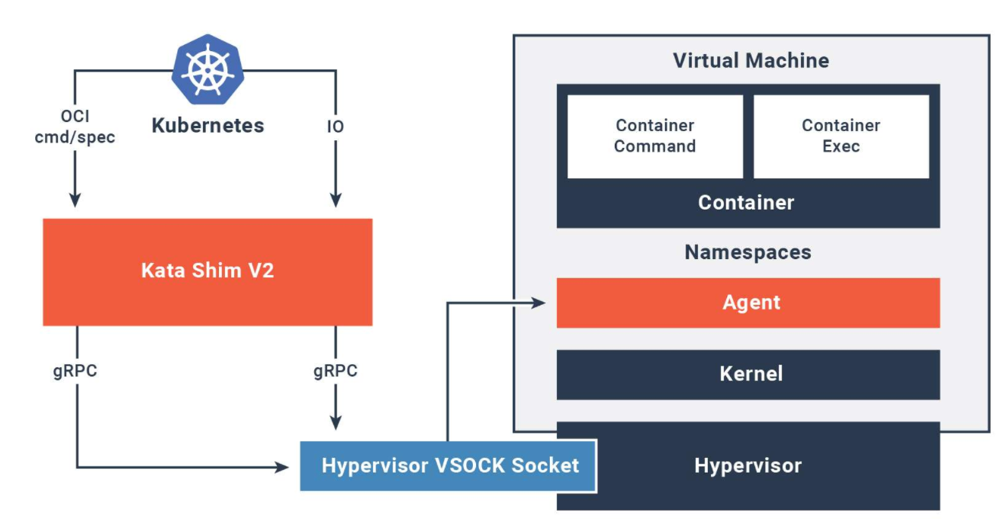
kata在主机上有kata runtime对新的容器进行启动与配置，对于每个在kata VM里面的容器，在主机上有一个对应的kata shim，shim接收客户端API的请求（如docker和kubectl）并通过vsock将请求传递到kata VM里的agent。[^2]


Kata Containers使用QEMU NVDIMM功能提供内存映射的虚拟设备，可用于将虚拟机的根文件系统DAX映射到guest内存地址空间[^9]：
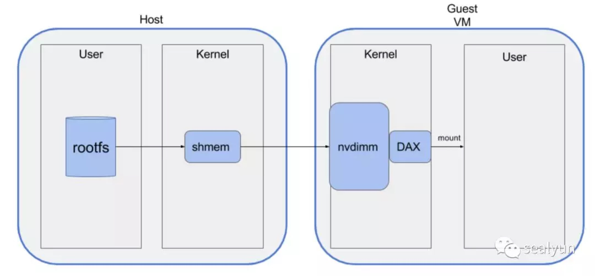

## kata_container的安装

1. [kata安装](https://github.com/kata-containers/documentation/blob/master/install/ubuntu-installation-guide.md)
2. [docker配置](https://github.com/kata-containers/documentation/blob/master/install/docker/ubuntu-docker-install.md)

### 遇到的问题

```bash
cwy@cwy:~$ sudo docker run busybox uname -a
docker: Error response from daemon: OCI runtime create failed: failed to launch qemu: exit status 1, error messages from qemu log: Could not access KVM kernel module: No such file or directory
qemu-vanilla-system-x86_64: failed to initialize kvm: No such file or directory: unknown.
ERRO[0001] error waiting for container: context canceled 
```

原因是我把它安装在虚拟机上了，需要安装在物理机上才能真正的运行：
[原因](https://oracle-base.com/articles/linux/docker-kata-containers-ol7)    [原因](https://ubuntu.com/kubernetes/docs/kata)

此时对于我的vmware虚拟机，我可以将其设置中的：
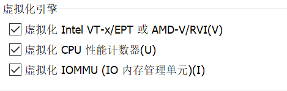
然后就可以运行了

## 内核的区别

对于一般的docker容器，其对应的内核信息如下：

```bash
cwy@cwy:~$ sudo docker run -it ubuntu /bin/bash
root@e583629a8af1:/# uname -a
Linux e583629a8af1 5.4.0-52-generic #57~18.04.1-Ubuntu SMP Thu Oct 15 14:04:49 UTC 2020 x86_64 x86_64 x86_64 GNU/Linux
```

而主机的内核：

```bash
cwy@cwy:~$ uname -a
Linux cwy 5.4.0-52-generic #57~18.04.1-Ubuntu SMP Thu Oct 15 14:04:49 UTC 2020 x86_64 x86_64 x86_64 GNU/Linux
```

可见docker的主机内核与主机的内核是一样的。

而安装了kata的容器的内核与主机是不一样的：

```bash
cwy@cwy:~$ sudo vim /etc/docker/daemon.json
cwy@cwy:~$ sudo vim /etc/docker/daemon.json
cwy@cwy:~$ sudo systemctl daemon-reload
cwy@cwy:~$ sudo systemctl restart docker
cwy@cwy:~$ sudo docker run -it ubuntu /bin/bash
root@a356febe014d:/# uname -a
Linux a356febe014d 5.4.60-51.container #1 SMP Thu Oct 22 16:13:49 UTC 2020 x86_64 x86_64 x86_64 GNU/Linux
root@a356febe014d:/# 
```

Docker使用主机操作系统内核,容器内没有自定义或者使用额外的内核。机器上运行的所有容器都共享此“主机”内核

## sysfs与procfs

```bash
root@9f15bc1ad622:/# cat /proc/mounts|grep sysfs
sysfs /sys sysfs ro,nosuid,nodev,noexec,relatime 0 0
```

```bash
root@9f15bc1ad622:/# cat /proc/mounts|grep proc  
proc /proc proc rw,nosuid,nodev,noexec,relatime 0 0
proc /proc/bus proc ro,relatime 0 0
proc /proc/fs proc ro,relatime 0 0
proc /proc/irq proc ro,relatime 0 0
proc /proc/sys proc ro,relatime 0 0
tmpfs /proc/acpi tmpfs ro,relatime 0 0
```

# firecracker

&gt; Firecracker is an open source virtualization technology that is purpose-built for creating and managing secure, multi-tenant container and function-based services that provide serverless operational models. 

架构如下：
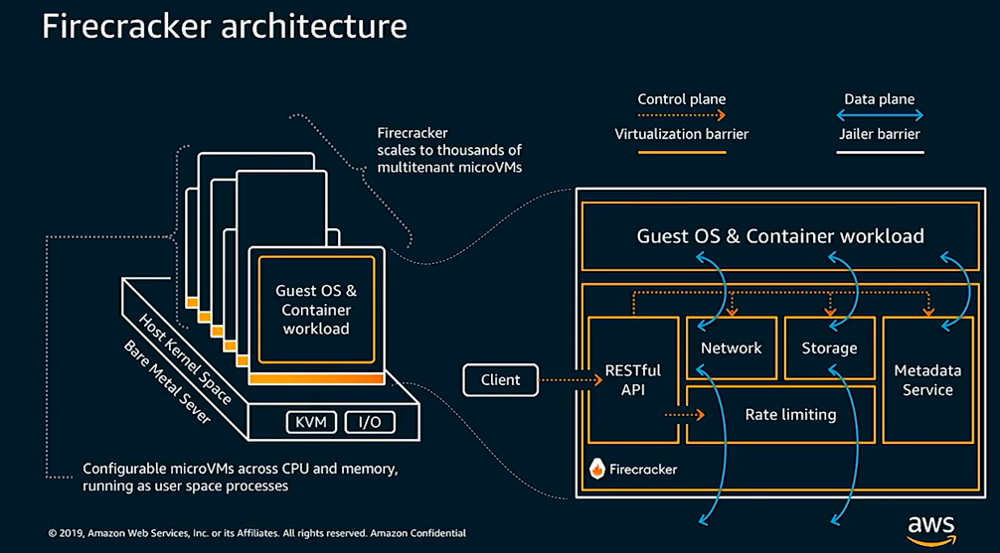
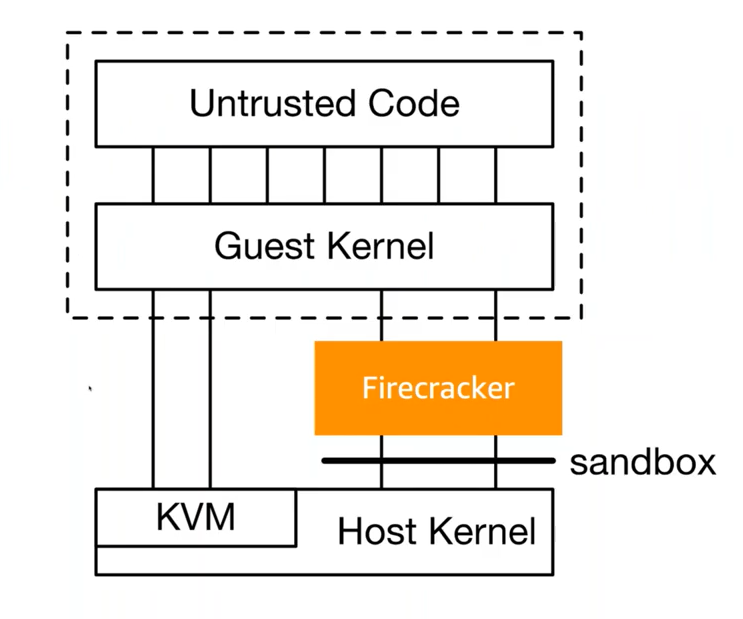
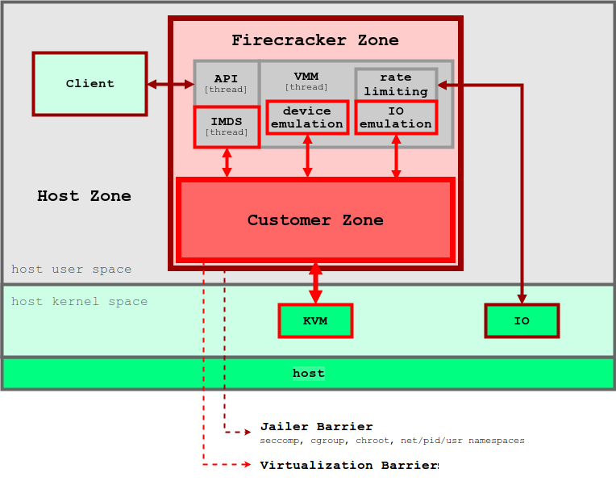  
从上图可知firecracker使用的是自己的内核，rootfs与sysfs也需要自己进行创建，所以rootfs不是使用主机的[^3]

在docker里面sysfs，rootfs都使用的是主机的

## firecracker安装

[安装教程](https://github.com/firecracker-microvm/firecracker/blob/master/docs/getting-started.md)
[安装教程](https://ieevee.com/tech/2018/11/28/firecracker.html)

# nabla container

## unikernels

unikernels是单地址空间的可以直接在hypervisor上跑的镜像，它将应用和其需要的内核函数打包进了一个镜像：
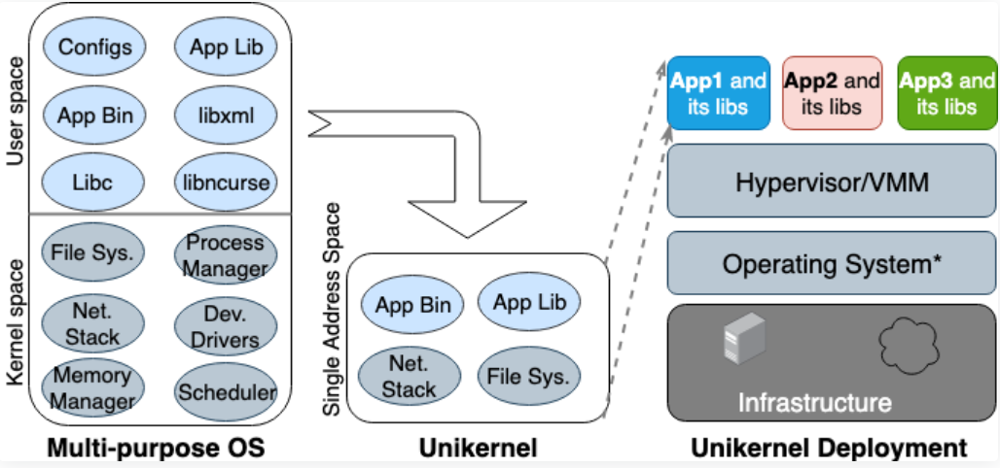
unikernel将内核分开为多个库只把有关的应用需要的库放在单个镜像中，跟VM一样，unikernel也在VMM上运行，由于体量小，unikernel能快速启动和扩展。

## nabla

### nabla的架构

nabla的架构如下：
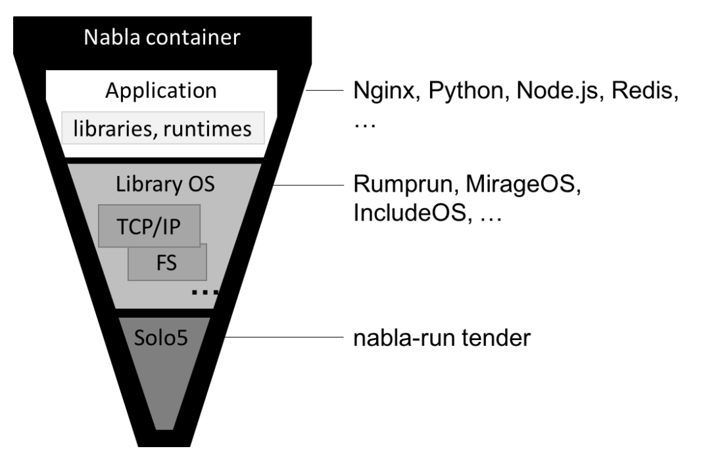

IBM的nabla的基本思想是将“把unikernel当成进程跑”，即把unikernel程序在一个特别的VMM上当做进程运行，nabla containers认为在unikernel和一般的VMM之间的超级调用（hypercall）仍然有较大的攻击可能性，所以用一个有unikernel特性的只允许更少系统调用的监视器能显著提升安全性。nabla tender拦截unikernel发送给VMM的超级调用并翻译为系统调用，linux seccomp（secure computing mode）屏蔽所有Tender不需要的调用：
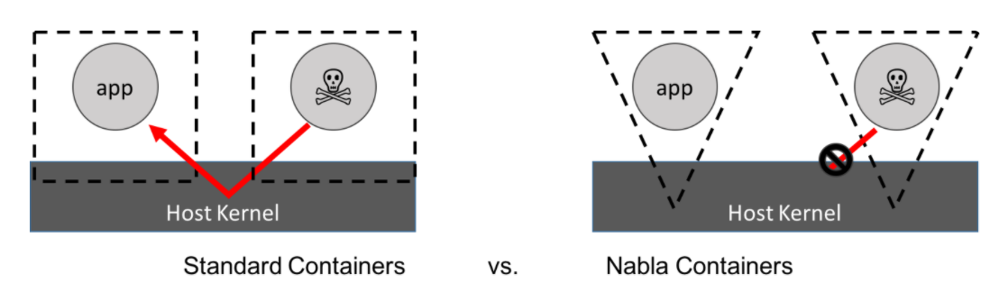
一个unikernel与nabla结合可以被当做一个主机上的用户空间的进程：
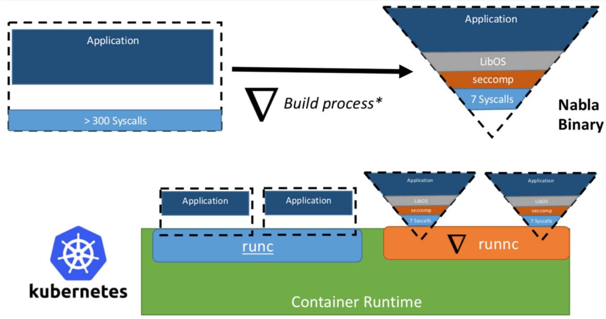

### nabla安装

安装的主要方法见[nabla安装1](https://nabla-containers.github.io/2018/06/28/nabla-setup/) 或者[nabla安装2](https://abdennoor.medium.com/successfully-running-containers-with-nabla-runtime-on-ubuntu-machines-2ec06e62861e)
执行过程中遇到了报错：

```bash
cwy@cwy:~/go/src/github.com/nabla-containers/runnc$ make container-build
sudo docker build . -f Dockerfile.build -t runnc-build
Sending build context to Docker daemon  7.624MB
Step 1/7 : FROM golang:1.11
 ---&gt; 43a154fee764
Step 2/7 : RUN go get -u github.com/golang/dep/cmd/dep
 ---&gt; Using cache
 ---&gt; c96b623cd623
Step 3/7 : RUN apt update
 ---&gt; Using cache
 ---&gt; 0b52b5e2cc0e
Step 4/7 : RUN apt install -y genisoimage
 ---&gt; Using cache
 ---&gt; 0d216af11007
Step 5/7 : RUN apt install -y libseccomp-dev
 ---&gt; Using cache
 ---&gt; ac6b324b417f
Step 6/7 : RUN apt install -y sudo
 ---&gt; Using cache
 ---&gt; c2cd0875f4e8
Step 7/7 : RUN apt install -y jq
 ---&gt; Using cache
 ---&gt; dd819ac61acc
Successfully built dd819ac61acc
Successfully tagged runnc-build:latest
sudo docker run --rm -v /home/cwy/go/src/github.com/nabla-containers/runnc:/go/src/github.com/nabla-containers/runnc -w /go/src/github.com/nabla-containers/runnc runnc-build make
dep ensure
The following issues were found in Gopkg.toml:

  ✗ unable to deduce repository and source type for &#34;golang.org/x/sys&#34;: unable to read metadata: unable to fetch raw metadata: failed HTTP request to URL &#34;http://golang.org/x/sys?go-get=1&#34;: Get http://golang.org/x/sys?go-get=1: dial tcp 216.239.37.1:80: connect: connection refused

ProjectRoot name validation failed
make: *** [Makefile:70: godep] Error 1
Makefile:52: recipe for target &#39;container-build&#39; failed
make: *** [container-build] Error 2
```

[网上博客](https://www.cnblogs.com/sage-blog/p/10640947.html)说是墙的原因导致的，但是不管我试哪种方法（包括换代理，科学上网，修改hosts）我都是会报这个错，由于不是很清楚该怎么解决，接下来的安装无法继续，但根据原理与架构我可以知道nabla是mount主机的sysfs和procfs[^5]

# gVisor

gVisor作为主机上的一个进程运行，这个进程提供被沙盒隔离的应用和主机之间的接口，gVisor的思想是保证提供进程模型的情况下尽可能的通过多层防护减小系统应用的攻击，Sentry 是 gVisor 的核心组件，它就像一个简单的操作系统内核，提供了系统调用，进程管理，内存管理等功能。Sentry实现了Linux系统的大多数调用， 以及很多重要的内核函数如信号传递，内存管理，网络堆栈，线程模型等。

 gVisor 对系统调用的劫持方法，目前提供了两种劫持模式：KVM 模式，与 ptrace 模式。ptrace 模式的性能不及 KVM 模式。因为应用的每个 SYSCALL 都需要通过 ptrace 访问 Sentry。[^4]
 gVisor 兼容 OCI，因此它的 rootfs 的文件来源就来自容器 OCI 镜像各层聚合以后的 rootfs。为了减少 Guest App 直接对 Host 系统调用的依赖，Sentry 使用了 9pfs。应用程序通过 9p 协议与 Runsc 进程通信（内部运行着 Gofer Server 的功能），通过 Runsc 间接地来对 Host 的 rootfs 进行操作。[^4]
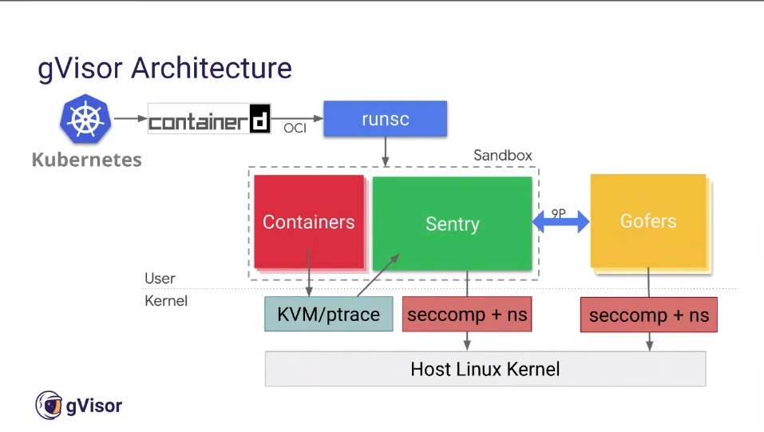
当应用调用了那些未被实现的系统调用时，Sentry 会直接报错返回。由于系统调用尚未完备，导致部分软件还不能无缝地运行在 gVisor 中。而且 gVisor 已支持的系统调用中，有若干还必须依赖 Host 内核。当处理这些系统调用时，Sentry 会陷回 Host 模式。[^4]

安装见 [安装教程](https://gvisor.dev/docs/user_guide/install/)

# sysfs和procfs是什么

## sysfs

sysfs是一个基于内存的文件系统，它的作用是将内核信息以文件的方式提供给用户程序使用。sysfs可以看成与proc,devfs和devpty同类别的文件系统，该文件系统是虚拟的文件系统，可以更方便对系统设备进行管理。它可以产生一个包含所有系统硬件层次视图，与提供进程和状态信息的proc文件系统十分类似。[^6][^7]

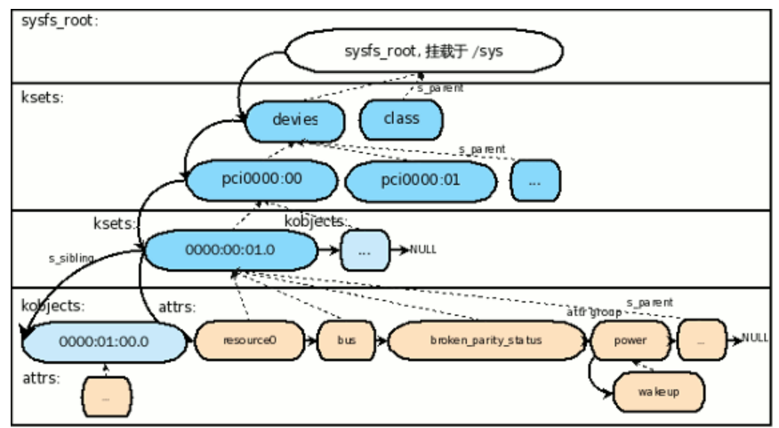

## procfs

## procfs和sysfs的区别

&gt; What is the difference between procfs and sysfs?

proc is the old one, it is more or less without rules and structure. And at some point it was decided that proc was a little too chaotic and a new way was needed.

Then sysfs was created, and the new stuff that was added was put into sysfs like device information.

So in some sense they do the same, but sysfs is a little bit more structured.

&gt; Why are they made as file systems?

UNIX philosophy tells us that everything is a &#34;file&#34;, therefore it was created so it behaves as files.

As I understand it, proc is just something to store the immediate info regarding the processes running in the system.

Those parts has always been there and they will probably never move into sysfs.

But there is more old stuff that you can find in proc, that has not been moved.[^8]

# 总结

gVisor和Nabla是沙盒化的runtime，它们可以将主机与容器化过程进一步隔离。 容器化过程不是共享主机内核，而是在Unikernel或内核代理层上运行，然后，该层将代表容器与主机内核进行交互。 由于增加了隔离度，因此这些runtime的受攻击面有所减少，并且使容器进程不太可能对主机产生不安全的影响。

Kata是虚拟化的runtime。 它们是OCI Runtime规范的实现，由虚拟机接口而不是主机内核支持。 他们使用标准Linux内核映像启动轻量级虚拟机，并在该虚拟机中运行“容器化”的过程。

与本机runtime相反，沙盒化和虚拟化runtime在整个容器化过程的整个生命周期中都会对性能产生影响。 在沙盒容器中，有一个额外的抽象层：进程在沙盒unikernel / proxy上运行，它将指令中继到主机内核。 在虚拟化容器中，存在一层虚拟化：该过程完全在虚拟机中运行，这本质上比本地运行慢。 将VM技术（如注重性能的AWS Firecracker）用作VM容器的支持虚拟机类型可以帮助最大程度地减少这种影响。

| 工具名称        | 系统调用是否借用host系统调用          | procfs、sysfs是否mount自主机 |
| --------------- | ------------------------------------- | ---------------------------- |
| docker          | 是                                    | 是                           |
| kata containers | 否（来自客户OS内核）                  | 否（来自虚拟机）             |
| firecracker     | 否（来自自带内核）                    | 否（来自自带的文件系统）     |
| nabla container | 否（来自unikernel，如果没有再用host） | 是                           |
| gvisor          | 否（go语言实现的内核的系统调用）      | 否（来自自带的文件系统）     |

[^1]: [kata与一般容器的区别](https://katacontainers.io/learn/)
[^2]: [几个容器工具的介绍](https://unit42.paloaltonetworks.com/making-containers-more-isolated-an-overview-of-sandboxed-container-technologies/)
[^3]: [Firecracker microVMs](https://github.com/firecracker-microvm/firecracker/blob/master/docs/design.md)
[^4]: [谷歌新作gVisor：VM容器融合技术已经到来](https://blog.csdn.net/omnispace/article/details/80597676)
[^5]: [nabla的文件系统](https://nabla-containers.github.io/2018/11/28/fs/)
[^6]: [sysfs的结构](https://www.jianshu.com/p/98606bee1dad)
[^7]: [使用 /sys 文件系统访问 Linux 内核](https://www.ibm.com/developerworks/cn/linux/l-cn-sysfs/)
[^8]: [procfs与sysfs的区别](https://unix.stackexchange.com/questions/4884/what-is-the-difference-between-procfs-and-sysfs)
[^9]: [强隔离容器那些事](https://sealyun.com/post/kubernetes-vm/)


