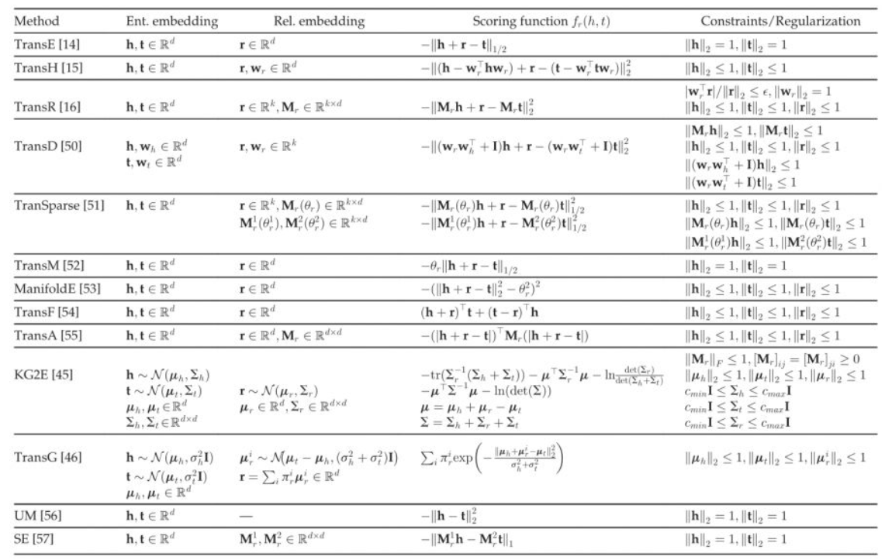
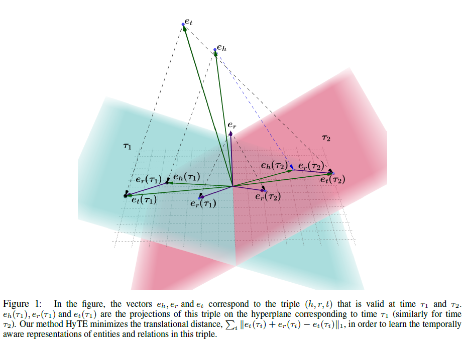
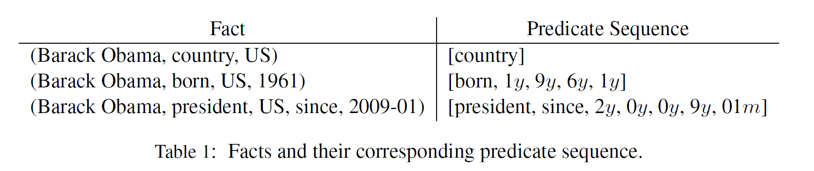

# 时序知识图谱综述

## 时序信息嵌入

### transE的几个变形[^1]$^,$[^3]$^,$[^4]

{{&lt; mermaid &gt;}}
graph LR 
A(transE) --&gt; B(将时间顺序作为限制)
B --&gt; C(&#34;Jiang et al., 2016[1]&#34;)
A --&gt; D(每个时间戳作为一个静态子图)
D --&gt; E(&#34;HyTE[2]&#34;)
A --&gt; F(将时间嵌入关系中)
F --&gt; G(&#34;TA_transE[4]&#34;)
{{&lt; /mermaid &gt;}}

#### HyTE

HyTE主要思想：

&lt;div&gt;$$
P _ { \tau } ( e _ { h } ) = e _ { h } - ( w _ { \tau } ^ { T } e _ { h } ) w _ { \tau }\\
P _ { \tau } ( e _ { t } ) = e _ { t } - ( w _ { \tau } ^ { T } e _ { t } ) w _ { \tau }\\
P _ { \tau } ( e _ { r } ) = e _ { r } - ( w _ { \tau } ^ { T } e _ { r } ) w _ { \tau }\\
f _ { \tau } ( h , r , t ) = | | P _ { T } ( e _ { h } ) &#43; P _ { \tau } ( e _ { r } ) - P _ { \tau } ( e _ { t } ) | | _ { l _ { 1 } / l _ { 2 } }\\
L = \sum _ { r \in [ T ] } \sum _ { x \in D_{\tau}^{&#43;}} \sum _ { y \in D_{\tau}^{-}} max( 0 , f _ { \tau ( x ) }- f _ { \tau } ( y )&#43; \gamma)
$$&lt;/div&gt;

与以前的时间敏感的KG嵌入方法相比，HyTE直接在训练的时候嵌入中编码时间信息。这使我们能够预测以前未考虑范围的KG事件的时间范围。 

#### TA_transE

$$
f_{\tau}=| | h &#43; r _ { t e m p } - t | | _ { 2 }
$$

一个例子：

|          | h                        | r                                                     | t                | 时间       |
| -------- | ------------------------ | ----------------------------------------------------- | ---------------- | ---------- |
| 原文关系 | Lawyer/Attorney (Turkey) | Complain officially                                   | Citizen (Turkey) | 2014-06-24 |
| 编码方式 | Lawyer/Attorney (Turkey) | $p_{seq}$:[Complain officially,2y,0y,1y,4y,06m,2d,4d] | Citizen (Turkey) |            |
| 编码     | 5890                     | $p_{seq}的编码$:[138, 2, 0, 1, 4, 15, 24, 26]         | 280              |            |

如果有诸如since或者until之类的词语，则编码如下：

最后会拿上述的编码进行嵌入与训练。

上述的关系也称为带有时序信息的谓词（predicate sequence，$p_{seq}$）。

### 评价指标mean rank 与filtered mean rank

假设整个知识库中一共有n个实体，那么评价过程如下[^3]：

&#43; 将一个正确的三元组a中的头实体或者尾实体，依次替换为整个知识库中的所有其它实体，也就是会产生n个三元组。
&#43; 分别对上述n个三元组计算其能量值，在transE中，就是计算h&#43;r-t的值。这样可以得到n个能量值，分别对应上述n个三元组。
&#43; 对上述n个能量值进行升序排序。
&#43; 记录三元组a的能量值排序后的序号。
&#43; 对所有的正确的三元组重复上述过程。
&#43; 每个正确三元组的能量值排序后的序号求平均，得到的值我们称为Mean Rank。
&#43; 计算正确三元组的能量排序后的序号小于10的比例，得到的值我们称为Hits@10。

上述就是评价的过程，共有两个指标：Mean Rank和Hits@10。其中Mean Rank越小越好，Hits@10越大越好。

改进:

但是上述过程存在一个不合理的地方：在将一个正确的三元组a的头或者尾实体替换成其它实体之后得到的这个三元组也有可能是正确的，在计算每个三元组的能量并排序之后，这类正确的三元组的能量有可能排在三元组a的前面。但是上面所说的基本评价过程并没有考虑这点。因此我们把上述基本评价过程得到的结果称为Raw Mean Rank和Raw Hits@10，把改进方法得到的结果称为Filtered Mean Rank和Filtered Hits@10。

为了更好的评价embedding的质量，我们对上述方法进行改进。

&#43; 将一个正确的三元组a中的头实体或者尾实体，依次替换为整个知识库中的所有其它实体，也就是会产生n个三元组。
&#43; 分别对上述n个三元组计算其能量值，在transE中，就是计算h&#43;r-t的值。这样可以得到n个能量值，分别对应上述n个三元组。
&#43; 对上述n个能量值进行升序排序。
&#43; 记录三元组a的能量值排序后的序号k。
&#43; 如果前k-1个能量对应的三元组中有m个三元组也是正确的，那么三元组a的序号改为k-m。
&#43; 对所有的正确的三元组重复上述过程。

每个正确三元组的能量值排序后的序号求平均，得到的值我们称为Filtered Mean Rank。

计算正确三元组的能量排序后的序号小于10的比例，得到的值我们称为Filtered Hits@10。

[^1]: Tingsong Jiang, Tianyu Liu, Tao Ge, Lei Sha, Sujian Li, Baobao Chang, and Zhifang Sui. 2016. Encoding temporal information for time-aware link prediction.In Proceedings of the 2016 Conference on Empirical Methods in Natural Language Processing, pages 2350–2354. Association for Computational Linguistics. 

[^2]: Dasgupta S S, Ray S N, Talukdar P. Hyte: Hyperplane-based temporally aware knowledge graph embedding[C]//Proceedings of the 2018 conference on empirical methods in natural language processing. 2018: 2001-2011.

[^3]: https://xiangrongzeng.github.io/knowledge%20graph/transE-evaluation.html

[^4]: A. Garc´ıa-Dur´an, S. Dumanˇci´c, and M. Niepert, “Learning sequence encoders for temporal knowledge graph completion,” in EMNLP, 2018,pp. 4816–4821.

