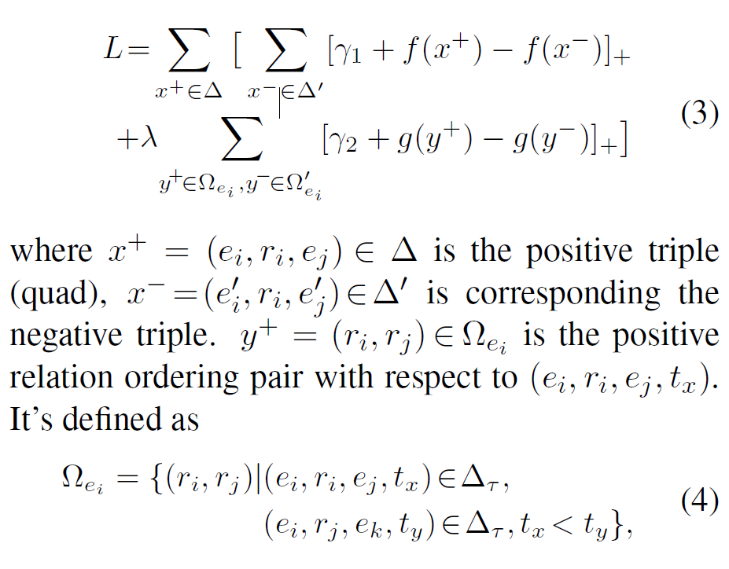

# 时序知识图谱综述

## 时序信息嵌入

### transE的几个变形[^1]$^,$[^3]$^,$[^4]

{{&lt; mermaid &gt;}}
graph LR 
A(transE) --&gt; D(每个时间戳作为一个静态子图)
D --&gt; E(&#34;HyTE[2]&#34;)
A --&gt; F(将时间嵌入关系中)
F --&gt; G(&#34;TA_transE[4]&#34;)
F --&gt; H(&#34;Trans-TAE[1]&#34;)
{{&lt; /mermaid &gt;}}

#### HyTE

HyTE主要思想：

&lt;div&gt;$$
P _ { \tau } ( e _ { h } ) = e _ { h } - ( w _ { \tau } ^ { T } e _ { h } ) w _ { \tau }\\
P _ { \tau } ( e _ { t } ) = e _ { t } - ( w _ { \tau } ^ { T } e _ { t } ) w _ { \tau }\\
P _ { \tau } ( e _ { r } ) = e _ { r } - ( w _ { \tau } ^ { T } e _ { r } ) w _ { \tau }\\
f _ { \tau } ( h , r , t ) = | | P _ { T } ( e _ { h } ) &#43; P _ { \tau } ( e _ { r } ) - P _ { \tau } ( e _ { t } ) | | _ { l _ { 1 } / l _ { 2 } }\\
L = \sum _ { r \in [ T ] } \sum _ { x \in D_{\tau}^{&#43;}} \sum _ { y \in D_{\tau}^{-}} max( 0 , f _ { \tau ( x ) }- f _ { \tau } ( y )&#43; \gamma)
$$&lt;/div&gt;

与以前的时间敏感的KG嵌入方法相比，HyTE直接在训练的时候嵌入中编码时间信息。这使我们能够预测以前未考虑范围的KG事件的时间范围。 

#### TA_transE

$$
f_{\tau}=| | h &#43; r _ { t e m p } - t | | _ { 2 }
$$

一个例子：

|          | h                        | r                                                     | t                | 时间       |
| -------- | ------------------------ | ----------------------------------------------------- | ---------------- | ---------- |
| 原文关系 | Lawyer/Attorney (Turkey) | Complain officially                                   | Citizen (Turkey) | 2014-06-24 |
| 编码方式 | Lawyer/Attorney (Turkey) | $p_{seq}$:[Complain officially,2y,0y,1y,4y,06m,2d,4d] | Citizen (Turkey) |            |
| 编码     | 5890                     | $p_{seq}的编码$:[138, 2, 0, 1, 4, 15, 24, 26]         | 280              |            |

如果有诸如since或者until之类的词语，则编码如下：

最后会拿上述的编码进行嵌入与训练。

上述的关系也称为带有时序信息的谓词（predicate sequence，$p_{seq}$）。

#### trans-TAE

该论文将时序作为一个限制，因此可以扩展到所有trans系列。

思想：对于某个实体的两个关系$r_i$与$r_j$，构建一个时序打分函数：$g(r_{ i } , r_{ j } ) = ||r_{ i }M - r_{ j }||\_{1}$，当这两个关系对按时间顺序排列时，这是一个较低的分数，反之会很高。将该打分函数应用到各个trans系列方法中，以transE为例，要使$f(e_i,r,e_j)=| |e_i&#43;r-e_j| |_{1}$中的正确的三元组比错误的三元组得到更低的值，考虑时序关系，有如下损失函数：

其中第一项表示传统的transE的损失函数，第二项为trans-TAE考虑关系的时序性的损失函数，正例为$r_i$的时间小于$r_j$的时间，反例为$r_i$的时间大于$r_j$的时间。

[^1]: Tingsong Jiang, Tianyu Liu, Tao Ge, Lei Sha, Sujian Li, Baobao Chang, and Zhifang Sui. 2016. Encoding temporal information for time-aware link prediction.In Proceedings of the 2016 Conference on Empirical Methods in Natural Language Processing, pages 2350–2354. Association for Computational Linguistics. 

[^2]: Dasgupta S S, Ray S N, Talukdar P. Hyte: Hyperplane-based temporally aware knowledge graph embedding[C]//Proceedings of the 2018 conference on empirical methods in natural language processing. 2018: 2001-2011.

[^3]: https://xiangrongzeng.github.io/knowledge%20graph/transE-evaluation.html

[^4]: A. Garc´ıa-Dur´an, S. Dumanˇci´c, and M. Niepert, “Learning sequence encoders for temporal knowledge graph completion,” in EMNLP, 2018,pp. 4816–4821.

