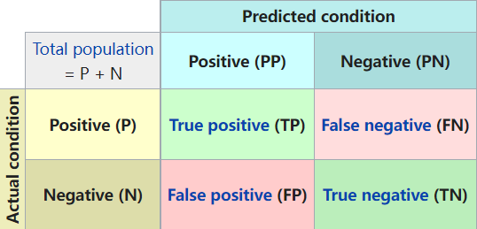
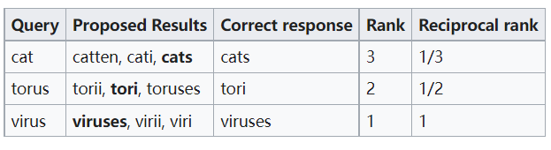

# 知识图谱常用评价指标

## 基础模型

混淆矩阵：

TP：真阳性，TN：真阴性，FP：伪阳性，FN：伪阴性

### 召回率/查全率

sensitivity, recall, hit rate, or true positive rate (TPR)
$$
recall =\frac{TP}{P}= \frac{TP}{TP&#43;FN}
$$

### 精度

precision or positive predictive value (PPV)
$$
precision=\frac{TP}{TP&#43;FP}
$$

### 精度与召回率结合

#### F1-score

精度和召回率的调和平均数：
$$
F_1 = 2\times \frac{precision\times recall}{precision&#43;recall}=\frac { 2 T P } { 2 T P &#43; F P &#43; F N }
$$

#### ROC（受试者特征曲线,Receiver Operating Characteristic curve）[^1]

X轴为伪阳性率（**false positive rate**，错误命中率，假警报率 (false alarm rate)）:$FPR=\frac{FP}{N}=\frac{FP}{FP&#43;TN}$，Y轴为真阳性率（**true positive rate**，又称命中率 (hit rate)、敏感度(sensitivity)）：$TPR=\frac{TP}{P}=\frac{TP}{TP&#43;FN}$。

**完美的预测**是一个在左上角的点，在ROC空间座标 (0,1)点，X=0 代表着没有伪阳性，Y=1 代表著没有伪阴性（所有的阳性都是真阳性）

- 点与随机猜测线的距离，是预测力的指标：**离左上角越近的点预测（诊断）准确率越高**。离右下角越近的点，预测越不准。
- 在**A**、**B**、**C**三者当中，最好的结果是**A**方法。
- **B**方法的结果位于随机猜测线（对角线）上，在例子中我们可以看到**B**的准确度（ACC，定义见前面表格）是50%。
- **C**虽然预测准确度最差，甚至劣于随机分类，也就是低于0.5（低于对角线）。然而，当将**C**以 (0.5, 0.5) 为中点作一个镜像后，**C&#39;**的结果甚至要比**A**还要好。这个作镜像的方法，简单说，不管**C**（或任何ROC点低于对角线的情况）预测了什么，就做相反的结论。

**AUC**：ROC曲线下方的面积（英语：Area under the Curve of ROC (AUC ROC)），**AUC值越大的分类器,正确率越高**。从AUC判断分类器（预测模型）优劣的标准：

- AUC = 1，是完美分类器，采用这个预测模型时，存在至少一个阈值能得出完美预测。绝大多数预测的场合，不存在完美分类器。
- 0.5 &lt; AUC &lt; 1，优于随机猜测。这个分类器（模型）妥善设定阈值的话，能有预测价值。
- AUC = 0.5，跟随机猜测一样（例：丢铜板），模型没有预测价值。
- AUC &lt; 0.5，比随机猜测还差；但只要总是反预测而行，就优于随机猜测。

### 翻译领域

#### BLEU

bilingual evaluation understudy是IBM在2002提出的[^2]，用于翻译任务的评价。BLEU算法的思想就是机器翻译的译文越接近人工翻译的结果，它的翻译质量就越高。

首先根据n-gram划分一个短语包含单词的数量，如1-gram（unigram）就是将语料划分成1个单词的短语。然后统计这些短语出现在参考译文中的个数，最后除以划分总数，得到BLEU-1分数。Unigram的准确率可以用于衡量单词翻译的准确性，更高阶的n-gram 的准确率可以用来衡量句子的流畅性。

计算方式如下[^3]：
$$
bleu_n= \frac{\sum_{c\in candidates}\sum_{n\_gram\in c}Count_{clip}(n\_gram)} {\sum_{ c^\prime \in candidates} \sum_{n\_gram^\prime\in c^\prime}Count(n\_gram^\prime)}
$$
candidate：神经网络生成的句子

reference：给定的标准译文

$Count_{clip}(n\_gram)$：某一个n−gram在reference中的个数

$Count(n\_gram&#39;)$：n−gram′在candidate中的个数

**优点：**

&#43; 易于计算且快速
&#43; 使用普遍

**缺点[^4]：**

- 它不考虑意义:有些同义词没有考虑替代
- 它不直接考虑句子结构：很多语法结构的错误被忽略
- 它不能很好地处理形态丰富的语言：
- 它与人类的判断并不相符

#### PPL（Perplexity）

$$
PP(S) = P(w_{1}w_{2}\cdots w_N)^{ - \frac { 1 } { N } } = \sqrt [ N ] { \frac { 1 } { P ( w _ { 1 } w _ { 2 } \cdots w _ { N }) } }\\\\
= \sqrt [ N ] { \prod _ { i = 1 } ^ { N } \frac { 1 } { p ( w _ { i } | w _ { 1 } w _ { 2 } \cdot w _ { i -1} ) } }
$$

S代表sentence，N是句子长度，p($w_i$)是第i个词的概率。

特点[^5]：

&#43; 训练数据集越大，PPL会下降得更低，1billion dataset和10万dataset训练效果是很不一样的；
&#43; 数据中的标点会对模型的PPL产生很大影响，一个句号能让PPL波动几十，标点的预测总是不稳定；
&#43; 预测语句中的“的，了”等词也对PPL有很大影响，可能“我借你的书”比“我借你书”的指标值小几十，但从语义上分析有没有这些停用词并不能完全代表句子生成的好坏。

#### 知识图谱领域

#### hit@K与MR（mean rank）

常见于transE等trans系列用于知识图谱推理预测的论文中。

假设整个知识库中一共有n个实体，那么评价过程如下[^6]：

&#43; 将一个正确的三元组a中的头实体或者尾实体，依次替换为整个知识库中的所有其它实体，也就是会产生n个三元组。
&#43; 分别对上述n个三元组计算其能量值，在transE中，就是计算h&#43;r-t的值。这样可以得到n个能量值，分别对应上述n个三元组。
&#43; 对上述n个能量值进行升序排序。
&#43; 记录三元组a的能量值排序后的序号。
&#43; 对所有的正确的三元组重复上述过程。
&#43; 每个正确三元组的能量值排序后的序号求平均，得到的值我们称为Mean Rank。
&#43; 计算正确三元组的能量排序后的序号小于K的比例，得到的值我们称为Hits@K。

上述就是评价的过程，共有两个指标：Mean Rank和Hits@10。其中Mean Rank越小越好，Hits@10越大越好。

#### filtered hit@K与filtered MR[^9]

但是上述过程存在一个不合理的地方：在将一个正确的三元组$(h,r,t)$的头或者尾实体替换成其它实体之后得到的这个三元组$(h,r,t&#39;)$也有可能是正确的(比如在训练集中存在这些替换后的三元组，$(h,r,t&#39;)\in \text{training set}$，在计算每个三元组的能量并排序之后，这类正确的替换三元组原本应该作为负样本，排序却有可能排在作为正样本的三元组$(h,r,t)$的前面。但是上面所说的基本评价过程并没有考虑这点。因此我们把上述基本评价过程得到的结果称为Raw Mean Rank和Raw Hits@K，把改进方法得到的结果称为Filtered Mean Rank和Filtered Hits@K。

为了更好的评价embedding的质量，我们对上述方法进行改进。

&#43; 将一个正确的三元组$(h,r,t)$中的头实体或者尾实体，依次替换为整个知识库中的所有其它实体，也就是会产生n个三元组$(h,r,t&#39;)$或$(h’,r,t)$。
&#43; 分别对上述n个三元组计算其能量值，在transE中，就是计算$||h&#43;r-t||_2$的值。这样可以得到n个能量值，分别对应上述n个三元组。
&#43; 对上述n个能量值进行升序排序。
&#43; 记录三元组$(h,r,t)$的能量值排序后的序号k。
&#43; 如果前k-1个能量对应的三元组中有m个三元组也是正确的，那么三元组$(h,r,t)$的序号改为k-m。
&#43; 对所有的正确的三元组重复上述过程。

&gt; 此处替换后的三元组正确指的是：替换后的三元组$(h,r,t&#39;)$在训练集/测试集/验证集中出现过

每个正确三元组的能量值排序后的序号求平均，得到的值我们称为Filtered Mean Rank。

计算正确三元组的能量排序后的序号小于K的比例，得到的值我们称为Filtered Hits@K。

#### MRR

MRR（平均倒数排序，Mean reciprocal rank[^7]）是一个国际上通用的对搜索算法进行评价的机制，即第一个结果匹配，分数为1，第二个匹配分数为0.5，第n个匹配分数为1/n，如果没有匹配的句子分数为0。最终的分数为所有得分之和。
$$
{\text{MRR}}={\frac  {1}{|Q|}}\sum _{{i=1}}^{{|Q|}}{\frac  {1}{{\text{rank}}_{i}}}.\!
$$
wiki上一个MRR的例子：

假设我们有以下三个示例查询，用于尝试将英语单词翻译成复数形式的系统。在每种情况下，系统都会做出三个猜测，第一个是它认为最有可能正确的猜测：

给定这三个样本，我们可以将平均倒数排名计算为 (1/3 &#43; 1/2 &#43; 1)/3 = 11/18。

#### filtered MRR

同理于filtered MR

#### time-aware filtered MRR与time-aware filtered hit@K[^8]

如果用一般的filtered方法，那么做法是：如果测试四元组是(Barack Obama, visit, India, Jan. 25, 2015)  ，对其进行实体预测(Barack Obama, visit, ?, Jan. 25, 2015)  ，此外在训练集中已有(Barack Obama, visit, Germany, Jan. 18, 2013)   ，根据filtered方法，(Barack Obama, visit, Germany, Jan. 25, 2015)  是正确的，要被filter筛选。

但是其实这个事件只在2013年1月18日才是正确的，因此time-aware的filtered方法将只在该时间刻的事件进行filter，得到了time-aware filtered方法。

[^1]: [ROC曲线 - 维基百科，自由的百科全书 (wikipedia.org)](https://zh.wikipedia.org/zh-hans/ROC曲线?oldformat=true)
[^2]: Papineni K, Roukos S, Ward T, et al. Bleu: a method for automatic evaluation of machine translation[C]//Proceedings of the 40th annual meeting of the Association for Computational Linguistics. 2002: 311-318.

[^3]: [BLEU详解 - 知乎 (zhihu.com)](https://zhuanlan.zhihu.com/p/223048748)
[^4]: [Evaluating Text Output in NLP: BLEU at your own risk | by Rachael Tatman | Towards Data Science](https://towardsdatascience.com/evaluating-text-output-in-nlp-bleu-at-your-own-risk-e8609665a213)
[^5]: [语言模型评价指标Perplexity_不眠旅行-CSDN博客_语言模型ppl](https://blog.csdn.net/index20001/article/details/78884646)
[^6]: [transE评价方法 - Sunder (xiangrongzeng.github.io)](https://xiangrongzeng.github.io/knowledge graph/transE-evaluation.html)
[^7]: [Mean reciprocal rank - Wikiwand](https://www.wikiwand.com/en/Mean_reciprocal_rank)

[^8]: Han Z, Ma Y, Wang Y, et al. Graph hawkes neural network for forecasting on temporal knowledge graphs[J]. arXiv preprint arXiv:2003.13432, 2020.
[^9]: Bordes A, Usunier N, Garcia-Duran A, et al. Translating embeddings for modeling multi-relational data[J]. Advances in neural information processing systems, 2013, 26.

